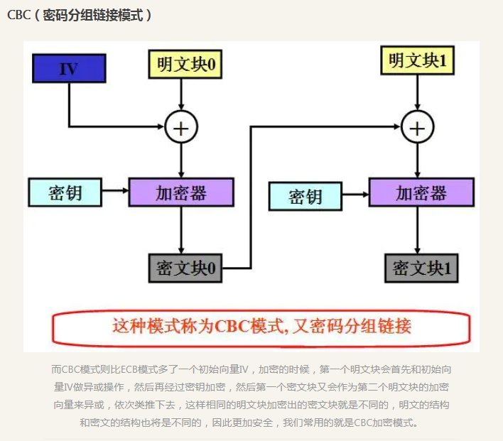

## 查找算法

### 二分查找
又叫折半查找算法，基于比较目标值和数组中间元素

待查找的数据必须是有序的

空间复杂度：O(1)
时间复杂度：O(1)~O(logN) 以2为底N的对数

算法规则： 目标值等于中间元素则找到目标值，目标值小于中间元素则向左侧继续搜索，目标值大于中间元素则向右侧搜索

* left+(right-left)/2 和 （right+left)/2 结果一样，但有效的避免了相加结果太大导致溢出

```
int binary_search(int[] nums, int target) {
    int left = 0, right = nums.length - 1; 
    while(left <= right) {
        int mid = left + (right - left) / 2;
        if (nums[mid] < target) {
            left = mid + 1;
        } else if (nums[mid] > target) {
            right = mid - 1; 
        } else if(nums[mid] == target) {
            // 直接返回
            return mid;
        }
    }
    // 直接返回
    return -1;
}

```

//寻找左侧边界的二分查找
```
int left_bound(int[] nums, int target) {
    int left = 0, right = nums.length - 1;
    while (left <= right) {
        int mid = left + (right - left) / 2;
        if (nums[mid] < target) {
            left = mid + 1;
        } else if (nums[mid] > target) {
            right = mid - 1;
        } else if (nums[mid] == target) {
            // 别返回，锁定左侧边界
            right = mid - 1;
        }
    }
    // 最后要检查 left 越界的情况
    if (left >= nums.length || nums[left] != target)
        return -1;
    return left;
}
```

//寻找右侧边界
```
int right_bound(int[] nums, int target) {
    int left = 0, right = nums.length - 1;
    while (left <= right) {
        int mid = left + (right - left) / 2;
        if (nums[mid] < target) {
            left = mid + 1;
        } else if (nums[mid] > target) {
            right = mid - 1;
        } else if (nums[mid] == target) {
            // 别返回，锁定右侧边界
            left = mid + 1;
        }
    }
    // 最后要检查 right 越界的情况
    if (right < 0 || nums[right] != target)
        return -1;
    return right;
}
```

//https://leetcode-cn.com/problems/binary-search/solution/er-fen-cha-zhao-xiang-jie-by-labuladong/


### 插值查找


### 算法
加密算法都是可逆的；  
摘要算法都是不可逆的，有信息丢失，不可逆


### 原地算法  
不依赖额外的资源或依赖少数的额外资源，仅依靠输出来覆盖输入的一种算法操作。  

### 哈希算法
可以将任意长度的输入转化为固定长度的输出  

### MD5算法
是哈希算法中的一种，可以将任意长度的字节序列转换为一个128位二进制的摘要，即长度为32的十六进制字符串，区分大小写  
是不可逆的  
对原数据做一丁点的改动，MD5值就会有巨大的改动  

用处：  
1. 登录、注册、修改密码等简单加密操作  相对较好的方式：将 服务端md5(客户端md5(pwd)+salt) 保存在数据库
2. 生成数字签名  

彩虹表：是一个庞大的数据库，收集了所有人常用的密码，以及密码所对应的MD5值、SHA-X值等哈希值。  
所以加密时最好加盐处理，对每个用户来说盐最好具备唯一性，最好由服务器随机产生并将盐存在数据库。  

### SHA-1算法
和MD5算法一样，都是由MD4算法导出，SHA-1算法的长度是40位十六进制数，即160位二进制数，更安全些。  

### AES加密算法
是**对称加密算法**的一种，采用分组密码体制(将明文切成一段一段的来加密，然后再把一段一段的密文拼起来形成最终密文的加密方式)，  
要求密钥的长度可以是128位16个字节，或192位或256位，位数越高加密越强但效率越低，  
Padding是用来把不满16个字节的分组数据填满16个字节，  
使用AES加密时需要主动提供一个密钥，每段数据加密都使用这个密钥，密钥为随机生成的。  

AES四种加密模式，通常使用CBC密码分组链接模式  


实际开发中服务端和客户端必须使用一样的密钥、初始向量IV、加密模式、Padding模式   
一般采用RSA+AES相结合的方式，AES加密数据、RSA加密AES的密钥。  

### RSA加密算法
是**非对称加密算法**的一种，为了保证加密的安全性，RSA密钥的长度一般都是1024位或者2048位，这就使得RSA加密的计算量大、加密速度慢。


