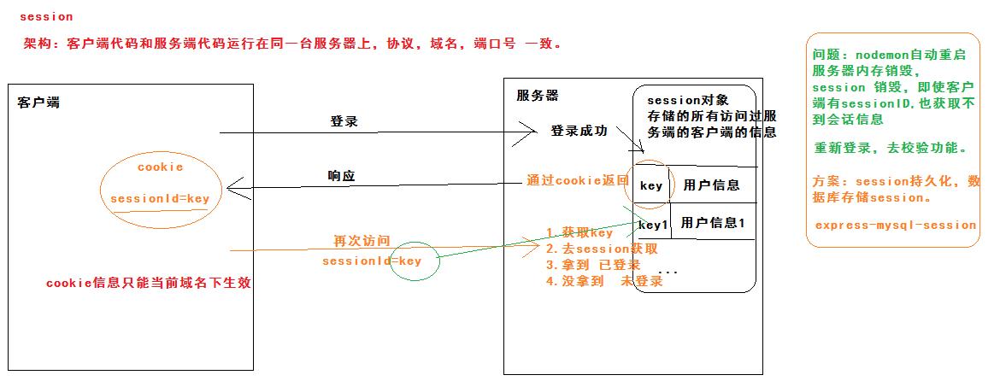
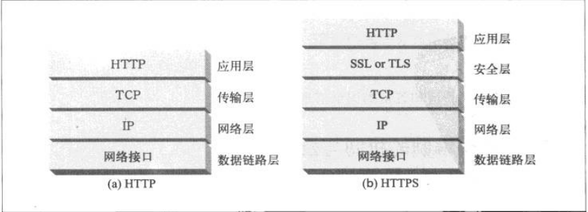
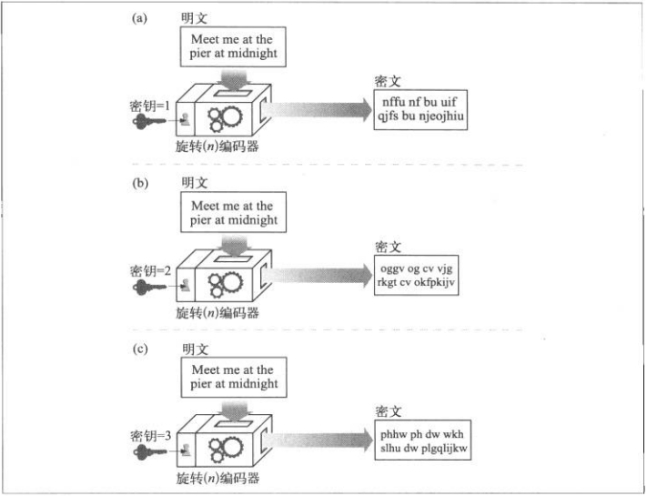
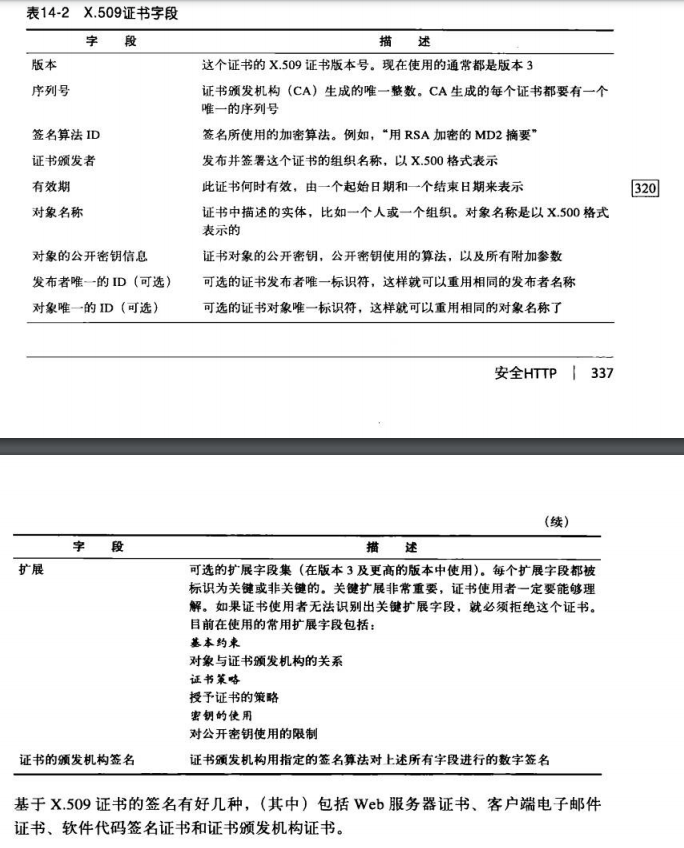

### OSI的七层网络协议
应用层、表示层、会话层、传输层、网络层、数据链路层、物理层

HTTP协议：应用层  
TCP协议：传输层  
ip协议：网络层  

TCP/IP协议是传输层，主要解决数据如何在网络中传输；HTTP协议是基于TCP连接的，主要解决如何包装数据；  
Socket是对TCP/IP协议的封装，不是协议，而是调用接口API，通过Socket我们才能使用TCP/IP协议    
若双方是 HTTP 连接，则服务器需要等客户端发送请求后，才能将数据回传给客户端  
若双方是 Socket 连接，可以由服务器直接向客户端发送数据。  
  
  
两台主机通信时依赖Socket，Socket则利用TCP/IP协议建立TCP连接，TCP则依赖于更底层的ip协议，ip协议依赖于更底层的链路层。
  
### Socket 
套接字，是通信的基石，包含了网络通讯必须的5种信息：连接使用的协议、本地主机的ip地址、本地进程的协议端口、远程主机的ip地址、远端进程的协议端口  
建立Socket连接：服务器监听等待客户端的连接请求`-->`客户端请求(指出服务器套接字的ip和端口号)`-->`服务端响应把套接字描述发给客户端，之后服务端继续监听

HTTP连接是短链接，Socket是长连接，如果协议栈检测到TCP长时间不再发送数据就会把连接断开，所以想要长时间保持连接可以发送心跳包

### http响应码
* 200 OK 客户端相应成功
* 301 Moved Permanently 代表永久性转移，会修改url地址
* 302 found 代表暂时性转移，不会修改url地址
* 400 Bad Request 客户端请求有语法错误，不能被服务器所理解
* 401 Unauthorized 请求未授权
* 403 Forbidden 服务器收到请求，但拒绝提供服务
* 404 Not Found 请求的资源不存在 eg:输入了错误的url
* 500 Internal Server Error 服务器发生了不可预知的错误
* 502 Bad Gateway 服务器响应超时；网络错误；防火墙阻止请求
* 503 Server Unavailable 服务器当前正在忙，不能处理客户端的请求，一段时间后可能会恢复
* 504 Gateway timeout 服务器作为网关或代理来完成客户端的请求，但是服务器没有及时从上游服务器得到响应

### forword和redirect
* forword是服务器行为，转发，地址栏不变，可共享request的数据，一般用于用户登录
* redirect是客户端行为，重定向，地址栏改变，不可共享数据，一般用于用户注销

### get和post
* get：把请求的数据附在url之后（即http协议头中），url和数据用?分隔，参数之间用&相连；  
  是form表单的默认提交方式，提交的数据会在浏览器显示出来；  
  不可用于提交二进制数据，如上传文件；  
  对数据大小有限制，最多1024字节；
* post：把请求的数据放在http包的包体中；  
  比get方式安全性高
  
  get比post速度要快些，在第三次握手时，post请求中浏览器会先发送post请求头，再发送数据，get请求会一并发送get请求头和数据；  
  多数浏览器会将get请求的静态资源(数据不会)缓存起来，post不会，对安全性要求不高的查询数据建议用get请求

### 关于http,XMLHttpRequest,Ajax的关系

http 是浏览器和web服务器交换数据的协议,规范  
XMLHttpRequest 是javascript的一个对象,是浏览器实现的一组api函数(方法),使用这些函数,浏览器再通过http协议请求和发送数据  
Ajax 不是一种技术,是综合多种技术实现交互的模式:用html+css展示页面>使用XMLHttpRequest请求数据>使用js操作dom  

### TCP和UDP
1. TCP是基于连接的、只能一对一，UDP是无连接的、可以一对一，一对多，多对一，多对多的交互通信
2. TCP是基于字节流的，UDP是数据报文模式
3. TCP多用于对数据准确性比较高的网路服务如文件传输、邮件发送；UDP多用于要求速度比较快的网路服务，如网络视频、网络电话。
4. 重视数据的安全和准确率用TCP，否则用更高效的UDP

### UDP
首部：8个字节，包括源端口号、目的端口号、长度、检验和，各16位
数据区：最大1472字节
  
数据帧的长度必须在46-1500字节之间，ip数据报的首部为20字节，UDP首部为8字节，所以UDP数据区最大为1472字节  

### udp在什么情况下会丢失精度
发送频率过高造成阻塞、发送的包过大等  
修改接收区缓冲区的大小

### TCP
发送的数据包括ip首部、ip数据部分，其中ip数据部分又包括TCP首部、TCP数据部分，TCP首部范围20-60字节，其中有20个字节的固定首部

连接：即客户端和服务器内存里各保存一份对方的信息，如ip、端口号

### TCP首部
源端口、目的端口、  
序号：对字节流进行编号。 TCP接收端可丢弃重复的报文段，记录以杂乱次序达到的报文段
确认号：期望收到的下一个报文的序号，例：B正确收到的A的序号为501，长度为200，则B期望的下个报文的序号为701，确认号也就是701  
数据偏移：TCP数据部分距离报文段起始处的偏移量，实际就是TCP首部的长度  
控制位：CWR，ECE，URG，ACK，PSH，RST，SYN，FIN

ACK：设为1时确认应答的字段有效，是累积的，N，表示所有直到N(不包括N)的字节已经成功被接收了  
SYN：用于建立连接，为1时表示希望建立连接  
FIN：为1时表示今后不再有数据发送，希望断开连接。每个主机对对方的FIN确认应答之后可以断开连接，主机接收到FIN为1的TCP段之后不是马上回复，而是等缓冲区的数据发送完毕自动删除后再发FIN包  

窗口：窗口值作为接收方让发送方设置其发送窗口的依据，这样限制是因为接收方的数据缓存空间是有限的

### TCP心跳
TCP是传输层协议
TCP两端A、B建立连接，A断掉电源或拔掉网线，B不会收到通知
TCP的建立连接（三次握手）和断开连接（四次挥手）是通过发送数据实现的。B端定时给A端发送数据来检测连接是否异常断开，这就是心跳，数据的内容无关紧要，是数据长度为0的心跳包。TCP协议中有一个KEEP_LIVE开关。
两端都应该互相发送心跳。	

### TCP是面向连接的
长连接：server端和client端建立连接后，不断开，进行报文发送和接收
短连接：连接后，交易完毕后立即断开，长用于一对多，例如一个server对多个client

TCP对传送的每个数据字节都进行编号，并请求接收方回传确认信息（ACK），一定时间内没收到确认信息，则重传。
数据编码使接收方能够处理数据的失序和重复问题。
没有接收方的流量控制，会因为接收缓冲区溢出而丢失大量数据
重视数据的安全传出用TCP，否则用更高效的UDP

TCP，基于流的传输，即无保护消息边界：发送三次数据包，只要接收到缓冲区大小比三个数据包总大小大就行，只要一次接收动作。所以TCP会出现粘包问题，即下一个包的头接着上一个包的尾。  
UDP，保护消息边界：发送三次数据包，UDP必须接收三次。

### TCP的三次握手

目的：建立TCP连接通道，确认双方都有收发数据的能力。

**序列号seq**：占4个字节，报文段携带数据的的第一个字节的编号（TCP连接发送的所有数据字节都编上一个序号，第一个序号由本地随机产生）。  
**确认号ack**：占4个字节，期待收到下一个报文的第一个数据字节的序号，即当前报文段最后一个字节的编号+1。  
**同步SYN**：SYNchronization，请求建立连接，并且设定其序列号（seq）的初始值。  
**确认ACK**：占1位，仅ACK为1时，ack才有效。  
**FIN**：FIN=1表示此报文段发送方的数据已发送完毕，希望断开连接。FIN报文段即使不携带数据，也要消耗一个序号  

SYN=1,ACK=0时，表示这是一个连接请求报文段；若同意连接，则在响应报文段中SYN=1,ACK=1，

SYN、ACK表示标志位，要么是1要么是0；  
  

首先服务器端处于LISTEN监听状态，等待客户端的连接请求
* 第一次握手：客户端发送SYN包(SYN=1,seq=x)到服务器，进入SYN_SENT状态，等待服务器确认； SYN=1，ACK=0  （服务端知道了：客户端的发送能力、服务端的接收能力都是正常的）
* 第二次握手：服务器收到SYN包，通过发送ACK(ACK=1,ack=x+1)确认客户的SYN，同时也发送一个自己的SYN(SYN=1,seq=y)包，即SYN+ACK包，此时服务器进入SYN_RECV状态；  （客户端知道了：客户端的接收、发送能力正常、；服务端的接收、发送能力正常）
* 第三次握手：客户端收到服务器的SYN+ACK包，向服务器发送确认包ACK(ACK=1,ack=y+1)和序号seq=x+1，此包发送完毕，客户端和服务器进入ESTABLISHED（TCP连接成功）状态，完成三次握手。   （服务端知道了：客户端的接收能力正常；服务端的发送能力正常）

  
最少需要三次握手才能双方都确认自己和对方的接收、发送能力都是正常的

### TCP的四次挥手
目的：断开连接
主动关闭方：A 被动关闭方：B
* 第一次挥手：A发送一个FIN，用于关闭A到B的数据传送，但此时A还可以接受数据。进入FIN_WAIT_1(终止等待)状态；
* 第二次挥手：B收到FIN后，发送确认报文ACK（序号为收到的序号+1，FIN也会占一个序号）给对方，此时进入CLOSE_WAIT（关闭等待）状态；
* 第三次挥手：B发送一个FIN，用于关闭B到A的数据传送，进入LAST-ACK（最后确认）状态，等待A确认（即等待接收A发送的ACK包）；
* 第四次挥手：A收到FIN后，发送一个ACK给B，进入TIME-WAIT（时间等待）状态，必须经过2MSL（最长报文段存活时间）后，当A撤销相应的TCB后，才进入CLOSED状态。B收到A发送的ACK，会立即进入CLOSE状态。

  
TIME-WAIT：进入此状态为了确保最后一个确认报文能够到达、让本连接持续时间内所产生的报文都从网络中消失，使得下一次新的连接不会出现旧的连接请求的报文  

查看等待time_wait状态连接数:  netstat -an |grep TIME_WAIT|wc -l  

### 避免粘包
1、由发送方引起的粘包，TCP提供了强制数据立即传送的操作指令push，而不必等缓冲区满。（影响效率）
2、由接收方引起的粘包，优化程序设计，设置接收进程优先级。（频率较高时会来不及接收）
3、由接收方引起的粘包，将一包数据按结构字段，人为控制分多次接收，然后合并。（效率较低，不适合实时应用）
周全之策：接收方创建一段预处理线程，预处理数据，将粘连的包分开。

Netty 中实现的一些协议都对粘包、拆包做了很好的处理。

### 解决TCP无保护消息边界问题：
1、发送固定长度的消息
2、把消息的尺寸与消息一块发送
3、使用特殊标记来区分消息间隔


### 拆包
要发送的数据大于 TCP 发送缓冲区剩余空间大小，将会发生拆包

### 封包
给一段数据加个包头，这样数据包就分为包头+包尾两部分

### RTT
一个报文段从发送到接收再到确认所经历的往返时间。

### TCP滑动窗口
窗口是缓存的一部分，用来暂时存放字节流，发送方和接收方各有一个窗口，接收方通过TCP报文段中的窗口字段告诉发送方自己的窗口大小，发送方根据这个值和其他值信息设置自己的窗口大小

## HTTP
默认端口80
### 用于承载用户相关信息的Http请求头部
From  用户的email地址  （为防止接收垃圾邮件，浏览器很少发送From）
User-Agent  用户的浏览器软件  
Referer  用户是从这个页面上依照链接跳转过来的  
Authorization  用户名和密码  
Client-IP 客户端的ip地址  
X-Forwarded-For  客户端的ip地址  
Cookie 服务器产生的id标签  

### HTTP方法  
GET： 用于请求访问已经被URI（统一资源标识符）识别的资源，可以通过URL传参给服务器  
POST：用于传输信息给服务器，主要功能与GET方法类似，但一般推荐使用POST方式。   
PUT： 传输文件，报文主体中包含文件内容，保存到对应URI位置。  
HEAD： 获得报文首部，与GET方法类似，只是不返回报文主体，一般用于验证URI是否有效。  
DELETE：删除文件，与PUT方法相反，删除对应URI位置的文件。  
OPTIONS：查询相应URI支持的HTTP方法  

### 完整的HTTP请求步骤
1. 建立TCP连接  
2. Web浏览器向Web服务器发送请求行  
3. Web浏览器向Web服务器发送请求头  
4. Web服务器应答  
5. Web服务器发送响应头  
6. Web服务器向Web浏览器发送数据  
7. Web服务器关闭TCP连接。如果浏览器或服务器的头信息加入了Connection:keep-alive，就会保持连接，以节省每次连接都建立新连接所需的时间，还节省了网络带宽

### HTTP1.1新特性
- 默认持久连接  
- 管线化，可以同时发送多个HTTP请求，而不用一个个等待响应  
- 断点续传，实际就是分块传输

### Cookie和Session
HTTP是无状态协议，每次的后续请求需要前面的信息时都需要再把所有的信息重传，导致每次连接传送的数据量增大。
于是，Cookie和Session应运而生

Cookie是服务器返回给客户端的特殊信息(在响应头Response Header中)，这些信息以文本文件的形式存在客户端，然后客户端每次向浏览器发送请求时都会带上这些信息(在请求头中Request Header)  

Session是通过服务器保存状态的，Java中是通过HttpServletRequest的getSession方法创建的，  
服务器创建Session的同时，会给Session生成一个唯一的SessionId，并将SessionId响应给客户端，  
客户端下次请求就带上SessionId，服务器根据SessionId找到相应的Session  


Cookie只能存储String类型的对象，Session可以存储任意类型的Java对象
重要信息保存在Session（如登陆信息），需要保留的信息存在Cookie（如购物车）
Session通过Cookie工作，Cookie传输的SessionID让Session知道这个客户端到底是谁

token，适用于项目级的前后端分离（前后端代码运行在不同的服务器下）
请求登录时，token和sessionId原理相同，是对key和key对应的用户信息进行加密后的加密字符，  
登录成功后，会在响应主体中将{token：'字符串'}返回给客户端。  
客户端通过cookie、sessionStorage、localStorage都可以进行存储。  
再次请求时不会默认携带，需要在请求拦截器位置给请求头中添加认证字段Authorization携带token信息，服务器端就可以通过token信息查找用户登录状态。
!Token.png](../image/计算机网络/token.png)


### WebSockets(应用层协议)
一种计算机通信协议，和HTTP是两个完全不同的协议，WebSocket是利用HTTP进行握手，两者都是基于TCP连接的。
WebSocket是一种持久化的协议，HTTP是非持久化的
HTTP1.0中，请求是一个Request一个Response，1.1后，做了优化，有一个keep-alive，一个Http连接可以发送多个Request连接，接收多个Response。
Http协议永远是这样，一个Request只能有一个Response，Response是被动的，不能主动发起。

WebSocket是一个双通道的连接，在同一个TCP连接上，可以同时双向传送数据

Ajax轮询：浏览器隔几秒发送一个请求，询问服务器是否有新信息。
long pull：采用阻塞模型，客户端建立连接后，如果没有消息就一直不返回Response，直到有消息后返回，客户端接收到消息后马上再次建立连接，周而复始。

WebSocket缺点：一个HTTP/WebSocket连接要跨越千山万水、经过无数的路由器、防火墙转发过滤，最后才到终点，  
在这些中间结点中可能会以为一份连接在一段时间没有数据就等于失效，会自作主张的切断连接，但服务端和客户端又不会收到任何提示。
解决：让浏览器和客户端能够发送ping/pong Frame以此来维持连接状态，Frame是一种特殊的数据包，只包含一些元数据

应用场景：即时聊天通信、多玩家游戏、在线协同编辑、实时数据流的拉取和推送、实时地理位置

  
### 阿里PiaPia开发规范
高并发服务器建议调小TCP协议的time_await超时时间，调大最大事件句柄数(fd)
  
### TTL
Time To Live的缩写，该字段指定IP包被路由器丢弃之前允许通过的最大网段数量  
TTL与DNS TTL有区别。二者都是生存时间，前者指ICMP包的转发次数（跳数），后者指域名解析信息在DNS中的存在时间。
  
  
  
## HTTPS
默认端口443
传输过程中SSL加密，安全性更好，响应速度较慢，消耗资源较多，需要用到CA证书  
SSL是个二进制协议，流量承载默认是443端口  
 
HTTPS相比于HTTP，提供了一个传输级的密码安全层

### SSL握手
发送已加密的报文之前，客户端和服务端要完成SSL握手，完成以下工作：  
- 交换协议版本号、  
- 选择一个两端都了解的密码、  
- 对两端的身份进行认证、  
- 生成临时的会话密钥，以便加密信道  
  
### 链接建立过程
1. 客户端向服务器发送一个请求  
2. 服务器发送一个SSL证书给客户端，内容包括：证书的发布机构、有效期、所有者、签名、公钥  
3. 客户端对发来的公钥进行真伪校验，校验为真则使用公钥对**对称加密算法种类和对称密钥**进行加密
4. 服务器使用私钥进行解密，并使用对称密钥加密确认信息发送给客户端
5. 随后客户端和服务器端使用对称密钥进行信息传输

### 密钥
改变密码行为的数字化参数，在密码机中输入正确的密钥，解密过程才能正确进行，每个密码机都有不同的密钥  
 

很多情况下，编/解码的算法都是众所周知的，因此密钥就是唯一保密的东西了

### 对称密钥加密算法
编码和解码时使用相同的密钥。加密速度快，如：DES、AES  

### 非对称密钥加密算法
编码和解码使用不同的密钥，密钥成对出现：公钥和私钥。

公钥：编码密钥，众所周知的。 公钥是从数字证书里获取的。    
私钥：解码密钥，只有主机才知道，不在网络中传输  
   
相对对称加密算法加密速度较慢，如：RSA、DSA  

### 公开密钥加密系统
一种能够使数百万计算机便捷的发送机密报文的系统

### 数字签名
用来验证报文未被伪造或篡改的校验和，校验和只有用户的私有密钥才能产生  

A发送一条报文到服务端B：  
1. A将变长的报文转为定长的摘要信息(通过哈希函数)  
2. 将摘要通过A的私钥进行加密得到数字签名
3. 将数字签名附加在报文的尾端，发送给B
4. B同A一样，先将报文转为摘要信息  
5. B用公钥将数字签名进行解密得到摘要信息  
6. 将两个摘要信息进行对比，相同则确定是A发送的。


数字签名技术是将摘要信息用发送者的私钥加密，与原文一起传送给接收者。
接收者用自己的公钥解密被加密的摘要信息，然后用HASH函数对收到的原文产生一个摘要信息，与解密的摘要信息对比。
如果相同，则说明收到的信息是完整的，在传输过程中没有被修改，否则说明信息被修改过，因此数字签名能够验证信息的完整性。


### 数字证书
一个由可信的组织，验证和签发的识别信息

虽然数字证书没有单一的全球标准，但是大多数证书都以一种X.509 v3格式来存储它们的信息  
  
 

HTTPS建立连接时，浏览器都会获取所连接服务器的数字证书，如果没有，则安全连接就会失败  

  
  
  
### 暂存
客户端向服务器请求对称加密的密钥，服务端用非对称加密加密后再传输  
  
  
### JWT鉴权
通过JWT的方式来进行用户认证和信息传递，保证服务之间用户无状态的传递。
  
  
  
  
  

### DNS域名解析服务器Domain Name Server
把域名翻译成ip
  
### MAC地址
网络中用来识别网卡设备的物理地址，不变、唯一。  

### ip  
分为两个部分：网络部分、主机部分  

### 子网掩码
为了区分ip地址的网络位和主机位，例：255.255.255.0
  
### 网关Gateway  
又称网间连接器，两个网络通过网关在传输层上实现网络互连，TCP/IP协议里的网关是最常用的。  
根据子网掩码与主机的ip地址做与运算，根据结果判断两个主机的是否在同一个网络里，  
如果主机A发送数据到主机B，但是和B不在同一个网络中，  
则A先将数据包转发给自己的网关A，然后网关A再转发给网关B，网关B再将数据包转发给主机B；  
所以应该设置好网关的ip地址(默认通常是该子网段的第一个ip)，是具有路由功能的设备的ip地址，如路由器、启用了路由协议的服务器。  
 
### 吞吐量 
网络中的数据是由一个个数据包组成，防火墙对每个数据包的处理要耗费资源。  
吞吐量是指在没有帧丢失的情况下，设备能够接受的最大速率。  
其测试方法是：在测试中以一定速率发送一定数量的帧，并计算待测设备传输的帧，  
如果发送的帧与接收的帧数量相等，那么就将发送速率提高并重新测试；  
如果接收帧少于发送帧则降低发送速率重新测试，直至得出最终结果。  
吞吐量测试结果以比特/秒或字节/秒表示。
  

### HTTP协议content-type和accept的区别
Content-type代表客户端发送的实体数据的数据类型  
Accept代表客户端希望接收的数据类型  
  
  
### 访问tyrz.gd.gov.cn时，java.net.UnknownHostException: tyrz.gd.gov.cn Name or service not known
解决方式：在/etc/hosts中添加映射210.76.73.10	tyrz.gd.gov.cn  
127.0.0.1是ip4的访问映射，::1是ip6的访问映射
```
127.0.0.1   localhost localhost.localdomain localhost4 localhost4.localdomain4  
::1         localhost localhost.localdomain localhost6 localhost6.localdomain6
210.76.73.10	tyrz.gd.gov.cn
19.15.0.200:8080 zwwx.gdzwfw.gov.cn
```
  
  
  
  
  
  
  
  
  
  
