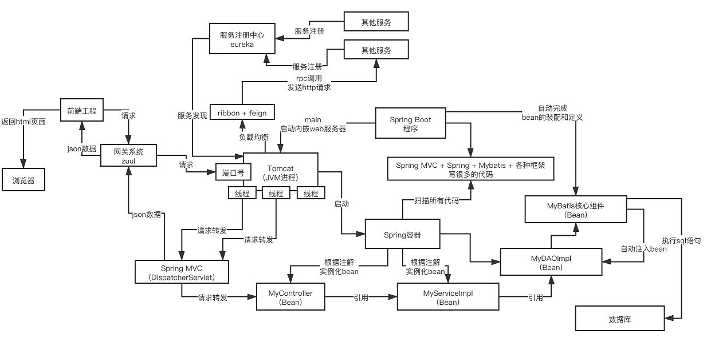
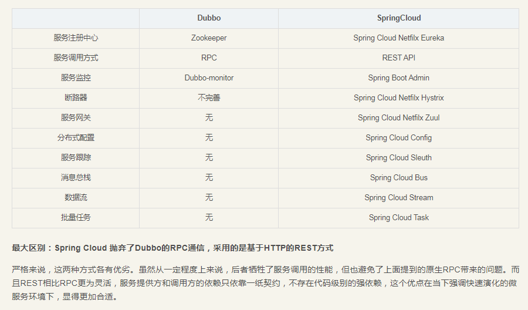

## 核心组件

### 1.Eureka
* 是微服务架构中的注册中心，专门负责服务的注册与发现。  
* Eureka Client组件： 每个服务中都有一个Eureka Client组件，负责将服务的信息注册到Eureka Server中，即告诉Eureka Server自己在哪台服务器上监听着哪个端口，  
* Eureka Server： 是注册中心，里面有一个注册表，保存了各个服务所在的机器和端口号。  
* 各服务内的Eureka Client组件默认情况下，每隔30秒会发送一个请求到Eureka Server，来拉取最新有变化的服务信息。  
* 心跳机制，Eureka默认每隔30秒发送一次心跳，通知Eureka Server，当前服务还活着。  

```
    <groupId>org.springframework.cloud</groupId>
    <artifactId>spring-cloud-starter-eureka</artifactId>
	
//主启动类加上@EnableEurekaClient注解，开启Eureka
  
//代表内存注册表的类
public abstract class AbstractInstanceRegistry implements InstanceRegistry {
	private final ConcurrentHashMap<String, Map<String, Lease<InstanceInfo> > >  registry = new ConcurrentHashMap<String, Map<String, Lease<InstanceInfo> > >();
}
//ConcurrentHashMap中的key，是String类型，表示服务名称，比如"inventory-service"(库存服务)，value表示了一个服务的多个实例。 inventory-service可以有3个服务实例，每个实例部署在一台服务器上
//Map中的key，也是String类型，表示服务实例的id，value中的类Lease的泛型InstanceInfo表示了服务实例的具体信息，包含了机器的主机名、ip地址、端口号等。Lease类里面维护了每个服务最近一次发送心跳的时间

```

* 多级缓存机制 避免同时读写内存造成的并发冲突问题    
> 拉取注册表时（即读）  
>> 1. 首先从ReadOnlyCacheMap里查缓存的注册表，  
>> 2. 若没有再从ReadWriteCacheMap缓存中的注册表，  
>> 3. 还没有，就从内存中获取实际的注册表数据  

> 注册表发生变更时（即写）  
>> 1. 在内存中更新变更的注册表数据，同时过期掉ReadWriteCacheMap，（此过程不会影响ReadOnlyCacheMap提供别的服务读取注册表信息）  
>> 2. 一段时间内（默认30秒），各服务拉取注册表会直接读取ReadOnlyCacheMap，  
>> 3. 30秒后，Eureka发现ReadWriteCacheMap被清空了，就会清空ReadOnlyCacheMap中的缓存，  
>> 4. 下次有服务拉取注册表时，会从内存中直接获取最新的数据，同时填充各个缓存。  
  
  保证的是AP，即满足可用性和分区容错性。  

### 2.Feign
```
    <groupId>org.springframework.cloud</groupId>
    <artifactId>spring-cloud-starter-feign</artifactId>
```
使用 @FeignClient 注解来指定提供者的名字  
使用动态代理机制，根据@RequestMapping等注解，动态构造出要请求的服务的地址。  
  
feign底层是使用了ribbon作为负载均衡的客户端，而ribbon的负载均衡也是依赖于eureka获得各个服务的地址，从Euraka本地的缓存列表里获取一台服务器，负载均衡，把请求直接用HTTP通信框架发送到指定机器上去。  
将ribbon的REST风格调用方式封装为接口调用方式

```
问题： cannot retry due to redirection, in streaming mode executing POST http://jczx-web/imChat/sendChatMessage
/imChat/sendChatMessage有权限认证
```

### 3.Ribbon
```
    <groupId>org.springframework.cloud</groupId>
    <artifactId>spring-cloud-starter-ribbon</artifactId>
```
Ribbon会从Eureka Client获取对应的服务注册表，也就知道了所有的服务都部署在哪些机器上，在监听哪些端口号，  
然后轮询算法，均匀的把请求分发到各个机器上(运行在消费者端)，实现负载均衡。  

### 4.Hystrix
```
<!--Hystrix依赖-->
<dependency>
    <groupId>org.springframework.cloud</groupId>
    <artifactId>spring-cloud-starter-hystrix</artifactId>
    <version>1.4.6.RELEASE</version>
</dependency>
<!--Dashboard流监控依赖-->
<dependency>
    <groupId>org.springframework.cloud</groupId>
    <artifactId>spring-cloud-starter-hystrix-dashboard</artifactId>
    <version>1.4.6.RELEASE</version>
</dependency>
```

是隔离、熔断、降级的框架  
隔离：创建多个线程池，不同的服务走不同的线程池，避免服务雪崩  
熔断：A服务调用B服务，B服务挂掉了，设置一段时间内请求B服务时直接返回，不必等待网络请求卡住无法响应。  
降级：熔断之后，可先记录一下要做的B服务（以便后续补充服务），即没完成本来的任务只能降级完成相对简单低级的任务。  

熔断相关参数：滑动窗口大小(20)、熔断器开关间隔(5s)、错误率(50%)   
每当20个请求中有50%失败，熔断器就会打开，次数再调用服务，就会直接返回失败，不再调远程服务；  
直到5秒钟之后，再重新检测触发条件，判断是否把熔断器关闭或者继续打开。  

### 5.Zuul
```
	<groupId>org.springframework.cloud</groupId>
	<artifactId>spring-cloud-starter-zuul</artifactId>
```
微服务网关，负责网络路由，所有请求都往网关走，网关根据请求中的一些特征，将请求转发给后台的各个服务。  
好处很多，可以做统一的降级、限流、认证授权、安全等。  
  
 *Feign和Zuul*  
Zuul是对外暴露的唯一接口，相当于路由的controller的请求，而Ribbon和Feign路由了Service的请求；  
Zuul做为外层的负载均衡，而Ribbon和Feign做的是系统内部各个微服务的Service的调用的负载均衡。  

### 6.Config
```
<!--Config服务端依赖-->
	<groupId>org.springframework.cloud</groupId>
	<artifactId>spring-cloud-config-server</artifactId>
<!--Config客户端依赖-->
	<groupId>org.springframework.cloud</groupId>
    <artifactId>spring-cloud-starter-config</artifactId>
```
将各个应用/系统/模块的配置文件存放在同一的地方然后进行管理  

### 7.Bus  
管理和广播分布式系统中的消息，是用于将服务和服务实例与分布式消息系统链接在一起的事件总线。  

### SpringCloud架构
  

### Dobbo VS SpringCloud
  

### REST VS RPC
|  比较项  | REST  |  RPC  |
| -------- | :---: | :----:|
| 协议     |  HTTP |   TCP |
| 性能     |   低  |   高  |
| 灵活度   |   高  |   低  |


### 优质博客
[史上最简单的 SpringCloud 教程](https://forezp.blog.csdn.net/article/details/70148833)

  
  
## Spring Cloud Alibaba

### Nacos
注册配置中心

#### 功能组件
分为Server和Client

#### Server  
由Java编写，管理注册服务，向Client提供服务列表，保存并提供Client配置信息，服务治理功能  

#### Client(项目模块,如AppService)
可由多种语言编写，注册自身服务，获取服务列表，获取配置信息，维持心跳信息  

#### 注册中心原理
Client每5秒向Server发送一次心跳，心跳带上服务名、ip、端口号等信息；同时Server主动发起健康检查，15没收到心跳视为实例不健康，30秒就剔除这个实例  

#### 配置中心原理  


spring-cloud-starter-alibaba-nacos-discovery包中集成了Ribbon，在RestTemplate的Bean中加上注解@LoadBalance，可以做到服务发现与负载均衡，实现调用其他模块的接口；  
也可用feign实现(达到以调用接口的形式调用)，feign的内部实现就是Ribbon

### Sentinel
可实现降级、熔断，功能类似于Hystrix，还记录了QPS
feign.sentinel.enabled=true  在feign中开启对Sentinel的支持，实现降级处理；  
Feign中的接口上声明fallback属性指向定义的类@Feign(value="app-Service", fallback=CreditServiceFallback.class),  
类中重写接口的方法，实现远程调用接口出错时来实现定义的CreditServiceFallback类中的降级处理业务
  
和Nacos一样也有页面支持，可在线操作

### Seata  
微服务分布式事务解决方案 
@GlobalTransactional

全局锁，保证强一致，用的较少


