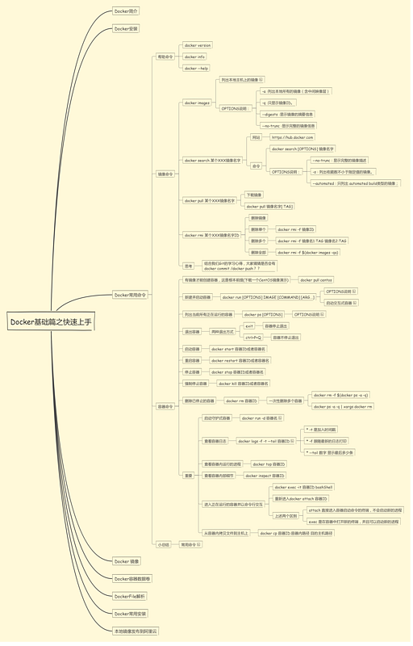

# Docker
---  
title: Docker
date: 2020-10-01
tags: tag1
categories: Docker
---  

软件容器平台  
- 可以将一整套环境打包成镜像，无需重复配置环境，解决环境带来的种种问题。  

- Docker容器之间是进程隔离的，互不影响。

- 容器通过镜像运行起来，仓库专门存放镜像的。

### 容器和虚拟机
容器：是应用层的，将代码和依赖资源打包在一起，多个容器可以在同一台机器上运行，占用空间较少、瞬间就能完成启动。
虚拟机：是物理硬件层的，将一台服务器变成多台服务器，多个虚拟机可以在同一台机器上运行，一个虚拟机包含一整台操作系统，占用大量空间、启动较慢。

### 运行
docker run hello-world  
打印了Hello from Docker！   
  
命令指示docker运行hello-world这个镜像，如果本地没有，就去远端镜像仓库拉取一份hello-world镜像，并生成容器（镜像运行的实例）运行起来，这个实例功能只打印了一句话：Hello from Docker！  

### 常用命令

