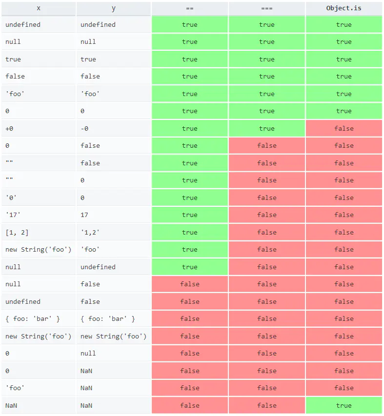
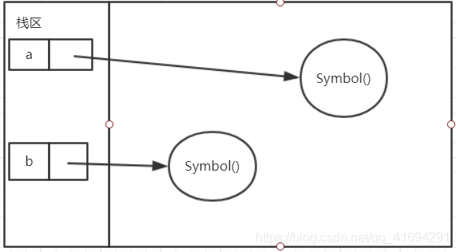
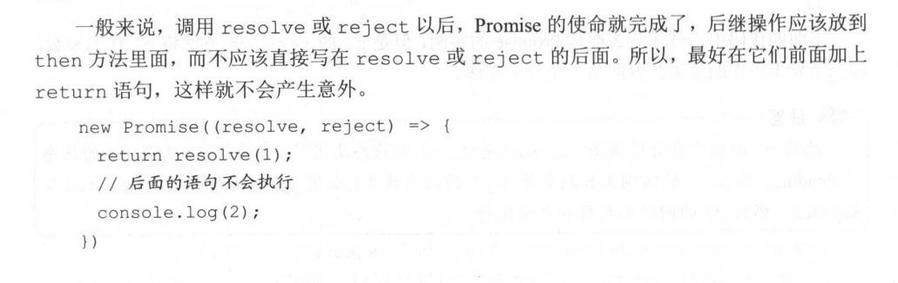

## let 和 const

> let与var相比，只在当前代码块有效，且同一个代码块中(块级作用域也是ES6新增的)不能被重复声明，必须先声明、再使用

> const关键字：用于声明一个或多个常量，声明时必须初始化；不是真正的常量，可以对常量==对象==的属性进行新增、修改，但不能对对象重新赋值；const和let的作用域一样，只在声明所在的块级作用域有效，    

## 块级作用域

在块级作用域没有返回值，在前面加do，可变成do表达式，将作用域的值返回
```js
let x = do { 
    let t = f () ; 
    t * t + l; 
};
```

## 顶层对象
顶层对象在浏览器环境中指的是window对象，在node环境中指的是global对象。  
ES6之前，顶层对象的属性与全局变量的属性是等价的

```js
window.a = 1;
console.log(a); // 1

var b = 2;
console.log(window.b); // 2
```
ES6将顶层对象的属性和全局变量的属性区分开来了
```
let c = 3;
console.log(window.c); // undefined 
```

## 变量解构赋值

数组、对象、字符串、数值、布尔值、函数的参数都可以进行解构赋值  

使用场景：  
  // 交换变量的值
``` js
  let x = 1;
  let y = 2;
  [x, y] = [y, x];
```
  // 函数返回一个数组
```js
  function example() {
    return [1, 2, 3];
  }
  let [a, b, c] = example();
```
  // 函数返回一个对象
```js
  function example() {
    return {
      foo: 1,
      bar: 2
    };
  }
  let { foo, bar } = example();
```
  // 提取 JSON 数据
```js
  let jsonData = {
        id: 42,
        status: "OK",
        data: [867, 5309]
	};

  let { id, status, data: number } = jsonData;
  console.log(id, status, number);
  // 42, "OK", [867, 5309]
```
  // 遍历 Map 结构
```js
  const map = new Map();
  map.set('first', 'hello');
  map.set('second', 'world');

  for (let [key, value] of map) {
    console.log(key + " is " + value);
  }
  // first is hello
  // second is world

如果只想获取键名，或者只想获取键值，可以写成下面这样。
  // 获取键名
  for (let [key] of map) {
    // ...
  }

  // 获取键值
  for (let [,value] of map) {
    // ...
  }
```
解构赋值获取字符串长度：类似数组的对象都有一个 length 属性 因此还可以对这个属性进行解构赋值
```js
let {length : len} = 'hello'; 
console.log(len);  // 5
```
### 对象扩展和新增方法
1. 对象的属性可以直接写变量
```js
const name = "VAQ";
const age = 18;
  
const person2 ={
    name:name,
    age:age
}
// 可简写为
const person1 = {name,age};//属性名是变量名，属性值是变量值
```
2. 表达式可以作为属性名，但是表达式必须放在方括号内
```js
const person = {
    ["say"+"Hi"](){
      console.log("Hi");}
};
person.sayHi();

```

## 字符串的扩展
1. 字符Unicode的表示法
2. codePointAt()
3. String.fromCodePoint()
4. 字符串也可以用for...of循环遍历
5. at()
6. normalize()
7. 
```js
var s = 'Hello world!';
s.startsWith('Hello') // true 
s.endsWith('!') // true 
s.includes('o') / / true
```
8. repeat(n); 返回一个新字符串，表示将原字符串重复n次
9. padStart()、 padEnd() 补全  
10. String.raw()   返回一个反斜线都被转义的字符串

==模板字符串==

```
用反引号(`)包裹的字符串，里面可以是一行或多行字符串，可以嵌入变量${name}，可以嵌入函数${fn()}
```
## 正则表达式的扩展

## 数值对象Number的扩展
二进制：前缀0b或者0B  
八进制：前缀0o或者0O  
Number.isFinite()检查数值是否有限  
Number.isNaN()
ES6 全局方法 parseInt()和 parseFloat()移植到了 Number 对象上面  
Number.isInteger(n); 判断n是否为整数，n=1.0也会返回true

## Math对象的扩展

Math.trunc(); 去除小数部分  
Math.sign(); 判断跟0的大小比较关系  
Math.cbrt(); 计算一个数的立方根  
Math.cypot(); 返回所有参数的平方和的平方根  
Math.log10(x); 返回以10为底x的对数  
Math.log2(x); 返回以2为底x的对数 

`指数运算符：a**b，表示a的b次方 eg: 2**3的值为8`

## 函数的扩展

参数可以设置默认值  
函数的length属性，返回没有指定默认值的参数的个数，并且不包括rest参数  
rest参数（形式为...参数名)，变量是个数组，用rest参数，就不需要arguments对象了  
rest参数只能放在参数的最后一个位置  
```js
// arguments 变量的写法
function sortNumbers() { 
	return Array.prototype.slice.call(arguments).sort()
}; 
// rest 参数的写法
const sortNumbers = (...numbers) => numbers.sort();
```
### 箭头函数 
简写了函数的写法，省略了function，`{`用`=>`代替了
```js
var f = v => v;
//等同于
var f = function(v){
      return v;
}
var sum = (num1,num2) => num1+num2 ;
//等同于
var sum = function(num1,num2){
      return num1+num2
}
```
箭头函数的代码块多于一条语句，就必须用`{}`括起来，并且最后用return语句返回  
箭头函数中的this对象，指的是定义时的当前对象，而不是使用时的外部对象；  
箭头函数不能当做构造函数  
箭头函数不能使用arguments对象  
箭头函数不可以使用yield命令，所以不能用作Generator函数    

函数绑定运算符：双冒号(::)，obj::fn 左边是对象，右边是函数，会将左边的对象作为上下文环境绑定到右边的函数上

## 数组的扩展
###  扩展运算符

三个点名为扩展运算符，会将一个数组转为用逗号分隔的参数序列。它如同rest参数的逆运算

```js
obj = {age:18}
obj2 = {name:'vaq',...obj,qq:'863'} // ...obj相当于将obj的属性展开放在obj2中 
```
### 数组方法

Array.from();  //将类似数组的对象或可遍历的对象（包括set、map）转为真正的数组  
Array.of(a,b,c); // 将一组数转为数组  
copyWithIn(); // 将数组指定位置的成员复制到其他位置（会覆盖原有成员）然后返回当前数组  
find(); //找出第一个符合条件的数组成员，都不符合条件则返回undefined，参数是个函数  
find(); //找出第一个符合条件的数组成员的位置，都不符合条件则返回-1，参数是个函数  
fill(); //填充数组  
entires()、keys()、values() 用于数组的遍历  
includes(); // 是否包含给定的值  

## 对象的扩展
> 对象中可以只写属性名，不写属性值，这时属性值等于属性名所代表的变量 

==方法的简写==  

```js

var m = ( 
	method(){
		return "hello"; 
	}
);
／／等同于
var m = ( 
	method: function(){
		return "hello";
	}
);
```
==属性名==：新增了可以用表达式或者参数作为变量名，放在方括号内

```js
obj.age  =  18;
obj['na'+'me'] = 'VAQ';
```
==Object.is()方法==
Object.is方法和===的区别



==Object assign();== 
将源对象属性**浅复制**到目标对象

==对象的属性可枚举、可遍历==

>遍历对象属性的5种方法
>1. for..in  // 专门为遍历对象设计的，遍历的键是字符串"0","1","2"...
>2. Object.keys(obj)
>3. Object.getOwnPropertyNames (obj)
>4. Object.getOwnPropertySymbols (obj)
>5. Reflect.ownKeys(obj)

_proto_属性
用来读取或设置对象的prototype对象
Object .setPrototypeOf(); 功能同_proto_属性的设置对象的prototype对象  
Object.getPrototypeOf(); 用来读取对象的prototype对象
Object.getOwnPropertyDescriptors(); 返回某个对象属性的描述对象

==Null传导运算符==
符号为?.一个问号一个点

obj? .prop表示如果obj不为null，则获取它的prop属性

> 4种用法
>
> obj?.prop ：读取对象属性
>
> obj?.[expr］：同上
>
> func?.( ... args ）：函数或对象方法的调用
>
> new C?.( ... args ：构造函数的调用


## Symbol

是ES6为JavaScript添加的第7中基本数据类型，表示一个独一无二的值。  
const a = Symbol(); // 创建一个Symbol的值，不能用new关键字  



## Set

Set是ES6新增的数据结构，一个Set对象可以存放任意类型的值，无论是原始值还是对象的引用；   

Set的值不能重复  

==Set和Array类型转换==
```js
// Array 转 Set
var mySet = new Set(["value1", "value2", "value3"]);
// 用...操作符，将 Set 转 Array
var myArray = [...mySet];
String
// String 转 Set
var mySet = new Set('hello');  // Set(4) {"h", "e", "l", "o"}
// 注：Set 中 toString 方法是不能将 Set 转换成 String
```

==Set对象主要作用： 数组去重==
```js
var mySet = new Set([1, 2, 3, 4, 4]);
[...mySet]; // [1, 2, 3, 4]
```
==Set的遍历==

keys()、values()、entires()、forEach()

Se默认的遍历器生成函数就是values()方法，说明values()可省略  

```js
let set = new Set([’red’,’green’,’blue’]);
for(let item of set) {  // 等同于for(let item of set.values()){
	console.log(item);
}
// red 
// green 
// blue
```

结构实例的forEach方法用于对每个成员执行某种操作，没有返回值。

```js
let set = new Set ([1, 2, 3]) ; 
set.forEach((value,key) => console.log(value * 2)) 
// 2 
// 4 
// 6
```


## WeakSet

结构同Set一样，且不可重复

与Set的区别：1. 只能存对象；2. WeakSet 中的对象都是弱引用，即垃坡回收机制不考虑 WeakSet 对该对象的引用，

也就是说，如果其他对象都不再引用该对象，那么垃圾回收机制会自动回收该对象所占用的内存，不考虑该对象是否还存在于 WeakSet 之中；3. 不能遍历

## Map

==Map创建、赋值==
```js
// Map的键可以是字符串、对象、函数、NaN
Map m = new Map();
m.set(key,value);
m.get(key);
```
==Map的遍历==

1. for...of 
```js
// 
for (var [key, value] of myMap) {
  console.log(key + " = " + value);
}

// entries()方法返回迭代器iterator，包含了有序的每个元素的[key,value]数组
for (var [key, value] of myMap.entries()) {
  console.log(key + " = " + value);
}

// 遍历key
for (var key of myMap.keys()) {
  console.log(key);
}

// 遍历value
for (var value of myMap.values()) {
  console.log(value);
}
```
2. forEach() 
```js
myMap.forEach(function(value, key) {
          console.log(key + " = " + value);
      }, myMap)

```
==Map与二维数组转换==
```js
var kvArray = [["key1", "value1"], ["key2", "value2"]];
 
// Map 构造函数可以将一个 二维 键值对数组转换成一个 Map 对象
var myMap = new Map(kvArray);
 
// 使用 Array.from 函数可以将一个 Map 对象转换成一个二维键值对数组
var outArray = Array.from(myMap);
```
==Map的克隆==
```js
Map map1 = new Map([[key1,value1],[key2,value2]]);  
Map map2 = new Map(map1);
```
==Map的合并==
```js
var first = new Map([[1, 'one'], [2, 'two'], [3, 'three'],]);
var second = new Map([[1, 'uno'], [2, 'dos']]);
 
// 合并两个 Map 对象时，如果有重复的键值，则后面的会覆盖前面的，对应值即 uno，dos， three
var merged = new Map([...first, ...second]);
```
==.map(fun ); 方法==
返回一个新数组，数组中的元素为原始数组调用函数处理后的值

```js
const a = [1,2,3].map(function (x) {
      return x * x;
});
console.log(a); // Array [1, 4, 9]
```

==Map转为对象==

```js
for(let [k,v] of strMap){
	obj[k]=v;
}

```

==对象转为Map==

```js
for(let k of Object.keys(obj)){
	strMap.set(k,obj[k]);
}
```


==Map转为JSON==

```js
JSON.stringify(strMapToOb](strMap}); //Map的键都是字符串时，可转为对象JSON

JSON.stringfy([...map]); //Map的键有非字符串时，可转为数组JSON
```

==JSON转为Map==

```js
JSON.parse(jsonStr); 
```

### WeakMap

### Map和Object的区别

1. Map是键值对形式的对象，任何值（对象或者原始值）都可以作为一个键或者值；Object的键只能是字符串或者Symbols  
2. Map有序；Object无序  
3. Map的键值对个数可以通过size方法获取；Object不能


## Proxy 

Proxy 可以理解成在目标对象前架设 个“拦截”层 ，外界对该对象的访问都必须先通过这层拦截，因此提供了一种机制可以对外界的访问进行过滤和改写。

### 使用 Proxy 实现观察者模式
关键是observable和observe两个方法
```js
    const person = observable({name: '张三',age: 20}); 

    function print() { 
        console.log(`${person.name}, ${person.age}`)
    }

    observe(print);

    person.name='李四'; // 当执行此句时会打印李四，20
```

## Reflect

1. Object 对象的一些明显属于语言内部的方法（比如 Object defineProperty)放到 Reflect 对象上。
2. 修改某些 Object 方法的返回结果，让其变得更合理。比如，Object,defineProperty(obj , name , desc )在无法定义属性时会抛出 个错误，而Reflect.defineProperty(obj , name , desc )则会返回 false

## Promise
> 
是个异步编程的一种解决方案，Promise对象代表一个异步操作，Promise对象有三种状态：未完成Pending、成功Resolved、失败Rejected；  
状态不受外界影响；  
状态一旦改变就不能再变；  
一旦执行就无法取消  

fetch的返回值就是一个Promise对象

```js
var promise= new Promise(function(resolve,reject) { 
                        // ... some code 
                        if(／＊异步操作成功＊／){
                            resolve(value);//将状态从Pending变为Resolved
                        } else { 
                            reject(error);//将状态从Pending变为Rejected
                        }
                      }
     				); 
// Promise构造函数接受一个函数作为参数，该函数的两个参数分别是resolve和reject
```
对于resolve和reject函数，reject函数的参数一般是Error对象的实例，resolve函数的参数除了正常的值外，还可以是另外的Promise实例


### Promise.prototype.then()
then(a,b)方法第一个参数是Resolved状态的回调函数（即当前promise实例状态改为Resolved后会调用该函数），第二个参数(可选)是Rejected的回调函数
then()方法返回的是个新的Promise实例，可采用链式写法，then后面再继续调用then

### Promise.prototype.catch()	
相当于.then(null,rejection)，用于指定发生错误时的回调函数，还能捕捉到前面.then抛出的错误，建议用.catch而不是.then(null,rejection);  
.catch方法返回的还是一个Promise对象，因此后面还可以继续调用.then方法

### Promise.prototype.finally()
不管怎样都会执行
### Promise.try()
try()里面是个函数，函数里可以调用其他函数，try代码块里调用的异步函数会异步执行、同步函数会同步执行，出错时都能被捕获到
通常写法Promise.try(...).then(...).catch(...)

### Promise.all(p1,p2,p3)
将多个Promise实例包装成一个新的Promise实例

## Iterator

遍历器为所有的数据结构提供一种统一的访问机制，即用for...of   

for...of用于遍历同步的Iterator接口；for await ...of用于遍历异步的Iterator接口  

数组、Set的解构赋值、扩展运算符(...)内部都会调用iterator接口  

对象的遍历不能用for...of，for...of是可以和break、continue、return配合使用的

## Generator 函数异步编程

Generator函数相对于普通函数多了两个特征：  
1. function关键字和函数名之间多了个*  
2. 内部使用了yield表达式，用于定义Generator函数的每个状态。   
>普通函数在被调用时会立即执行，而Generator函数不会立即执行，而是会返回遍历器对象（Iterator对象），通过遍历器对象的next()方法来遍历内部的yield表达式定义的每个状态
```js
function *ge1() {
	yield 'Hello'
	yield 'world'
	return 'ending'
}

let MG = ge1()

MG.next() // {value:'Hello',done:false}
MG.next() // {value:'world',done:false}
MG.next() // {value:'ending',done:true}
MG.next() // {value:'undefined',done:true}
MG.next() // {value:'undefined',done:true}
```
第一次调用Generator函数开始执行，直到遇到第一个yield表达式为止，next方法返回一个对象，value是yield的当前的值，done为false表示遍历还没结束；第二次调用Generator函数会从上次调用停止的地方继续运行，直到下一个yield或者return或者到函数结束。
next方法可以传参，参数表示上一条yield语句的返回值，但是在第一次调用next方法传参是无效的，第二次调用才有效。第一次调用next方法是用来启动遍历器对象，所以不用带参数。

==next传参使得Generator函数能够和外界进行数据交换==

==for...of循环可以自动遍历Generator函数生成的Iterator对象，并且此时不用再调用next方法==

yield后面跟遍历器对象时，需要加上*，yield* 遍历器对象  
yield后只能是Thunk函数或Promise对象  
任何数据结构，只要有Iterator接口，就能被yield*遍历  

## async、await 异步编程
async函数就是Generator函数的语法糖，相当于对Generator函数的改进，用法 将Generato 函数的星号（*替换成 async ，将 yield替换成 await）  
async表示函数里有异步操作，返回值是个Promise对象；await表示需要等待结果，await后跟Promise对象（也可以跟原始类型的值，就等同于同步操作了）  
**async函数内部return返回的值，会成为.then回调函数的参数；内部抛出错误，也会作为参数被.catch回调函数接收到**

### async 函数的多种使用形式

```js
// 函数声明
async functioηfoo () {} 

// 函数表达式
con st foo = a sync function () {}; 

//对象的方法
let obj = { async foo () {} } ; 
obj.foo().then( ... ) 

// Class 的方法
class Storage { 
constructor () { 
    this.cachePromise = caches.open ('avatars'); 
    async getAvatar(name) { 
        const cache = await this.cachePromise; 
    	return cache .match(`/avatars/${name}.jpg`);
    }
}
const storage= new Storage(); 
storage.getAvatar('jake').then(...); 

//箭头函数
const foo = async() => {} ;
```
### async函数的注意点
1. await命令最好放在try...catch代码块中
```js
try{
	await fun();
}catch(err){
	console.log(err);
}
// 或
await fun().catch(err){console.log(err);}
```
2. 多个await命令的同时触发问题
```js
await getFoo(); 
await getBar();
// 这样会依次执行，不能同时触发
// 优化一
await Promise.all([getFoo(), getBar()]) ;
// 优化二
let fooPromise = getFoo(); 
let barPromise = getBar(); 
await fooPromise; 
await barPromise;
```

## class的用法

`prototype `、`_proto_`、`Object.setPrototypeOf()`、`Object.getPrototypeOf()`

### `_proto_`

```
Point p1 = new Point();
Point p2 = new Point();
```

p1、p2是Point的实例，他们的原型是`Point.prototype`，他们的原型对象是`p._proto_`
两个实例的原型对象一样的，说明可以通过`_proto_`为类添加属性、方法，但这是厂商私自添加的属性，不建议使用，可使用`Object.getPrototypeOf`来获取实例的原型，再为原型添加属性、方法


一般方法或属性前面有下划线`_`，表示这是仅限于内部使用的

## export default

export导出  
用于对外输出当前文件中的变量、函数；  
一个文件中export可以有多个，export相当于导出一个属性，可以在import中直接使用(name)；export default必须只有一个，相当于一个对象，在import中用对象.属性/函数的方式使用(obj.name)      
import导入  
对声明了export的文件导入进行使用；通过export方式导出的，需要加{}，export default方式导出的不需要加{}

## 编程风格
不用var，用let替代  
全局环境中，let和const，优先使用const  
字符串使用单引号，不使用双引号  
优先使用解构赋值  
单行定义的对象不以逗号结尾，多行定义的对象以逗号结尾  
使用扩展运算符复制数组，使用Array.from()将类似数组的对象转为数组  
使用import取代require

## Other

### ES6声明变量的6种方法
ES6之前，var、function声明；ES6又新增了let、const、import、class

### forEach方法
无法中途跳出， break 命令或 return 命令都不能奏效。


