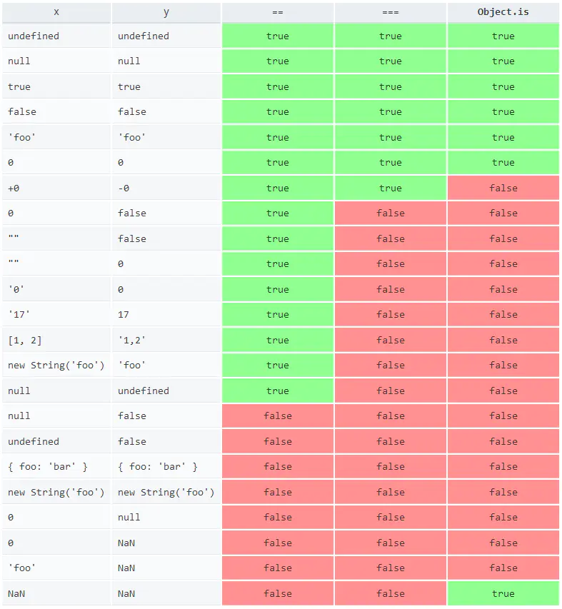

## export default  
export导出  
用于对外输出当前文件中的变量、函数；  
一个文件中export可以有多个，export相当于导出一个属性，可以在import中直接使用(name)；export default必须只有一个，相当于一个对象，在import中用对象.属性/函数的方式使用(obj.name)      
import导入  
对声明了export的文件导入进行使用；通过export方式导出的，需要加{}，export default方式导出的不需要加{}

## let 和 const

ES6后的let相对于var，只在当前代码块有效，且同一个代码块中不能被重复声明，必须先声明、再使用

const关键字：用于声明一个或多个变量，声明时必须初始化；不是真正的常量，可以对常量对象的属性进行新增、修改，但不能对对象重新赋值    

## 变量解构赋值

数组、对象、字符串、数值、布尔值、函数的参数都可以进行解构赋值  

使用场景：
// 交换变量的值
``` js
  let x = 1;
  let y = 2;
  [x, y] = [y, x];
```
  // 返回一个数组
```js
  function example() {
    return [1, 2, 3];
  }
  let [a, b, c] = example();
```
  // 返回一个对象
```js
  function example() {
    return {
      foo: 1,
      bar: 2
    };
  }
  let { foo, bar } = example();
```
  // 提取 JSON 数据
```js
  let jsonData = {
        id: 42,
        status: "OK",
        data: [867, 5309]
	};

  let { id, status, data: number } = jsonData;
  console.log(id, status, number);
  // 42, "OK", [867, 5309]
```
  // 遍历 Map 结构
```js
  const map = new Map();
  map.set('first', 'hello');
  map.set('second', 'world');

  for (let [key, value] of map) {
    console.log(key + " is " + value);
  }
  // first is hello
  // second is world

如果只想获取键名，或者只想获取键值，可以写成下面这样。
  // 获取键名
  for (let [key] of map) {
    // ...
  }

  // 获取键值
  for (let [,value] of map) {
    // ...
  }
```

### 对象扩展和新增方法
1. 对象的属性可以直接写变量
```js
const name = "VAQ";
const age = 18;
  
const person2 ={
    name:name,
    age:age
}
// 可简写为
const person1 = {name,age};//属性名是变量名，属性值是变量值
```
2. 表达式可以作为属性名，但是表达式必须放在方括号内
```js
const person = {
    ["say"+"Hi"](){
      console.log("Hi");}
};
person.sayHi();

```

### Symbol

是ES6为JavaScript添加的第7中基本数据类型，表示一个独一无二的值。  
const a = Symbol(); // 创建一个Symbol的值，不能用new关键字  


### Set

一个Set对象可以存放任意类型的值，无论是原始值还是对象的引用；   

Set的值不能重复  

==Set和Array类型转换==
```js
// Array 转 Set
var mySet = new Set(["value1", "value2", "value3"]);
// 用...操作符，将 Set 转 Array
var myArray = [...mySet];
String
// String 转 Set
var mySet = new Set('hello');  // Set(4) {"h", "e", "l", "o"}
// 注：Set 中 toString 方法是不能将 Set 转换成 String
```

==Set对象主要作用： 数组去重==
```js
var mySet = new Set([1, 2, 3, 4, 4]);
[...mySet]; // [1, 2, 3, 4]
```
### Map

==Map创建、赋值==
```js
// Map的键可以是字符串、对象、函数、NaN
Map m = new Map();
m.set(key,value);
m.get(key);
```
==Map的遍历==

1. for...of 
```js
// 
for (var [key, value] of myMap) {
  console.log(key + " = " + value);
}

// entries()方法返回迭代器iterator，包含了有序的每个元素的[key,value]数组
for (var [key, value] of myMap.entries()) {
  console.log(key + " = " + value);
}

// 遍历key
for (var key of myMap.keys()) {
  console.log(key);
}

// 遍历value
for (var value of myMap.values()) {
  console.log(value);
}
```
2. forEach() 
```js
myMap.forEach(function(value, key) {
          console.log(key + " = " + value);
      }, myMap)

```
==Map与二维数组转换==
```js
var kvArray = [["key1", "value1"], ["key2", "value2"]];
 
// Map 构造函数可以将一个 二维 键值对数组转换成一个 Map 对象
var myMap = new Map(kvArray);
 
// 使用 Array.from 函数可以将一个 Map 对象转换成一个二维键值对数组
var outArray = Array.from(myMap);
```
==Map的克隆==
```js
Map map1 = new Map([[key1,value1],[key2,value2]]);  
Map map2 = new Map(map1);
```
==Map的合并==
```js
var first = new Map([[1, 'one'], [2, 'two'], [3, 'three'],]);
var second = new Map([[1, 'uno'], [2, 'dos']]);
 
// 合并两个 Map 对象时，如果有重复的键值，则后面的会覆盖前面的，对应值即 uno，dos， three
var merged = new Map([...first, ...second]);
```
==.map(fun ); 方法==
返回一个新数组，数组中的元素为原始数组调用函数处理后的值

```js
const a = [1,2,3].map(function (x) {
      return x * x;
});
console.log(a); // Array [1, 4, 9]
```

#### Map和Object的区别

1. Map是键值对形式的对象，任何值（对象或者原始值）都可以作为一个键或者值；Object的键只能是字符串或者Symbols  
2. Map有序；Object无序  
3. Map的键值对个数可以通过size方法获取；Object不能


### Promise & async / await 异步编程
fetch的返回值是一个Promise对象


### Generator 函数异步编程
Generator函数相对于普通函数多了两个特征：1.function关键字和函数名之间多了个*，2.内部使用了yield表达式，用于定义Generator函数的每个状态。  
普通函数在被调用时会立即执行，而Generator函数不会立即执行，而是会返回遍历器对象（Iterator对象），通过遍历器对象的next()方法来遍历内部的yield表达式定义的每个状态
```js
function *ge1() {
	yield 'Hello'
	yield 'world'
	return 'ending'
}

let MG = ge1()

MG.next() // {value:'Hello',done:false}
MG.next() // {value:'world',done:false}
MG.next() // {value:'ending',done:true}
MG.next() // {value:'undefined',done:true}
MG.next() // {value:'undefined',done:true}
```
第一次调用Generator函数开始执行，直到遇到第一个yield表达式为止，next方法返回一个对象，value是yield的当前的值，done为false表示遍历还没结束；第二次调用Generator函数会从上次调用停止的地方继续运行，直到下一个yield或者return或者到函数结束。

###  ...obj

三个点名为扩展运算符

```js
obj = {age:18}
obj2 = {name:'vaq',...obj,qq:'863'} // ...obj相当于将obj的属性展开放在obj2中 
```

### find方法
```js
theDataList.find((item) => {
          if(item.name == "m3"){
            this.models.model.sampleVolumeUnit = item.itemId;
          }
        });
// find会遍历theDataList数据，返回第一个符合条件的值，没有则返回undefined
```

### 箭头函数  
简写了函数的写法，省略了function，`{`用`=>`代替了
```js
var f = v = > v;
//等同于
var f = function(v){
      return v;
}
var sum = (num1,num2) => num1+num2 ;
//等同于
var sum = function(num1,num2){
      return num1+num2
}
```
箭头函数中的this对象，指的是定义时的当前对象，而不是使用时的外部对象；  
箭头函数不能当做构造函数  
箭头函数不能使用arguments对象  
箭头函数不可以使用yield命令，所以不能用作Generator函数  


### Object.is方法和===的区别


