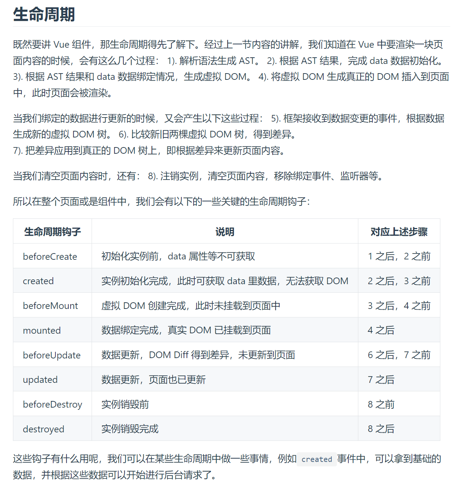

### 生命周期
也叫钩子函数，即从创建到销毁所触发的函数，共8个

#### 1. beforeCreate(); //实例被创建之前
data和method的数据和方法都还没有被初始化

#### 2. created();  //实例创建完成
data和method的数据和方法已经被创建好了

全局vue.js不强制刷新或者重启时只创建一次，也就是说，created()只会触发一次

#### 3. beforeMount();  //挂载之前
模板已经在内存中编译完成了，但是尚未把数据模板渲染到页面上，还不能获取dom元素

#### 4. mounted();  //挂载完成
内存的模板已经挂载到页面中了（已通过虚拟DOM生成真正的DOM插入到页面中），用户可以看到渲染好的页面

#### 5. beforeUpdate();  
执行当前方法时，页面显示的数据是旧的，data中的数据是最新的，即页面尚未和最新数据保持同步

#### 6. update();  
执行时，页面和数据保持同步，都是最新的

#### 7. beforeDestroy();
销毁之前

#### 8. destroy();  
销毁了



#### 4.5 activated();
只有被包含在`<keep-alive>`中创建的组件，才会有activated()方法；
`<keep-alive>`会将最新的数据保留在内存中，如果每次进入页面需要获取最新的数据，需要在activated()里获取数据，承担在create()获取数据的任务


### 钩子函数created和mounted的区别
created：在模板渲染成HTML前调用，通常是初始化某些属性值，然后再渲染视图
mounted：官方解释：el被新创建的vm.$el替换，并挂载到实例上去，之后调用该钩子。即在模板渲染成HTML后调用，通常是初始化页面完成后，对HTML的节点进行一些需要的操作

### Vue.config.productionTip = false
消息提醒的环境配置，设置为开发环境，不展示警告检查的错误提醒

### Vue.use(组件/插件)  
表示使用此组件; 该组件必须有install方法，Vue.use函数内部会调用参数的install方法，
如果组件没被注册过，则注册成功后会给插件添加个installed的属性值为true，以避免被重复注册。
```vue
<script>
install（Vue，options）{
 Vue.myGlobMethod = function(){}; //添加全局方法或属性
 Vue.dirctive(); //添加全局指令
 Vue.mixin(); //添加混入
 Vue.prototype.$xxx = function(){}; //添加实例方法
 Vue.component() //注册全局组件
}
</script>
```
### 组件重命名

```vue
<script>
import db from 'utils/localstorage'
Vue.prototype.$db = db
</script>
```


在vue页面中都可以通过$db.属性，来调用localstorage.js的属性

### 箭头函数

生命周期函数中不能用箭头函数
```vue
<script>
render: h=>h(App)

//等价于
render：h=>{
  return h(App);
}

//等价于
render: function(h){
  return h(App);
}

//等价于
render: function(createElement){
  return createElement(App);
}
</script>
```
vue是虚拟DOM，所以拿到template模板时也要转译成VNode的函数，而用render函数构建DOM（通过createElement函数，简写为h），vue就免去了转译过程。

createElement函数的三个参数：
```vue
<script>
// @returns {VNode}
createElement(
  // {String | Object | Function}
  // 一个 HTML 标签字符串，组件选项对象，或者
  // 解析上述任何一种的一个 async 异步函数，必要参数。
  'div',

  // {Object}
  // 一个包含模板相关属性的数据对象
  // 这样，您可以在 template 中使用这些属性。可选参数。
  {
    // (详情见下一节)
  },

  // {String | Array}
  // 子节点 (VNodes)，由 `createElement()` 构建而成，
  // 或使用字符串来生成“文本节点”。可选参数。
  [
    '先写一些文字',
    createElement('h1', '一则头条'),
    createElement(MyComponent, {
      props: {
        someProp: 'foobar'
      }
    })
  ]
)
</script>
```


### 创建vue实例
```vue
<script type="text/javascript">
var vaq = new Vue({
	el:'#vue_det',
	data:{name:"sunkz",age:"21",blog:"vaq.gitee.io"},
	methods:{
		funName:function(){
			return this.name+this.age;
		}
	}

})
</script>
```
### 调用属性

vaq.$el //vue提供的属性
vaq.age //用户自定义的属性

* $attrs  
* $children  
* $createElement  
* $el 绑定的元素  
* $listeners  
* $mixin  
* $options  
* $parent  
* $refs  
* $root  
* $scopedSlots  
* $slots  
* $vnode  
* $watch 

### 单选框回显问题，v-decorator中属性值要有['']
```vue
<template>
  <div>
  <a-form-item
    label="是否复用于医生端APP"
    v-bind="{ labelCol: { span: 9, offset: 1 },wrapperCol: { span: 12, offset: 0 }}"
  >
    <a-radio-group v-decorator="['useDoctor']" >
      <a-radio :value="1">是</a-radio>
      <a-radio :value="0">否</a-radio>
    </a-radio-group>
  </a-form-item>
  <div>
</template>
```

### 手机号验证，以1开头的数字
```vue
<template>
  <div>
<a-form-item v-bind="formStyle" label="别名(英文)">
     <a-input         
	 placeholder="请输入别名"         
	 v-decorator="['menuPath', { rules: [             
	 { required: true, message: '请输入别名' },
	 { validator: this.changeKey }         ] }]"     /> 
</a-form-item> 
  <div>
</template>
<script>
methods:{  
	changeKey(rule, value, callback)
	{ //定义你需要的正则，前后用/包住
		let rgx = /^1[0-9]*$/;
		if(rgx.test(value)){ 
		//验证通过调用回调函数  
		callback() 
		}else{ 
		callback(new Error('请填写正确的.....')) 
		} 
	} 
}
</script>
```
### 验证输入为正整数
``` vue
<template>
  <div>
       <a-form-item label="服务顺序："  :labelCol="{span: 6, offset: 1}" :wrapperCol="{span: 17, offset: 0}" >
            <a-input
               style="width: 100%"
              placeholder="请输入"
              v-decorator="['serviceSort',
                       {rules: [
                       { pattern: '^([1-9][0-9]*){1,3}$', message: '“服务顺序”为正整数！'},
                        { required: true, message: '“服务顺序”不可为空！'}
                      ]}]"
            />
       </a-form-item>
  <div>
</template>
```
### 标志为必填，前有红星*
:required="true"

### 选择框加上全部按钮
```vue
<script>
that.treeData = r.data.data
//改为
that.treeData = [ {
        "title": "全部",
        "key": "000000",
        "children": r.data.data
        }]
</script>
```

###	状态查询总是在加载中	
```vue
<template>
  <div>
       <a-col :md="8" :sm="24">
           <a-form-item
              label="是否回复超时"
              :labelCol="{span: 6, offset: 0}"
              :wrapperCol="{span: 14, offset: 0}"
            >
              <a-select placeholder="请选择" v-model="queryParams.csStatus">
                <a-select-option  :value="null">全部</a-select-option>
                <a-select-option  :key="0">否</a-select-option>
                <a-select-option  :key="1">是</a-select-option>
              </a-select>
            </a-form-item>
       </a-col>
  <div>
</template>
```

### 子组件向父组件传值
父组件中：`@abc = editAtomic`
子组件中：`this.$emit("abc", record);` // editAtomic为父组件中定义的函数，record为传递的参数；通过abc来传递	
		
### props和data
props，将数据从父组件向下传递到子组件；  
data，当前组件的数据

props命名规则：

父组件传递数据用                :my-title   无需定义
子组件中在props中定义接收用     myTitle     必须在props中定义

### computed
computed用来监控自己定义的变量，该变量不在data里面声明，直接在computed里面定义，然后就可以在页面上进行双向数据绑定展示出结果或者用作其他处理；  
computed比较适合对多个变量或者对象进行处理后返回一个结果值，也就是说多个变量中的某一个值发生了变化则我们监控的这个值也就会发生变化，  
举例：购物车里面的商品列表和总金额之间的关系，只要商品列表里面的商品数量发生变化，或减少或增多或删除商品，总金额都应该发生变化。这里的这个总金额使用computed属性来进行计算是最好的选择		
		
### watch
watch主要用于监控vue实例的变化时，来执行一些操作，它监控的变量当然必须在data里面声明才可以，它可以监控一个变量，也可以是一个对象  		
//监听indexNumber的值变化则调用getPrescriptionSign()方法

```vue
<script>
  data() {
    return {
      indexNumber: '',
	  city: {id: 1, name: 'shanghai'}
    };
  },
  
  watch: {
    indexNumber: {
      handler(newParam, oldParam){
        this.getPrescriptionSign();
      },
      immediate: true //为true时，组件之间刚传值时就调用，false时默认不调用第一次值变化时才调用方法
    },
	
	'city.name': {
      handler(newName, oldName) {
        // ...
      },
      deep: true,  //为true，则是只监听某个属性的变化，如city的name
      immediate: true
    }
  }
</script>
```

### watch、computed
watch适合监控路由、input输入框，比较适合一个数据影响多个数据  
computed主要用于计算，监听的自定义的变量，该变量不在data里面声明，适合多个数据影响一个数据

### Vue接收字符串转换为数组
```vue
<script>
imgList: []
		
{
    "data": "one.png,two.jpg,three.png",
    "code": 0,
    "message": "success"
}
		
if (res.data.code == 0) {
	if(res.data.data.indexOf(','==-1)){
		var tempImg = res.data.data.split(','); //
		for(var img in tempImg){
			this.imgList.push(img)
		}
}
</script>
```


### 展示默认数据的图片
```vue
<template>
  <div>
    <a-upload
      :action="$http+'/oss/oss/upload'"
      name="file"
      listType="picture-card"
      :fileList="imgList"
      @preview="handlePreview"
      @change="handleChangeImg"
      :options="uploadProps"
      :beforeUpload="beforeUpload"
    >
  </div>
</template>

<script>
var tempObj = {};
var tempImg = res.data.data;
	for(var i in tempImg){
		tempObj = {
			name: "就诊人处方图片"+i,
			url: tempImg[i],
			status: "done",
			uid: "patientImg"+i
		}
		this.imgList.push(tempObj);
	}

// imgList中要有name、url、status、uid这四个参数
</script>
```
### 返回上一页
`this.$router.go(-1);`

### 数组加一个对象push(),减一个最左边(索引为0的)的对象shift()

### inject
Vue实例的属性/方法，在子组件中使用（直接this.属性/方法），作用是刷新Vue组件  

### ref的使用
1. 本页面获取dom元素  
2. 父组件获取子组件中的data属性  
3. 父组件调用子组件的方法  
[ref的作用](https://www.jianshu.com/p/623c8b009a85)

### {{}} 
插值表达式  

里面可以写JavaScript语法、属性名、方法名

### 基础Vue
导入Vue.js
创建Vue实例
设置el属性和data属性

### el 
挂载点

### data

## Vue指令

### v-text
设置标签的文本值

### v-html
普通文本和v-text一样，如果是HTML结构的内容，就会被解析出效果
`<div v-html="messaage"></div>`

### v-on
为元素绑定事件
v-on:click="functionName"  点击事件，可简写为@click，方法中传入$elment参数，则可在方法里面使用原生的event事件
v-on:monseenter  鼠标移入
v-on:dblclick  双击

### v-show 

根据表达式的真假，切换元素的显示和隐藏，操纵的是样式，为false时，样式相当于样式添加了display:none。可以是表达式；  
不能用在`<template>`上

### v-if

根据表达式的真假，切换元素的显示和隐藏，操纵的是DOM元素，为false时，整个元素都没有了。
```vue
<template>
  <div>
	<div v-if='seen'> 展示v-if效果</div>
  </div>
</template>
<script>
data: {
	seen: true
}
</script>
```

### v-bind
设置元素的属性（eg: src、title、class）

v-bind:属性名=表达式
``
也可简写``

#### 属性前加`:`和不加的区别
加了`:`,表示双引号里是个动态变量；没加则表示是字符串
```vue
<template>

   //imgSrc是data里的属性

<template>

<script>
	data(){
		return {
			imgSrc:"https://123456.png"
		}
	}
</script>
```

### v-for
根据数据生成列表结构，即遍历数据(数组或对象)
```vue
<template>
  <div>
	<ul>
		<li v-for="(item,index) in arrData" v-bind:key="index" >  //遍历数组; :key的作用是使Vue能够跟踪每个节点的身份，从而重用和重新排序现有元素。
			{{index}} {{item.name}}  
		</li>
	</ul>
	<ul>
		<li v-for="(value,key) in objectData" :key="index" > //遍历对象
			{{key}} {{value}}
		</li>
	</ul>
  </div>
<template>
<script>
	data: {
		message: 'hello world',
		name: 'Vue',
		seen: false,
		arrData: [{ name: 'VAQ1' }, { name: 'VAQ2' }],
		objectData: {
			name: 'VAQ',
			age: 18
		}
	}
</script>
```
### v-model
双向数据绑定，获取和设置表单元素的值（表单元素！）
用在`<input>、<textarea>、<select>`元素上

### v-once
标签里引入v-once指令，表示该值不会再被修改  
```vue
<template>
	<div>
		<div v-once>{{message}}</div>
	</div>
</template>
```

### v-pre
跳过编译，直接输入原始值。  
会直接原样输出`{{message}}`

### v-cloack
渲染完成DOM后，才显示

## Vue修饰符
用由点开头的指令后缀来表示

### v-model修饰符
**.trim**  
自动过滤首位空白字符

```vue
<template>
	<div>
		<div id='other'>
   			<input v-model.trim='name'> 
		</div>
	</div>
</template>
```
**.number**  

只能输入数值类型

### 事件修饰符

**.stop**  

阻止冒泡事件的发生
```vue
<template>
	<div>
        <div id='other'>
            <div v-on:click='fun1'>
                <button v-on:click.stop='fun2'>点击</button>
            </div>
        </div>
	</div>
</template>
<script>
methods: {
    fun1: function () {
    console.log('执行了父级点击事件')
	},
    fun2: function () {
        console.log('执行了自己的点击事件')
    }
}
</script>
```


## Template模板
用于设置组件的结构，最终被引入根实例或其他组件中,vue的template标签内部只能有一个根元素（html的template标签可以有多个），eg:`<template> <div>....</div></template>`   

1. 在选项里写；适用于较少的HTML
```html
template: `<div>我是template选项模板</div>`  
```

2. 在标签里；只是展示内部的结构，不会渲染成元素，即检测元素看源代码时看不到template；`v-show`在`<template>`标签上不生效
```vue
<template id = d2>  
	<div>我是template标签模板</div>
</template>

template: '#d2'
```
3. 写在Script标签里面；  可以从外部引用
type为x-template
```vue
<script type="x-template" id="d3">
        <h2 style="color:red">我是script标签模板</h2>
    </script>

    <script type="text/javascript">
        var app=new Vue({
            el:'#app',
            data:{
                message:'hello Vue!'
            },
            template:'#d3'
        })
    </script>
```
4. xxx.vue  


## 组件
是可复用的Vue实例，且带有一个名字，是自定义的标签  
```
一个Vue组件中:  
data: 维护自身的数据和状态
methods、生命周期钩子：维护自身的事件  
props: 通过提供配置的方式，来控制展示或控制执行逻辑  
$emit、$on: 通过一定的方式（事件监听/触发、api提供），提供与外界（如父组件）进行通信的方式  


```
### 组件注册
* 全局注册   
即使是全局组件，也要放在vue作用域中才行
```vue
<script>
Vue.component('vaq',{  // vaq是组件名
	template: `<div>我是全局vaq组件</div>` 
});
</script>
```

* 局部注册  
```html
<html>
<body>
    <div id="app">
      <panda></panda>
    </div>

    <script type="text/javascript">
        var app=new Vue({
            el:'#app',
            components:{
                "panda":{
                    template:`<div style="color:red;">局部注册的panda标签</div>`
                }
            }
        })
    </script>
</body>
</html>
```
* 构造器外部写局部注册组件 
* 

### 组件通信

props  设置或获取标签上的属性值，用于属性的传递
```html
<template>
    <div id="app">
          <panda here="China"></panda>
    </div>
</template>

<script type="text/javascript">
    var app=new Vue({
        el:'#app',
        components:{
            "panda":{
                template:`<div style="color:red;">Panda from {{ here }}.</div>`,
                props:['here']
            }
        }
    })
</script>


// from-here对应驼峰命名方式fromHere  
<template>
	<panda from-here="China"></panda>	
</template>
<script>
	var app=new Vue({
            el:'#app',
            components:{
                "panda":{
                    template:`<div style="color:red;">Panda from {{ fromHere }}.</div>`,
                    props:['fromHere']
                }
            }
        })
</script>
```

### 组件标签   
用于实现动态绑定
```vue
<template>
	<component v-bind:is = "currentComponent"> </component>  //Vue自带的,:is表示当前绑定的组件  
</template>
<script>
        data() {
            return { 
                currentComponent: 'vaq'
        	}
      	}
</script>
```

### 组件插槽
可以让父组件向子组件指定的位置插入HTML结构，适用于父==>子

#### 默认插槽
1. 在主组件中用slot属性传递值
```vue
//app.vue  
<template>
    <vaq>
        <a href = "http://www.baidu.com">百度</a>
    </vaq>
</template>
```
2. 在组件模板中用标签接收值
```vue
//vaq.vue
<template>
	<slot><slot>
</template>
```

#### 具名插槽  
1. 在主组件中用slot属性传递值
```vue
// app.vue
<template>
    <vaq>
        <a slot="baiDu" href = "http://www.baidu.com">百度</a>
        <a slot="shopping" href = "http://www.taobao.com">淘宝</a>
        <a slot="shopping" href = "http://www.jd.com">京东</a>
    </vaq>
</template>
```
或  
```vue
// app.vue
<template>
    <vaq>
        <a slot="baiDu" href = "http://www.baidu.com">百度</a>
        <template v-slot:shopping>
            <a href = "http://www.taobao.com">淘宝</a>
            <a href = "http://www.jd.com">京东</a>
        </template>
    </vaq>
</template>

// v-slot只能用在template标签中
```
2. 在组件模板中用标签接收值
```vue
// vaq.vue

<slot name="baidu"><slot>
<slot name="shopping"><slot>
```

#### 作用域插槽
数据在子组件，但用到数据的结构由父组件定义  
1. 声明作用域
```vue
// app.vue

<vaq>
	<template scope="v1"> // scope可以换为slot-scope  
		{{v1.youxi}}  
		{{v1.yinyue}}
	</template>
</vaq>

// 必须结合template标签使用
```
2. 在组件模板中将数据放在插槽供app.vue使用
```vue
// vaq.vue

<slot :youxi={{games}} :yinyue={{music}}><slot>
```

## 全局API
```js
Vue.directive //自定义指令 v-vaq
Vue.extend //扩展实例构造器  
Vue.set //在构造器外部操作构造器内部的数据、属性、方法
Vue.set(VAQ,'age',18); //将VAQ对象的age属性设置为18（VAQ是data中的一个对象）
Vue.set(arr,1,A); //将arr数组的下标为1的值设置为A  
Vue.delete(VAQ, age); //删除VAQ的age属性值
Vue.filter( id, [definition] ); 用于注册或获取全局过滤器。
Vue.component( id, [definition] ); 注册或获取全局组件。
Vue.mixin( mixin ); 全局注册一个混入，影响注册之后所有创建的每个 Vue 实例。
```

## Vue构造器里的选项Option  
Option包括5类属性
1. 数据： data()、pros、propData、computed、methods、watch
2. DOM：el、template、render、renderError
3. 生命周期钩子：beforeCreate()、created()、beforeMount()、mounted()、beforeUpdate()、update()、beforeDestroy()、destroy()
4. 资源：directives、filters、components
5. 组合：parent、mixins、extends、provide、inject

el 
```
new Vue({
  el:'#app',
  render:h=>h(Demo)
})
//等价于
new Vue({
  render:h=>h(Demo)
}).$mount('#app')

```
data Vue实例也代理了data对象上所有的property，因此访问 vm.a 等价于访问 vm.$data.a
component 组件最好用大写，以避免与HTML重名  
template: ``

methods  
	方法中传递参数 $event，都是关于点击鼠标的一些事件和属性。
	引入其他组件，在其里面调用当前methods内的方法，则需要用到.native `<div><vaq @click.native="add(3)"></vaq></div>`
mixins  混入，可以放数组或对象，需要添加临时的方法或公用方法时使用，它会优先于构造器的方法调用，当声明了钩子函数，并且和钩子函数同名时它就会失效
extends  扩展选项，和mixins很相似，但它只能有一个对象，它会优先于构造器的方法调用，当声明了钩子函数，并且和钩子函数同名时它就会失效
delimiters  可以修改插值表达式的方式 `delimiters:['${','}']` 这样就变成了${}
render  
```
import Demo from './Demo.vue'
new Vue({
components:{Demo},
template:`
 <Demo/>
`
//等价于
render: h=>h(Demo)
})

```
**三个不常用的构造函数**  
activated() 在组件第一次渲染时会被调用，之后在每次缓存组件被激活时调用。  
deactivated() 组件被停用(离开路由)时调用，使用了keep-alive就不会调用beforeDestroy(组件销毁前钩子)和destroyed(组件销毁)，因为组件没被销毁，被缓存起来了；这个钩子可以看作beforeDestroy的替代，如果你缓存了组件，要在组件销毁的的时候做一些事情，你可以放在这个钩子里  
errorCaptured() 当子孙组件出错时，会调用这个钩子函数 

## 实例
可以在构造器外部操作构造器内部的属性选项或方法

### 什么是实例
vaq就是实例
```vue
<template>
	<div id = 'vaq'> {{name}}  </div>  //属性
</template>

<script type="text/javascript">
var vaq = new Vue({
	el:'#vue_det',
	data:{name:"sunkz",age:"21",blog:"vaq.gitee.io"},
	methods:{
		funName:function(){
			return this.name+this.age;
		}
	}
	
})

vaq.funName();//调用方法
</script>

```
### 实例的方法
* $mount，用来挂载扩展
```html
<!DOCTYPE html>
<html lang="en">
<head>
    <meta charset="UTF-8">
    <script type="text/javascript" src="../assets/js/vue.js"></script>
    <title>Examples Method Demo</title>
</head>
<body>
    <h1>Examples Method Demo</h1>
    <hr>
    <div id="app">
        {{message}}
    </div>

    <script type="text/javascript">
      var vaq = Vue.extend({
          template:`<p>{{message}}</p>`,
          data:function(){
              return {
                  message:'Hello ,I am vaq'
              }
          }
      })
      var vaq2 = new vaq().$mount("#app")
    </script>
</body>
</html>
```
* $destroy，卸载扩展
`vaq2.$distroy();  //结合上面$mount挂载后，进行卸载`

* $forceUpdate，强制更新
`vaq2.$forceUpdate();  //强制更新当前组件的方法`

* $nextTick()，对未来更新后的视图进行操作，进行数据修改，页面渲染完后才会执行
```js
function tick(){
    vm.message="update message info ";
    vm.$nextTick(function(){
        console.log('message更新完后我被调用了');
    })
} 
```

### 实例事件  
在构造器外部写调用构造器内部的方法   
`vaq.$on` 在构造器外部添加事件,$on接收两个参数，第一个参数是调用时的事件名称(方法名)，第二个参数是一个匿名方法。

```js
vaq.$on('reduce',function(){
    console.log('执行了reduce()');
    this.num--;
});
```
vaq.$once 执行一次的事件  
vaq.$off 关闭事件  
app.$emit('reduce');外部调用内部事件
$on 接收数据 
$emit 发送数据
$bus 事件总线，可用于非关联组件之间的通信  

```js
// main.js
Vue.prototype.$bus = new Vue(); // $bus是原型对象上的实例

// child1
this.$bus.$on('foo', handle)  //子组件通过$bus监听事件

// child2
this.$bus.$emit('foo')  //子组件通过$emit触发事件
```

## vue-router
是**==单页==**应用的路径管理器，是一个插件包  
单页应用整个应用只要一个完整的页面，eg:index.html，点击导航链接不会刷新页面，只会做页面的局部刷新，数据需要通过Ajax请求  
安装：npm install vue-router --save-dev  

一个路由就是一组映射关系key-value 
* 前端路由：key为页面路径，value是component展示页面内容  
* 后端路由：key为接口路径，value是function处理客户端提交的请求   

在main.js中引用
```js
import VueRouter from 'vue-router' 
Vue.use(VueRouter)  
```


## vue-cli
vue脚手架，内部使用工具Webpack来构建的。  
我们在代码中会使用到很多的资源，图片、样式、代码，还有各式各样的依赖包，而打包的时候怎么实现按需分块、处理依赖关系、不包含多余的文件或内容，同时提供开发和生产环境，包括本地调试自动更新到浏览器这些能力，都是由 Webpack 整合起来的。

```
// 安装脚手架
npm install -g @vue/cli
// 脚手架生成 vue 项目，同时会自动安装依赖
vue create vue-cli-demo
```
## vuex
在vue实现的集中式状态（数据）管理的Vue插件，实现多组件之间共享数据   
是个插件，所以这样用Vue.use(vuex)

什么时候使用？  
* 多个组件依赖同一状态  
* 来自不同组件的行为需要变更同一状态  

使用步骤：
1. 安装 npm i vuex
2. 引入 
```js
import Vue form 'vue' 
import Vuex from 'vue'  
```
3. 使用 
```js
app.vue

Vue.use(vuex);  
this.$store.dispatch('方法名','参数');  

```
4. 创建store
在src/store/index.js或src/vuex/store.js   
action 响应组件的动作；接收dispatch，执行commit操作  
mutations 操作数据；接收commit，处理后更新state  
state 存储数据  
getters 用于将state中的数据进行加工  // Vuex的state和getters的关系相当于Vue中的data和computed

5. 在元素中使用值  
```vue
{{$store.state.xxx}}  
{{$store.getters.xxx}}
```


### Vuex的4个map
mapState、mapGetters   
import {mapState,mapGetters} from 'vuex'  
从State、Getters中读取数据  

mapActions、mapMutations  


## Others
v-if和v-for不能连用  

### import和require的区别
require: 运行时调用，理论上可以运用在代码的任何地方，
import：编译时调用，必须放在文件开头

懒加载：component: resolve => require(['@/view/index.vue'], resolve)
用require这种方式引入的时候，会将你的component分别打包成不同的js，加载的时候也是按需加载，只用访问这个路由网址时才会加载这个js

非懒加载：component: index
如果用import引入的话，当项目打包时路由里的所有component都会打包在一个js中，造成进入首页时，需要加载的内容过多，时间相对比较长

vue的路由配置文件(routers.js)，一般使用import引入的写法，当项目打包时路由里的所有component都会打包在一个js中，在项目刚进入首页的时候，就会加载所有的组件，所以导致首页加载较慢，

而用require会将component分别打包成不同的js，按需加载，访问此路由时才会加载这个js，所以就避免进入首页时加载内容过多。


## TODO
import {mapState} from 'vuex' 
导入{}？
require
_.extend

v-slot:form="{ model }"

this.$emit('input', false) 

## .env.development

配置文件中的属性必须是以(VUE_APP_)开头，在Vue文件中使用`process.env.VUE_APP_XXX`

## 网络请求
this.$http.get
this.$http.post
{emulateJSON: true}作用：请求会以application/x-www-form-urlencoded作为Content-Type进行发送 就像普通的HTML表单一样；若为false，说明发送的是JSON数据，则后台接收时参数要加上@RequestBody注解


# Other
v-slot 有对应的简写 #，因此 `<template v-slot:header>` 可以简写为 `<template #header>`

## Vue中的data为什么被定义为一个函数?
保证了每个组件实例都有独立的数据，避免了多个组件实例之间数据的混乱和共享问题。

# 被删的前端游乐场


