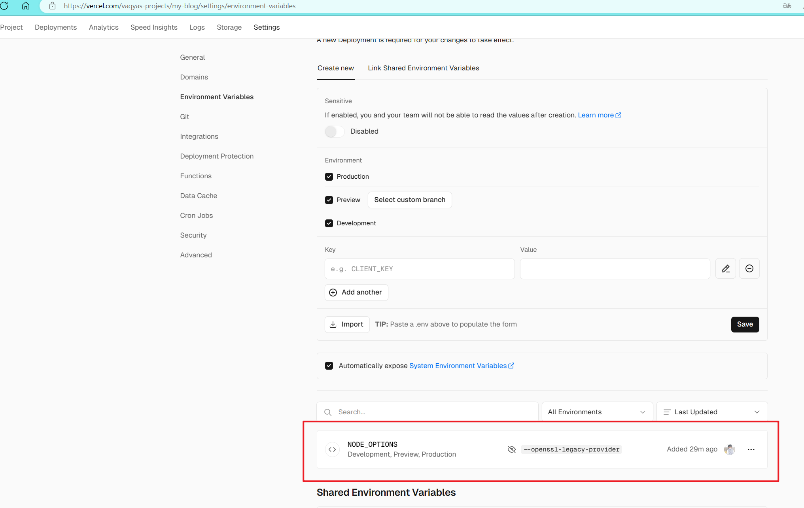

## npm 方式

## init
npm install @vuepress-reco/theme-cli -g
theme-cli init my-blog

## install
cd my-blog
npm install

## run
npm run dev

## build
npm run build

build时，当前的Node.js版本可能不支持，建议用以下对应版本  

|                     | 版本号  | 版本号  |
| ------------------- | ------- | ------- |
| Nodejs              | 14.16.0 | 18.19.1 |
| vue                 | 2.7.16  | 2.7.16  |
| vuepress            | 1.8.2   | 1.8.2   |
| vuepress-theme-reco | 1.6.10  | 1.6.17  |


当用git管理有.git文件夹时，再npm run build，插件`"vuepress-plugin-sitemap": "^2.3.1"`会报错


## 规范
```
1. 分类的名称可以随意起名，没必要一定有此文件夹名
2. md文件名和文件夹名不能有中文、不能有空格
3. 注意博客内容中出现的 <>、[]可能会导致编译报错
4. 头部冒号后面有空格，如categories: 前端相关
5. 引入的图片不能是.webp格式
6. URL的单词之间用-分隔，最好用小写字母
```

**部署在Vercel上，当用18.*版本的Nodejs部署时，必须在环境变量中配置NODE_OPTIONS：--openssl-legacy-provider**




