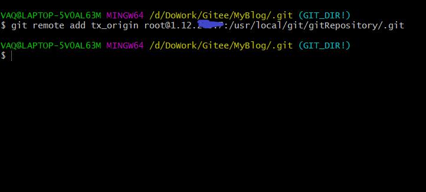
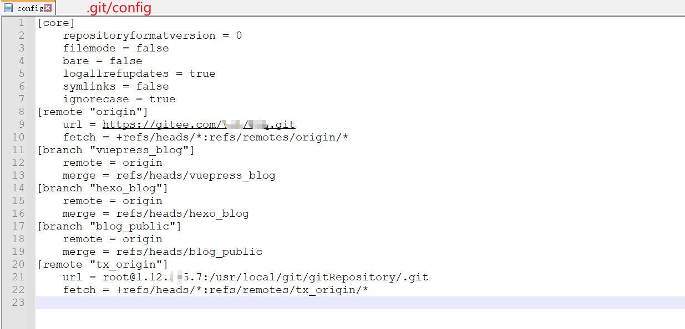

[官方下载](https://www.git-scm.com/download/)

解压

```
tar -zxvf nginx-1.9.9.tar.gz
```

### 上游分支

当前分支是从上游分支开出的新分支

### master分支
永存、无误、不可直接commit
对应nfys.kinglian.cn

### develop分支

上游：master
feature分支和hotfix分支合并到develop
永存、无误、不可直接commit

### feature分支

上游：develop
命名：feature/业务功能名称
业务完成功能（测试无bug,产品要发布改业务）后，合并到develop

### test分支

1. 全功能测试分支test/all：

上游：develop
feature分支合并到test分支

2. 部分功能测试分支
直接使用feature/业务功能名称，部署该分支代码，运维对应不同的端口号

### release分支
上游：develop 

### hotfix分支

上游：master
命名：hotfix/修复名称
完成修复后，merge 到develop，然后merge到master并打tag


### push 被远程拒绝

git pull

git pull origin feature/placeMall_V1.0.08

git pull origin master --allow-unrelated-histories

### git pull和git fetch的区别
相同点：  
都能够起到更新代码的作用  

不同点：  
git fetch：  
从远程获取最新版本到本地，不会自动merge，将远程的版本号commitID更新到本地仓库。  
之后，再手动执行merge操作，解决冲突生成一个新的commitID  
git pull：  
功能上相当于git fetch + git merge  
但是，会将本地仓库的commitID更新成远程仓库最新的代码版本  

==建议：用git fetch + git merge==


## clone人事项目

项目地址：https://github.com/lenve/vhr 
git clone https://github.com/lenve/vhr.git







