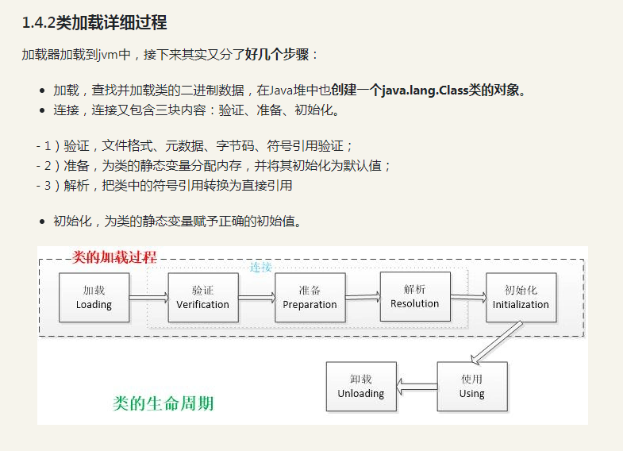
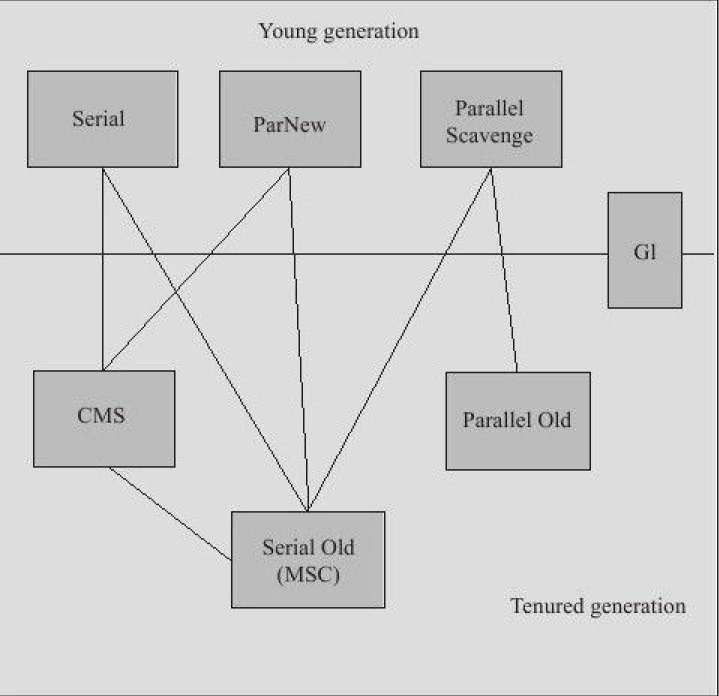
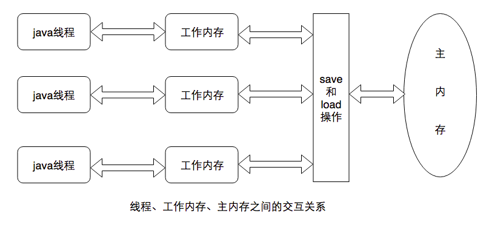

### 
javac.exe 编译.java文件，生成.class文件。 javac Test.java  
java.exe 将.class文件交由JVM解析并运行。 java Test
  
javap 深入了解编译机制。  
javap -c Test.class 分解方法代码  
javap -verbose Test.class 指定显示更进一步的详细信息  

### JVM(Java Virtual Machine) 是运行Java字节码的虚拟机

1. 类加载器子系统  将class文件装载到JVM运行时数据区中 
	1.1 BootStrap，启动类加载器/核心类加载器，由C++实现，加载JAVA_HOME/lib（eg:rt.jar)
	1.2 ExtClassLoader,扩展类加载器，加载JAVA_HOME/lib/ext 的jar包
	1.3 APPclassLoader，应用程序加载器，负责用户类路径（ClassPath）配置下的类库
	1.4 自定义类加载器


	类加载器的双亲委派模型：一个类加载器收到类加载请求时，自己先不加载，将请求委托给父加载器处理，  
		如果父类加载器还存在其父类加载器，则继续向上请求，直到达到顶层的BootStrap加载器，  
		BootStrap类加载器开始加载，如果无法加载，子加载器才尝试自己加载；    
		拒绝修改java源码(核心库)，保证了Java程序的稳定性。  


2. 运行时数据区（内存结构）
```
    2.1 堆(Heap)： 线程共享，内存不连续，存储对象，一个JVM中只有一个堆。  非静态成员变量也放在堆区

		年轻代+老年代 堆默认600m，老年代占2/3内存。年轻代中又分为Eden：From Survivor: To Survivor = 8:1:1，两个Survivor一个用来保存上次GC存活下来的对象，另一个空着。  
		jdk1.7后将字符串常量池、静态变量从方法区移到了堆中，运行时常量池还在方法区
	
	2.2 方法区（又叫静态区、永久代）： 线程共享，保存的是整个程序中永远唯一的元素  
									（jdk1.8中，没有了方法区，而是用元空间metaspace替换，元空间不在虚拟机中，放在了本地内存。因为为永久代分配多少空间很难确定，超出指定空间容易造成内存泄漏，且不便于GC回收）
    		
        jdk各版本中，运行时常量池一直都在方法区		
		静态成员常量(属于类属性)、类信息（类名、方法信息、字段属性信息）、编译器编译后的代码
	
	2.3 栈(Stack)： 线程私有，内存连续，线程运行时会分配给该线程一块栈内存A，线程私有，该线程每运行一个方法都会创建一个栈帧，从A内存分配一块B内存给该方法 。
					存放的一个个栈帧FILO先进后出 ，一个方法从调用到到执行完成就对应着一个栈帧在虚拟机栈中入栈到出栈的过程。   
				
					栈帧中包含了    
						局部变量表：基础类型时存局部变量的值，对象类型时存对象在堆中的内存地址（占用的空间大小在编译器时就确定了）
						操作数栈：变量操作时暂存的数值
						指向运行时常量池的引用：  方法运行时可能会用到类中的常量
						方法返回地址：方法执行完毕后要返回调用它的地方
	          
	2.4 本地方法栈： 线程私有，本地方法运行时需要的一块内存。  eg: native 修饰的方法是由C语言实现的，线程的start方法
	
	2.5 程序计数器(Program Counter Register) 线程私有： 也称为PC寄存器，记录运行代码的位置，这样线程切换时可以在当前位置继续运行。 字节码执行引擎负责修改记录程序计数器的值
													程序计数器存储的数据所占空间的大小不会随程序的执行而发生改变，所以程序计数器不会出现内存溢出现象（唯一一个）
```

3. 字节码执行引擎	执行class文件的字节码指令，相当于机器的CPU

类文件被编译成字节码文件后，JVM虚拟机通过类加载器子系统将其加载到数据区，再由字节码执行引擎去运行 

### 静态常量池、字符串常量池、运行时常量池
静态常量池是在文件中，字符串常量池和运行时常量池是在JVM内存中，字符串常量池逻辑上属于运行时常量池

* 静态常量池，是指在编译期就被确定并保存在.class文件中的一些数据，字面量和符号引用
字面量：final修饰的基本类型及对象类型(String和数组)
符号引用：类和接口的全限定名、字段的名称和描述符、方法的名称和描述
final只对引用的地址值有效，使引用只能指向初始指向的对象，而对所指的对象变化是不可控的。  
```
* 字符串常量池，是一个记录了interned String的全局表，本质是个HashSet<String>，只存储了String实例的引用，不存内容，内容在堆中。   
intern方法，如果存在当前字符串，直接返回此字符串的引用；如果不存在，则将此字符串引用保存在常量池中，再返回引用。 
JVM对于字符串引用，由于在字符串的"+"连接中，有字符串引用存在，而引用的值在程序编译期是无法确定的。  
```
 ```
	String a = "AA";
	String b = "BB";
	String c = "AABB";
	String d = "AA" + "BB";
	String e = a +"BB";
	
    System.out.println(c==d);  //true
	System.out.println(c==e);  //false
	System.out.println(c.equals(e));  //true
```

* 运行时常量池

类加载完成后将每个类的静态常量池中的符号引用替换为直接引用，转存到JVM中的运行时常量池中，还包括了运行期间产生的常量。
str.intern()方法可以强制将String放入常量池  
  
```
基本类型包装类和常量池没有任何关系
Byte、Short、Integer、Long、Character、Boolean，这5种包装类默认创建了数值[-128，127]的相应类型的缓存数据
```


### 字节码
扩展名是.class的文件，只是面向虚拟机的，因此Java程序无需重新编译就能在不同的操作系统上运行

### HotSpot
消耗大部分资源的只有那一小部分热点代码，JVM会根据代码被执行的情况收集信息进行优化，所以代码执行的次数越多，运行的速度越快。  
采用计数器的方式(方法调用计数器、回边计数器)，当计数器超过阈值时，就触发JIT编译。  

### JIT(Just in Time,运行时编译)  
JVM将字节码文件的热点代码进行编译优化(JIT编译)，生成机器码(运行调用时更快)，   
而非热点代码在调用时由Java解析器直接解析，逐条取出、逐条执行  

### JDK和JRE
JRE是Java程序的运行环境，包括了JVM和Java类库
JDK是Java Development Kit(Java开发工具)即Java SDK，它包括了JRE，还具有编译器javac和工具javadoc，能够创建和编译Java程序。

### Java语言是编译和解释并存
编译型：将源码全部一次性翻译成平台可识别的机器码
解释型：一行一行的将源码翻译后机器码

Java编写程序需要先将Java文件编译成字节码文件，再由Java解释器来解释执行

### Java语言的平台无关性
Java编译器（javac.exe）生成字节码文件，JVM虚拟机负责运行字节码，把他交给解释器（java.exe）并操作解释器进行解释字节码文件为机器码。而JVM针对不同的系统会有特定的实现，能够保证相同的字节码都会得到相同的结果

### 类加载过程


### 5中情况下一定会对类初始化
1. 创建类的实例，访问类或接口的静态变量，对静态变量赋值或调用静态方法
2. 初始化某个类的子类
3. 启动类(包含main方法的类)
4. 反射
5. JDK1.7的动态语言支持时


## GC  
Garbage Collection垃圾收集  

回收垃圾对象（可达性分析后不可达的对象）
分为Minor GC，在Yong区，频繁收集，采用了复制算法    
Full GC，在Old区，较少收集，采用标记-整理算法      

### 标记垃圾方法
1. 引用计数法，对象头分配一个字段用存储该对象的引用，对象被其他对象引用，计数就+1。 无法解决循环引用的问题  
2. 可达性分析法，先查找当前活跃的引用GC Roots，接着将GC Roots作为根节点，遍历对象引用关系图，遍历不到的(不可达)的对象作为无用对象  

GC Roots：局部变量、静态变量、常量、JNI handles  

### Java中为什么会有GC机制
* 安全性
* 减少内存泄露
* 减少程序员工作量

### GC主要回收的内存
主要回收方法区和堆内存，这两个里面的数据是程序运行期间动态创建的。

### GC什么时候回收？
1. 对于堆中的对象，可达性分析判断是否存在引用，当对象没有任何引用时就会被回收，引用又分为4种，且回收机制不同：强、软、弱、虚。  
2. 对于方法区中的常量和类，常量没有任何对象引用它时被回收，对于类，判定它为无用类时回收。  
  
强引用：不会被回收  
软引用：系统将会发生内存溢出时，才会被回收  
弱引用：GC直接回收  
虚引用：对象是否存在虚引用对生存时间不会构成影响  

### 垃圾收集算法  

复制算法：在年轻代，效率高，但需要双倍内存空间  
标记-清除：在老年代，可达性分析之后，清除未标记的对象，两次扫描耗时严重，会产生内存碎片。效率低，GC占用时间过长的话影响正常程序使用   
标记-整理：在老年代，相对标记-清除算法多了整理(移动对象)这一步，不会有内存碎片，但效率低   
分代收集：新生代采用复制算法，老年代采用标记-整理算法  

### 垃圾收集器
如图中7种，它们之间大部分是互相组合使用的。



### 什么时候会触发Full GC ?  
* 显式调用system.gc()会触发full gc
* 老年代空间不足时  
* Minor GC晋身为老年代的平均大小大于老年代的剩余空间


### 内存泄露
是指分配出去的内存没有被回收回来，由于失去了对该内存区域的控制，因而造成了资源的浪费。
Java中一般不会产生内存泄露，因为有垃圾回收器自动回收垃圾，但这也不绝对，
当我们new了对象，并保存了其引用，但是后面一直没用它，而垃圾回收器又不会去回收它，这边会造成内存泄露

### 内存溢出
是指程序所需要的内存超出了系统所能分配的内存（包括动态扩展）的上限。

- 内存泄露导致堆栈内存不断增大。 解决内存泄露问题
- 大量的jar，class文件的加载，装载类的空间不够。  设置参数加大空间：-Xms，初始堆大小；-Xmx，最大堆大小。   
- 操作大量的对象导致堆内存空间用满。   代码中是否有死循环或循环中创建了太多的对象或一次查询了太多的数据记录到内存    
- NIO直接操作内存，内存过大导致溢出。 不要用NIO直接操作内存  

### java内存模型(JMM)
* 主内存：是虚拟机内存中的一部分，所有的变量(此变量不是程序的变量)必须从主内存中产生。
* 工作内存：每个线程都有自己的工作内存，线程私有，工作内存保存了线程需要的变量在主内存中的副本，线程对主内存变量的修改必须在线程的工作内存中进行，不能直接读写主内存的变量，线程之间也不能互相访问工作内存。


数据原子操作
1. lock(锁定)Main   ： 将主内存变量加锁，标识为线程独占内存       
2. read(读取)Main   ： 从主内存读取数据
3. load(载入)Work   ： 将从主内存读取的数据载入工作内存
4. use(使用)Work    ： 从工作内存读取数据来运行计算
5. assign(赋值)Work ： 将计算好的值重新赋值到工作内存中
6. store(存储)Work  ： 将工作内存数据存到主内存
7. write(写入)Main  ： 将store过去的变量值赋值给主内存的变量
8. unlock(解锁)Main ： 将主内存变量解锁，解锁后其他线程才可以锁定该变量

作用于主内存：Main
作用于工作内存：Work


### JVM加载Class文件的原理、机制，怎么实现自己加载指定类
查找、导入class文件，  
检查文件的正确性、为类的静态变量分配存储空间，  
初始化静态变量、静态代码块

### JVM常见的调优参数  

```
idea64.exe.vmoptions

-Xms128m
-Xmx1966m
-XX:ReservedCodeCacheSize=512m
-XX:+UseConcMarkSweepGC
-XX:SoftRefLRUPolicyMSPerMB=50
-XX:CICompilerCount=2
-XX:+HeapDumpOnOutOfMemoryError
-XX:-OmitStackTraceInFastThrow
-ea
-Dsun.io.useCanonCaches=false
-Djdk.http.auth.tunneling.disabledSchemes=""
-Djdk.attach.allowAttachSelf=true
-Djdk.module.illegalAccess.silent=true
-Dkotlinx.coroutines.debug=off
-javaagent:C:\Users\Public\.BetterIntelliJ\BetterIntelliJ-1.16.jar

```
Xms：初始堆大小，默认物理内存的1/64  
MinHeapFreeRatio：默认40%，空余堆内存小于40%时，就会一直增大堆直到Xmx的最大限制，空余堆内存大于70%时，会一直减小到Xms的最小限制    
Xmx：最大堆大小，默认物理内存的1/4  
-XX:MaxNewSize，设置新生代的最大内存；  
-XX:MaxTenuringThreshold，设置新生代对象经过一定的次数晋升到老生代；  
-XX:PretrnureSizeThreshold，设置大对象的值，超过这个值的对象会直接进入老生代；  
-XX:NewRatio，设置分代垃圾回收器新生代和老生代内存占比；  
-XX:SurvivorRatio，设置新生代 Eden、Form Survivor、To Survivor 占比。  


