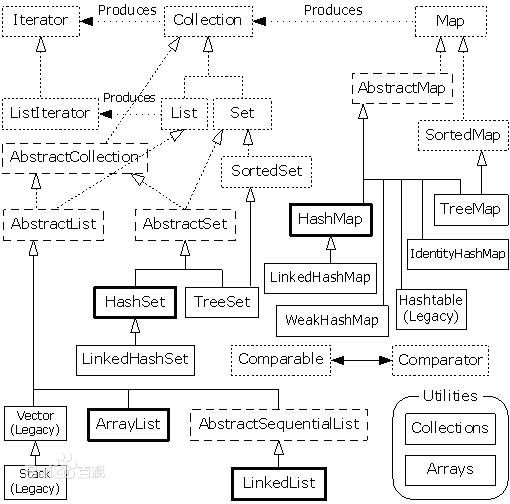

# Java基础

### byte 
最高位表示符号位，0正1负 范围[-128 ， 127]
1000 0000 表示 -0 ，即 -128 
1111 1111  表示 – (2^6+2^5+2^4+2^3+2^2+2^1+2^0）= -127
0111 1111 表示  2^6+2^5+2^4+2^3+2^2+2^1+2^0 = 127

无论位运算还是算数运算，都是先获得补码（原码取反再加一，前提符号位不变），再运算，再得到原码（补码取反再加一，前提符号位不变）
```
<< n，左移，乘以2的n次方
>> n，右移，除以2的n次方
| 或     有1则1 ， & 有0则0
^ 异或   相同为0，不同为1
>>> 无符号右移，左边补0

```

### 面向对象的三（四）大特征
封装、继承、多态。（抽象）

> 封装：就是对数据和数据操作进行封装，只对外界提供一个接口，封装可以提高代码的重用性和安全性。

> 继承：从已有的类中继承信息创建新的类，提高了代码的复用性，是多态的前提。

> 多态：分为两种：
>> 编译时多态机制，是静态分派的: 同类中方法的重载。 
>> 运行时多态机制，是动态分派的：子类中方法的重写。实现多态的前提就是父类的引用或接口的引用指向子类的对象，子类进行方法重写。
### 多态的好处
多态可以实现同样的对象引用调用同样的方法做出不同的事情。具有可扩充性，增加新的子类不影响已经存在的类的结构。
### 虚拟机中是如何实现多态的
通过动态绑定技术，在运行期间判断所引用对象的实际类型，根据实际类型调用对应的方法。
### 接口
接口是一系列方法的声明，方法没有方法体，变量是public static final修饰的，方法默认是被public abstract修饰的。不能有构造方法  
接口需要被其他类实现，这些实现可以有不同的行为。  
### 抽象类
用abstract修饰的类，不能被实例化，可以有构造方法、抽象方法和非抽象方法。  
抽象类不一定有抽象方法，但有抽象方法的类一定是抽象类。

### 接口和抽象类的区别
* 不同点
> 抽象类中可以有抽象方法和普通方法（没有方法体的方法称为抽象方法），接口中的方法全是抽象方法。
 抽象类中可以有构造方法，接口中没有。构造方法在在实例化派生类之前调用，可以初始化抽象类字段或执行其他与子类相关的代码。
 抽象类可以有普通成员变量，接口中没有。
 抽象类在代码实现上发挥作用，接口主要是定义项目模块之间的通信。
 一个类只能继承一个抽象类，一个接口可以被多个类实现。
 抽象类可以提供某些方法的部分代码的实现，接口不行，向一个抽象类加入一个新的普通方法(非抽象方法)时，它的所有子类都自动有了这个新方法，而接口不行，接口中加入了新方法，其实现类（非抽象类）必须重写这个新方法。  

* 相同点：
> 都不能实例化对象，子类必须实现抽象类或者接口的全部抽象方法，否则子类也必须定义为抽象类。
### 重载、重写/覆盖
> 重载：参数列表不同（个数、顺序、类型），方法名相同，在同一类中。

> 重写/覆盖：参数列表相同，方法名相同，在子类中，子类的方法修饰符权限必须高于父类，抛出的异常必须比父类范围小。

### 父类的静态方法能否被子类重写？
不能，重写只适用于实例方法，如果子类中有和父类相同签名的静态方法，子类这个方法就会被隐匿，子类只能调用父类的这个静态方法。

### 不可变对象
指对象一旦创建就不能被改变，任何修改都会创建一个新的对象，如String，Integer等包装类。

### 静态变量和实例变量的区别
> 静态变量又称为类变量，存在于方法区，程序加载类的字节码时就会给静态变量分配空间，可以直接用类名调用。
> 实例变量在创建实例对象时才被分配空间，实例变量本身存放在堆内存中（动态分配，速度慢），其引用存放在栈中（大小固定，速度快）

### Java创建对象的几种方式
1. 采用new
2. 通过反射
3. 采用clone
4. 通过序列化机制

其中new方式是耦合度最高的，尽量少用new创建对象。

### 序列化的实现
将对象的内容进行流化： 类实现Serializeable接口，使用一个输出流（如FileOutputStream）构造一个ObjectOutputStream（对象流）对象，在使用ObjectOutPutStream对象的writeObject（Object obj）方法将对象写出。
反序列化就是用输入流，用ObjectInputStream对象的readObject（ ）方法

### transient关键字
属性前添加关键字transient，那么该属性将不需要序列化  

### switch中能否用String做参数
jdk1.7之后可以。switch不能用在long上。

### String 
> s1="ab",String s2="a"+"b",String s3="a",String s4="b",s5=s3+s4,那么s2=s5返回什么？
> false，编译过程中，编译器会将s2优化为"ab",会将其放置在常量池中，s5则是被创建在堆区，相当于s5=new String("ab");
> ps:Java中字符串的连接（+）实际上都是使用StringBuilder的append()方法，(+)本质上就是创建了StringBuilder对象进行append操作，然后将拼接后的StringBuilder对象toString方法成String对象。
> String 底层就是个字符类型数组char[]

### 字符型常量char和字符串常量String的区别
1. 形式上，字符常量单引号引起的一个字符，字符串常量是双引号引起的0至多个字符，char c = 'a'; String s = "abc";
2. 含义上，字符常量是一个整型的Ascll值，而字符串常量代表的是字符串在内存中的地址
3. 占内存大小上，字符常量占两个字节，字符串常量占0至多个字节

### String 对象的intern()方法。
intern()方法会首先从常量池中查找是否存在该常量值，如果常量池中不存在，则先在常量池中创建，如果已经存在则直接返回。

### String 的subString方法，截取字符串
```
subString(start,end)，[start,end);  //左闭右开
subString(a);  //从a开始，一直到结束

```
### String 的split方法
返回字符串数组，对于一些参数是正则表达式的一部分则需要用转译符\  
split(",");   根据,分隔，返回所有的数据；  
split(",",3); 根据,分隔，返回前3条数据 

### 创建了几个对象
1. String str = new String(“abc”);创建了几个对象，常量池有abc字段是1个，常量池没有"abc"字段则是2个。
2. String str=“abc”;创建了几个对象（如果常量池里面已经有对象了就是0个。如果没有就是1个）;
3. new String(“abc”).intern();创建了几个对象（如果常量池里面已经有该字符串对象了就是1个，如果没有就是两个）

### Java中==和equals()的区别？equals()和hashCode()的区别？为什么重写equals一定要重写HashCode？
> 1. ==是运算符，比较两个变量是否相等，equals()是Object类的方法，比较两个对象是否相等（默认的是比较两个对象的地址，和==结果一样。
2. hashCode()也是Object类的方法，返回一个哈希值，若两个对象的的equals()是相等的，那么调用hashCode()一定返回相同的哈希值；若equals()比较不相等，hashCode()不一定相等；hashCode()相等，equals()不一定相等；hashCode不等，equals()一定不等。
ps:Java规范：使用equals()判断两个相等的对象，必须具有相等的equals()方法，所以重写equals()方法时，一定要重写hashCode()方法。将对象放入集合中先判断集合中是否有此对象的hashCode()，没有再equals()比较。
hashCode来源于这个对象的内部地址转换成的整型值，比较两个对象是否相同之前会先比较HashCode是否相同，HashCode相同的话再用equals方法比较，HashCode不同则直接判断这两个对象不同，如果只是重写equals方法，可能会出现equals方法相同而HashCode不同，导致重写的equals方法就没有意义了

```
	// Effective中提供的重写hashcode方法
	@Override
	public int hashCode() {
		int result = name.hashCode();
		result = 17 * result + sex.hashCode();
		result = 17 * result + age.hashCode();
		return result;
	}
```

### a+=b 和 a=a+b
+=会隐式强转结果类型。

### short s1=10; s1=s1+1; 
错误，s1+1会将结果转为int类型

### &和&&
&是位操作，&&是逻辑运算符，&&具有短路特性。

### 内部类
就像是独立的实体，提供了更好的封装，除了外围类，其他类都不能访问。

### final、finalize、finally
1. final修饰变量不可变，修饰类不能被继承，修饰方法不能被重写；
final在构造函数中修饰变量，初始化一个对象并赋值给一个引用变量之前，final域会先被初始化；
在获取一个对象的引用之后，再读取其final域的值
如果修饰的是基本数据类型的变量，则其数值一旦在初始化之后便不能更改；如果是引用类型的变量，则在对其初始化之后便不能让其指向另一个对象。
2. finalize方法是Object对象的方法，是对象在被回收之前调用的
3. finally是与try、catch一起用于处理异常的，一定会执行

### 浅拷贝和深拷贝
> 浅拷贝只复制对象，而不复制对象中所引用的对象
> 深拷贝会把对象和其所有引用的对象都复制一遍

### static
* 静态变量
* 静态方法   如果方法的执行不依赖于类的变量和其他方法，最好设置为静态的，占用更小的空间
* 静态代码块（多用于初始化）
* 静态内部类   不能使用任何外围类的非static成员变量和方法。
* 静态导包 eg: import static java.lang.Math.*; 则此类中就可以用Math类的方法了

类不管构造多少对象，静态代码块只执行一次

单类构造对象执行顺序：
1. 静态代码块
2. 非静态代码块
3. 构造方法

有父类的子类构造对象执行顺序
1. 父类静态代码块
2. 子类静态代码块
3. 父类非静态代码块
4. 父类无参构造方法
5. 子类非静态代码块
6. 子类无参构造方法


### this
用于表示本类对象的引用

### super
用于表示父类对象的引用
子类构造方法的第一行默认调用了super()，如果第一行调用了其他构造方法，则会替代super()

## new Son(); 调用步骤
1. super();
2. Son();
相当于
1. Father();
2. Son();
### new Son(name); 调用步骤
1. super();
2. Son(String name);
相当于
1. Father();  //父类没有显式的写出无参构造则会报错
2. Son(String name);

### 如果子类重写的构造方法需要子类的无参构造方法，则必须在第一行写this();
1. this(); 
相当于
1. Father(); 
2. Son();

### 如果子类重写的构造方法需要父类的无参构造方法，则必须在第一行写super();
1. super();
相当于
1. Father();

### this(name); 
相当于
1. Father();
2. Son(String name);


this和super是对象实例级别，static是类级别，this、super不能用在static中

### 使用什么类型表示价格？
不是特别关心性能和内存，用BigDecimal对象，
加减乘除操作分别为add(BigDecimal value)、substruct(BigDecimal value)、multiply(BigDecimal value)、divide(BigDecimal value)。

### byte[]数组和String转换,并设置编码
.getBytes("UTF-8");
new String(b1,"UTF-8");

### 可以将int转换成byte类型吗？
可以，int是32位，byte是8位，强转会丢失高24位。

### 枚举
* 通过枚举实现的设计模式：单例模式、策略模式


### 异常
1. error：虚拟机相关的异常，如系统崩溃、内存不足、方法调用栈溢出
2. Exception：
* CheckedException编译时异常：用try/catch或throw、throws处理
* RuntimeException运行时异常： 
java.lang.NullPointExcetion 空指针异常
java.lang.ClassNotFoundExcetion 找不到指定的类
java.lang.NumberFormatException 字符串转换数字异常
java.lang.IndexOutOfBoundException 数组角标越界异常
java.lang.ClassCastException 数据类型转换异常

* throw 用在方法体内，抛出一个实例
* throws 用在方法声明后，由该方法调用者处理异常，表示会出现一种异常的可能性

### 类的实例化顺序
1. 父类的静态变量和静态代码块（书写顺序）
2. 子类的静态变量和静态代码块（书写顺序）
3. 父类的成员变量赋值
4. 父类类的构造代码块
5. 父类的构造方法
6. 子类的构造代码块
7. 子类的构造方法

## 多线程

### 进程和线程
进程是程序运行和资源分配的基本单位
线程是CPU调度和分派的基本单位

进程在执行过程中拥有独立的内存单元，而多个线程可以共享内存资源

### 守护线程
守护线程为用户线程提供服务，eg:GC线程
程序执行完毕，JVM会等待非守护线程运行完毕后关闭，而不会等待守护线程。

### 线程切换
CPU控制权由一个正在运行的线程切换到另一个就绪并等待获取CPU执行权的线程

### 创建线程的方式
1. 继承java.lang.Thread类
2. 实现java.lang.Runnable接口
第二种方式的优点：Java不支持多继承，实现接口后还可以再继承其他类；继承整个Thread类的开销更大

### Thread类的start()方法和run()方法
线程调用start()方法,表示此线程启动了，此时java虚拟机会调用此线程的run()方法；start()方法真正实现了多线程运行，而无需等待run()方法执行完毕而直接继续执行下面的代码。
run()方法只是Thread的一个普通方法，只执行主线程这一个线程，而且要等待run()方法执行完毕，才继续执行下去，这样就达不到写线程的目的了。

### 怎么检测一个线程是否持有对象监视器？
Thread类中的静态方法holdsLock(Object obj),当且仅当对象的监视器（即锁）被当前线程持有的时候才会返回true。

### Runnable接口的run()方法和Callable接口的call()方法区别
run方法无返回值，call方法可以返回装载有返回结果的Future对象，Future对象调用get()方法可以获得该返回值。
两个方法结束后线程会自动结束；
> Future是个接口，因此可以使用它的实现类FutureTask
> public interface `RunnableFuture<V>` extends Runnable , `Future<V>`
> public class FutureTask implements `RunnableFuture<V>`

### sleep()和wait()方法的区别
1. sleep()是Thread类的方法，wait()是Object类方法
2. 调用sleep()方法，对象不会释放线程锁，wait()方法会释放对象锁
3. sleep()睡眠后不会让出系统资源，wait()会让其他线程占用CPU
4. sleep(milliseconds)需要指定一个时间，时间一到自动唤醒，wait()方法配合notify()或notifyAll()使用;wait()和notify()方法必须在同步块中被调用，wait会立即释放锁，notify则会在同步块执行完了再释放。

### 为何wait(),notify(),notifyAll()方法不放在Thread类中？
这三个方法都是对锁进行操作，Java提供的锁是对象级的，而不是线程级的，所以把他们定义在Object类中。

### 如何在两个线程间共享数据？
共享对象即可，通过wait/notify/notifyAll、await/signal/signalAll进行唤醒和等待，阻塞队列BlockingQueue就是为共享数据设计的

### 如何正确使用wait()?
````
synchronized (obj){
   while(条件不成立){
    obj.wait();
   }
}

````
### 线程局部变量ThreadLocal
属于线程自身所有，每个Thread里面都维护了一个ThreadLocal.ThreadLocalMap把数据进行隔离，不在多个线程间共享，保证了线程的安全。

### 生产者消费者模型的作用
1. 通过平衡生产者的生产能力和消费者的消费能力，提升系统的运行效率
2. 解耦，使两者联系更少，独自发展不会受到双方的制约

### 写一个生产者消费者队列
1. 使用阻塞队列实现
````
//生产者
public class Producer implements Runnable {
    private final BlockingQueue<Integer> queue;
	public Producer(BlockingQueue q){
	    this.queue=q;
	}
	
	@Override
	public void run(){
	    try{
		    while(true){
			    Thread.sleep(1000);
				queue.put(produce());
			}
		}catch (InterruptedException e){
		
		}
	}
	
	private int produce(){
	    int n = new Random().nextInt(10000);
		System.out.println("Thread:"+Thread.currentThread().getId()+"produce:"+n);
		return n;
		
	}
}
````

````
//消费者
public class Consumer implements Runnable{
    private final BlockingQueue<Integer> queue;
	public Consumer (BlockingQueue q){
	    this.queue = q;
	}
	@Override
	public void run(){
	
	    while(true){
		    try(){
			    Thread.sleep(2000);
				consume(queue.take());//take()方法，取走queue里排在首位的对象
				
			}catch (InterruptedException e){
			
			}
		}
	}
	
	private consume(Integer n){
	    System.out.println("Thread:"+Thread.currentThread().getId +"consume:"+n);
	}
}

````
````
//测试
public class Test(){
    public static void main(String[] args){
	    BlockingQueue<Integer> queue = new ArrayBlockingQueue<>(100);
		
		Producer p = new Producer(queue);
		Consumer c1 = new Consumer(queue);
		Consumer c2 = new Consumer(queue);
		
		new Thread(p).start();
		new Thread(c1).start();
		new Thread(c2).start();
		
	}
}
````
2. 使用wait-notify来实现
````


````


### 什么是CAS 
Compare and Swap 比较-替换。
内存值V，旧的预期值A，要修改后的值B。预期值A与内存值V相等时，将内存值修改为B，并返回true。  
能保证原子性，是硬件指令，由C语言实现，比synchronized更快

### volatile变量
* volatile变量是一种比synchronized更轻量级的同步机制。
* 对非volatile变量进行读写时，系统先从内存拷贝变量到CPU缓存中；对volatile变量，系统直接从内存中读取，跳过了CPU缓存这一步。
* 一个线程修改了volatile变量的值，volatile能保证新值能立即同步到主内存，以及每次使用前立即从主内存刷新。
* 内禁止CPU指令重排序（CPU指令重排序：CPU采用了允许将多条指令不按程序规定的顺序，分开发送各相应电路单元处理）
* 性能：读和普通变量几乎相同，写操作较慢（因为要在代码中插入内存屏障保证处理器不发生乱序执行）

### 乐观锁、悲观锁
乐观锁：认为线程竞争不总是发生，不需要持有锁，但是在更新数据时要判断别人有没有修改数据，一般用CAS算法和版本号机制实现 
优点：提高了并发性能  
缺点：乐观锁只能保证一个共享变量的原子操作；CAS长时间不成功的话会一直自旋，给CPU带来很大开销
悲观锁：总是认为线程会竞争，每次拿到数据都会上锁。

### ConcurrentHashMap的并发度
segment的大小：16，即最多可以16个线程操作ConcurrentHashMap

### ConcurrentHashMap
1. jdk1.6中
> 采用分离锁的方式，没有对整个hash表进行锁定，而是局部锁定，不影响其他线程对hash表的其他地方进行访问

2. jdk1.8中
> 与1.6不同，它采用了乐观锁CAS算法，底层还是数组+链表->红黑树,

### 多线程开发良好的实践
1. 给线程命名
2. 考虑使用线程池
3. 优先使用volatile变量
4. 优先使用并发容器而非同步容器
5. 线程通信用高层次的并发工具，如BlockingQueue，少用wait()、notify()
6. 最小化同步范围

## 数组
查找 时间复杂度O(1)
插入、删除 涉及到元素的移动，时间复杂度为O(n)

### 创建数组的方式
```
int[] arr = new int[6];
int[] arr1 = new int[]{1,2,3,4,5,6};
int[] arr2 = {1,2,3,4,5,6}
```
### 存入数据put
通过对数据元素的hashCode值对容量取模（hashCode值 % 容量）来分配位置到数组，取模值相同则在数组的当前位置以链表结构形式继续存入

### 扩容
扩容时，是用位运算，将旧数据元素分配位置，迁移到新数组

## 链表
新增、删除 只需处理结点间的引用，时间复杂度为O(1)
查找 需要遍历列表的所有结点逐一进行对比，复杂度为O(n)

## 集合.在java.util包中

### Java中集合及继承关系




集合分为两大类：Collection、Map
> Collection
> 是一个个的存（Map是键值对的形式存）,Collection对象在调用remove、contains方法时会调用equals和hashCode方法，重写equals时必须重写hashCode方法。
> Collection继承了Iterable接口，有个iterator()方法，用于统一遍历元素，返回的Iterator对象，称为迭代器，可以方便的删除集合中的内容

> Map

## 1.实现了Collection接口的集合
一个一个的存  
在调用remove、contains方法时会调用equals和hashCode方法  
重写equals时必须重写hashCode方法  
Collection继承了Iterable接口，有个iterator()方法用于统一遍历元素，返回的Iterator对象，称为迭代器，可以方便的删除集合中的内容
### List接口
有序，元素可重复
实现类有：
* LinkedList 基于链表，增删快，查询慢，非线程安全
* ArrayList 基于数组，增删慢，查询快，非线程安全
* Vector 基于数组，都慢，效率低，线程安全，增删改查方法都加了synchronized 来保证同步

* CopyOnWriteArrayList，线程安全，只是在读、删方法上加了锁，适合读取多、修改少的数据
写人数据时会将原数组内容copy到volatile修饰的成员变量数组中，修改操作的同时，读操作不会被阻塞，而是继续读取旧的数据

### Set接口
无序，元素不可重复，元素在集合的位置由元素的hashCode决定
实现类有：
* HashSet 无序、不可重复。底层由HashMap实现，使用时要重写equals()方法和hashCode()方法 非线程安全
* LinkedHashSet 继承于HashSet 非线程安全
* TreeSet 有序、不可重复。底层红黑树

## 2.实现了Map接口的集合

### Map接口
无序，Key不可重复、值可以，键值对形式的存
实现类有：
1. **HashMap**
> 基于hash表的Map接口实现，非线程安全，支持null键、null值
> HashMap的静态内部类
``` 
static class Node<K,V> implements Map.Entry<K,V> 
属性有  final int hash;
        final K key;
        V value;
        Node<K,V> next;
```
> 基于数组+链表的存储结构（数组中的每一项(map.Entry)存储的数据是个链表），数据hash值 & (length-1) 得到该数据在数组中的位置;eg:每个数组元素存储的是链表的最后插入的数据A，A的index是0，则Entry[0]=A,此时又put了B，B的index也是0，则Entry[0]=B,B.next=A。  
> 数组默认容量16，加载因子0.75，即当存入12个元素后就进行扩容，扩容是新建一个长度为16*2的数组，选择0.75作为默认的加载因子，完全是时间和空间成本上寻求的一种折衷选择  
> 扩容后重新寻址rehash，遍历原entry数组重新hash到新数组中，原来的对象在新数组中的位置，要么在原下标的位置，要么在(原下标+原容量16)，位运算时数组长度是2的n次方（因为这样不同的key的hash计算结果相同的几率较低，减少hash碰撞，使得数据在数组上分布的比较均匀，查询的时候就不用遍历某个位置上的链表，可以提升定位元素的的效率）  
> jdk1.8后链表长度大于阈值(8),链表会转为红黑树（时间复杂度从O(n)到O(logn)），转为红黑树之前判断，数组长度小于64则会先扩容
> jdk1.8后put或get方法操作链表时比1.7多了对是否存在树节点的判断  

* jdk7：
数组+链表。  
数组的定义：Entry<>   
链表头插法：新增结点插在头部，实现简单，但插入的顺序和读取的顺序是相反的，并发下可能会死锁
```

hash值：使用hashCode的值，通过一定算法产生的hash值，如下方法
final int hash(Object k) {
        int h = 0;
        h ^= k.hashCode();

        h ^= (h >>> 20) ^ (h >>> 12);
        return h ^ (h >>> 7) ^ (h >>> 4);
    }
	
索引：static int indexFor(int h, int length) {
        return h & (length-1);
    }
	
```
* jdk8：  
数组+链表+红黑树。  
数组的定义：Bucket<> TreeCode<>   
链表长度超过一定阈值(8)时会转存为红黑树，尾插法：新增结点总是插在尾部，实现复杂，插入顺序与读取顺序一致  

```

hash值：使用hashCode的值，通过一定算法产生的hash值，如下方法
static final int hash(Object key) {
        int h;
        return (key == null) ? 0 : (h = key.hashCode()) ^ (h >>> 16);
    }
索引：hash值 & (length-1)，删除了indexFor方法声明，直接用式子表示

```
2. **LinkedHashMap**
	HashMap的子类，有序 非线程安全  
	是基于HashMap和双向链表实现的，双向链表只是用于保证顺序  

3. **ConcurrentHashMap**
	jdk1.8中，抛弃了jdk1.7的Segment(Segment继承了ReentrantLock)分段式锁，采用CAS+synchronized来保证线程安全，存储方式是数组+链表/红黑树，默认容量16，负载因子0.75

4. **HashTable**  
   不支持null键、null值 线程安全，存储方式是数组+链表，链表主要是解决哈希冲突   
5. **TreeMap** 
	红黑树,还实现了SortMap接口

### HashMap和ArrayList的大小
HashMap默认大小16个元素，扩容是原大小的2倍，加载因子0.75，如果传了初始值，会变成比当前值大的2的n次方的最小数  
ArrayList默认大小10个元素，扩容是原大小的1.5倍 `NewLength = OldLength + OldLength >> 1`

### HashMap和WeekHashMap的区别
WeekHashMap使用上和HashMap没有任何区别，只不过是使用了弱引用作为key，key对象没有任何引用时，key/value就会被回收


### poll()方法和remove()方法的区别
两者都是从队列中取出一个元素，poll()方法取出元素失败时会返回null，remove()方法失败时会抛出异常

### LinkedHashMap和PropertyQueue的区别
LinkedHashMap遍历时根据元素插入的顺序，PropertyQueue是优先级队列，遍历时没有任何顺序保证

### ArrayList和LinkedList的区别
* ArrayList底层的数据结构是数组，查询时时间复杂度是O(1),较快  
* LinkedList底层是双向循环链表,查询时时间复杂度是O(n),比较慢  

### ArrayList和Array的区别
Array可以容纳基本类型和对象，而ArrayList只能存放对象
Array可以指定大小，而ArrayList的大小是固定的

### ArrayList和CopyOnWriteArrayList的区别
`java.util.ArrayList<E> extends AbstractList<E> implements List<E>, RandomAccess, Cloneable, java.io.Serializable`
`java.util.concurrent.CopyOnWriteArrayList<E>   implements List<E>, RandomAccess, Cloneable, java.io.Serializable`

ArrayList线程不安全，CopyOnWriteArrayList线程安全
想要保证ArrayList线程安全，如果用synchronized或ReadWriteLock，写操作加锁后如果有大量读操作，会造成阻塞，

### 如何打印数组
用Arrays.toString()方法或Arrays.deepToString()//数组中还有数组，深度打印

### 遍历ArrayList时如何正确移除特定值的元素
1. for循环遍历，使用ArrayList的remove()方法，移除了某个值后指针自动后移，for的条件又加一了，可能会忽略下一个符合条件的元素。可以再i--进行处理。
2. iterator迭代器遍历，使用iterator的remove()方法，next()指针逐个后移，建议使用。

### HashMap
> 是线程不安全的 会出现死锁（1.7版本之前会）或数据丢失
	resize时的死循环及使用迭代器时fast-fail
> 多线程扩容可能会死锁，如果当前位置有两个数据AB，其中一个线程新扩容存储顺序可能是AB，另一个线程是BA，造成死锁  
JDK8对HashMap死循环的解决方法是：扩容后，新数组中的链表顺序依然与旧数组中的链表顺序保持一致。  

### 遍历map集合
1. keySet()方法，返回`Set<Key>`集合 keySet,
for(String key ：keySet){
    key//key值
}
2. entrySet()方法，返回`Set<Entry<Key,Value>>`集合 entrySet,
```
for(Entry<Key,Value> entry : entrySet){
    entry.getKey //key值
	entry.getValue //key对应的value值
}
```
### Comparable
> java.lang.Comparable接口，只有一个方法compareTo()
> 所有排序的类都实现了该接口
> public int compareTo(Object object);
> 返回0，相等，
> 返回正数，大于object，
> 返回负数，小于object。

### fail-fast机制
快速失败机制，Java集合中的错误检测机制，HashMap和ArrayList常见  
如何避免：单线程中调用迭代器的remove方法，而不是集合自身的；用Java并发包中的类CopyOnWriteArrayList替代ArrayList，ConcurrentHashMap替代HashMap

### 数组转集合
1. List list = Arrays.asList("a","b","c");
最快的方式，返回的只是个视图，不需要多余的内存来创建list以及复制操作，不能进行增加、删除操作，可以用set（）方法修改，原数组也会跟着修改

2. Java8的Stream
```
* 包装类型
Integer[] myArray = {1,2,3};
List list = Arrays.stream(myArray).collect(Collectors.toList());
* 基本类型
int[] myArray2 = {1,2,3};
List list2 = Arrays.stream(myArray2).boxed().collect(Collectors.toList());
```
3. Guava包
```
List<String> il = ImmutableList.of("string1", "string2");  // from 可变参数
List<String> i2 = ImmutableList.copyOf(aStringArray);      // from 数组

List<String> l1 = Lists.newArrayList(anotherListOrCollection);    // from 其他集合
List<String> l2 = Lists.newArrayList(aStringArray);               // from 数组
List<String> l3 = Lists.newArrayList("or", "string", "elements"); // from 可变参数
```
4. 使用 Apache Commons Collections
```
List<String> list = new ArrayList<String>();
CollectionUtils.addAll(list, str);
```
5. 使用 Java9 的 List.of()方法
```
Integer[] array = {1, 2, 3};
List<Integer> list = List.of(array);
System.out.println(list); /* [1, 2, 3] */
/* 不支持基本数据类型 */
```

## IO流
### 两种不同操作单元的流
1. 字符流：
```
单元是两个字节的Unicode字符，以字符或字符数组的形式读写数据，只能读写二进制文件
* Reader->InputStreamReader , BufferedReader
* Writer->OutputStreamWriter , BufferedWriter
```

2. 字节流：
单元是一个字节，你能读写各种类型的数据
* InputStream
* OutputStream

> 字节输入流转字符输入流，通过适配器模式，用InputStreamReader实现，该类构造器可以传入InputStream对象；同样的字节输出流转字符输出流用OutputStreamWriter。 图片、音频的传输最好用字节流，涉及到中文的最好用字符流

### IO线程模型


* 同步：需要主动读取数据，读写数据过程中还会阻塞； 能够保证程序的可靠性。
* 异步：只需要IO操作完成的通知，并不主动读写数据，由操作系统内核完成数据的读写； 能够提高程序的性能。
* 阻塞：CUP停下来等待这个线程完成后才继续运行。
* 非阻塞：CUP去做其他工作，当这个完成后再继续完成后续的操作；会提高CPU的利用率，但会增加线程切换的消耗。


### BIO和NIO
1. BIO，同步阻塞IO
> 服务器实现模式是一个连接对应一个线程，当客户端有连接请求时服务器就会启动一个线程进行处理，如果连接不做任何事就会造成不必要的开销，可用线程池优化。
> 必须使用多线程是因为BIO通信模型涉及的三个主要函数socket.accept()、socket.read()、socket.write()都是同步阻塞的。

2. NIO，同步非阻塞IO
> 服务器实现模式是一个请求对应一个线程，客户端发送的连接请求都会注册到多路复用器上，多路复用器Selector轮询到连接有IO请求时，才启动一个线程进行处理。
> 基于通道的IO操作，在java.nio包中，提供了接口Channel，抽象类Selector和Buffer。 SocketChannel和ServerSocketChannel对应BIO的Socket和ServerSocket，这两种套接字通道都支持阻塞和非阻塞

> Buffer(缓冲区)，IO是面向流的，NIO是面向缓冲区的，NIO中任何写入、读出操作都是直接通过Buffer操作的，常用
` public abstract class ByteBuffer extends Buffer implements Comparable<ByteBuffer> `
> Channel(通道)，通过Channel进行读写，是双向的，无论读写只能和Buffer交互
> Selector(选择器)，负责监听IO事件，使用单个线程处理多个通道。线程-->Selector-->n个Channel


虽然多路复用也是阻塞的，但是阻塞在Selector上，而不是阻塞在真正的IO系统调用上

### reactor模式
反应器模式（事件驱动模型），主要有两部分组成BOSS和WORK，BOSS就像老板，拉活、谈项目，然后下发到worker去处理。
处理并发请求，如果有内容进来会自动通知我们，不必开启多个线程死等了。

### IO最佳实践
1. 使用有缓冲的IO，不要单独读取字节或字符
2. 尽量不用BIO
3. 在finally中关闭流
4. 使用内存映射文件比IO读写速度更快


## JDBC

### jdbc最佳实践

1. 优先使用批量操作来插入和更新数据
2. 使用PreparedStatement来避免SQL注入
3. 通过列名来获取结果集
4. 使用数据连接池

### 注解原理
注解本质是一个继承了Annotation的特殊接口，其具体实现类是Java运行时生成的动态代理类。我们通过反射获取注解时，返回的是Java运行时生成的动态代理对象，
通过代理对象调用自定义注解的方法，会最终调用AnnotationInvocationHandler的invoke方法。该方法会从memberValues这个Map中索引出对应的值。而memberValues的来源是Java常量池。

## Mybatis

### ${}和#{}的区别
${}是字符串替换；#{}是预编译处理
Mybatis在处理${}时，就是把${}替换成变量的值；在处理#{}时，就是将SQL中的#{}替换成？并调用PreparedStatement的set方法来赋值
使用#{}可以有效防止SQL注入，提高系统安全性  
尽量使用#{}，表名或者在order by后传入参数时必须用${}

### 当实体类的属性名和表中的字段名不一样，怎么办？
1. 在查询的SQL语句中定义字段的别名，使其和实体类的属性名一致
```
<select id=”selectorder” parametertype=”int” resultetype=”me.gacl.domain.order”>
       select order_id id, order_no orderno ,order_price price form orders where order_id=#{id};
</select>

```
2. 使用`<resultMap>`标签来映射字段名和实体类属性名一一对应
```
<select id="getOrder" parameterType="int" resultMap="orderresultmap">
        select * from orders where order_id=#{id}
</select>
 
<resultMap type=”me.gacl.domain.order” id=”orderresultmap”>
    <!–用id属性来映射主键字段–>
    <id property=”id” column=”order_id”>
 
    <!–用result属性来映射非主键字段，property为实体类属性名，column为数据表中的属性–>
    <result property = “orderno” column =”order_no”/>
    <result property=”price” column=”order_price” />
</reslutMap>
```
3. 在Mybatis全局配置文件中开启驼峰命名，注意：前提是数据库中的字段是按驼峰命名规则的两个单词之间加“_”命名的
```
<settings>
        <!-- 开启驼峰命名规则，可以将数据库中的下划线映射为驼峰命名
        例如：user_name可以映射为userName -->
        <setting name="mapUnderscoreToCamelCase" value="true" />
</settings>
```

### 通常会有一个dao接口与一个xml映射文件相对应，dao接口的工作原理是什么，其中的方法能重载吗？
dao接口即Mapper接口。
接口的全限名就是映射文件中的namespace的值；
接口的方法名就是文件中Mapper的statement的id值；
接口方法内的参数就是传递给sql语句的参数

Mapper接口没有实现类，当调用接口中的方法时，接口全限名+方法名拼接字符串作为key值，可唯一定义一个MapperStatement。（Mybatis中每个&lt;select>、&lt;insert>、<update&gt;、<delete&gt;标签都会被解析为一个MapperStatement对象）

Mapper接口里的方法不能重载，因为Mybatis使用的是全限名+方法名的保存和寻找策略。

工作原理：Mybatis运行时会使用JDK动态代理为Mapper接口生成代理对象，代理对象会拦截接口的方法，然后执行MapperStatement所代表的sql，然后将sql执行结果返回。

### Mybatis动态sql
以标签的的形式编写sql语句，并动态拼接sql语句。有9中标签：
1. trim
2. where
3. set
4. foreach
5. if
6. choose
7. when
8. otherwise
9. bind

### Mybatis延迟加载
Mybatis仅支持association关联对象和collection关联集合对象的延迟加载，association指一对一，collection指一对多查询；
可以配置是否启用延迟加载：lazyLoadingEnabled=true/false 默认为false
原理是动态代理形式实现

## Spring Boot


## 数据库

### 关系型数据库和非关系型数据库
关系型数据库：
1. 支持事务的一致性
2. 支持SQL，可以进行复杂的数据查询

非关系型数据库：
1. 基于键值对，数据没有耦合性，容易扩展
2. 无需SQL层的解析，读写性能很高
3. 可以键值对形式、文档形式、图片形式存储
4. 可用于高并发读写，海量数据的存储和访问，高扩展性。

### select语句执行顺序
1. from
2. where
3. group by
4. 聚合函数
5. having 
6. 计算所有的表达式
7. select字段
8. order by对结果集进行排序

### 为什么用自增列作为主键？
如果使用非自增主键，MySQL每次插入新纪录时都会为找到合适的位置而移动其他数据，增加了开销，频繁的移动和分页操作会造成大量的内存碎片，得到不够紧凑的索引结构，不得不用optimize table来重建表来优化和重建页面

### OPTIMEZE TABLE
当删除数据时，已删除的数据的存储空间和索引位会空在那里等待新的数据弥补空缺，没有数据及时填补空缺会造成资源的浪费，optimeze可以重建表并优化填充页面

### 存储过程
是一个预编译的sql语句，允许模块化，一次创建多次调用；如果某次操作需要执行多次SQL语句，使用存储过程速度更快。

### 触发器
是一种特殊的存储过程，用于保证数据的完整性和一致性。

### 视图
视图是一种虚拟表，通常是一个表或者多个表的行或列的子集，可以进行增、改、查操作，其修改会影响基本表，相比于多表查询，使用视图更容易。

### 游标
是对查询出来的结果集作为一个单元进行处理，游标可以定位在该单元的特定行，从结果集的当前行检索一行或多行，对当前行进行修改处理。一般是需要逐条处理数据时用游标。

### drop、truncate、delete区别
* drop是删除表
* truncate是删除表中数据，下车添加是自增id又从1开始
* delete是删除表中数据，可以加where条件

### 临时表
临时表只对当前连接可见，当关闭连接时，所有临时表会被删除，释放内存；临时表和普通表的操作一样，只不过多个关键字TEMPORARY

### 数据表的连接方式
1. 内连接(inner join)：两张表都有的才能显示出来。
2. 左连接(left join)：左边的表数据都显示出来，右边的表只显示共同的部分，没有的补空。
3. 右连接(right join)：右边的表数据都显示出了，左边的表只显示共同的部分，没有的补空。
4. 外/全 连接(outer join)：两张表数据都显示出来，并去除重复的那部分，没有的补空；MySQL不支持全连接，可用 左连接+右连接+去重 实现。
5. 左连接不包含内连接：只查询左边有的数据，共同的查不出来。
6. 右连接不包含内连接：只查询右边有的数据，共同的查不出来。
7. 外/全 连接不包含内连接：只查询两边不同的数据。
以上7中连接如下图所示。


8. 自然连接(natural join):两张表中必须有相同的属性列，无需添加连接条件
9. 笛卡尔积连接：MySQL默认的连接方式，一个表里的记录要分别和另一个表里的记录匹配成一条记录。左表3条记录，右表4条数据，则查询的结果有3*4条数据

### char和varchar
1. char长度不可变，会有内存浪费；varchar长度可变
2. char速度更快
3. char对英文字符占一个字节，中文字符占两个字节；
   varchar对英文和中文都占两个字节

### 索引
* 索引文件以B树的格式保存
* 索引可以加快数据的检索速度
* 可以加速表与表之间的连接

* 在唯一、不为空、经常被查询的字段适合建索引
* 索引可以提高select的效率，但同时也降低了insert和update的效率，因为insert或update时可能会重建索引
### 聚集索引、非聚集索引
* 聚集索引：表记录的排列顺序和索引的排列顺序一致，查询效率快
* 非聚集索引：排序不一致

### 数据库的隔离级别
1. Read Uncommitted 读未提交，一个事务可以读取到另一个未提交的事务。可能会出现脏读
2. Read Commited 读已提交（SQL Server 、Oracle默认），一个事务要等另一个事务提交后才能读取数据。可能会有不可重复读问题，即一个事务中出现了其他事务对该事物的update操作，导致两次相同的查询返回不同的结果。
3. Repeatable read 重复读（MySQL默认），开启事务后不再允许修改（update）操作。可能会出现幻读，insert问题，一个事务按相同的查询条件查询两次，结果不一样，中间被insert了新数据
4. Serializable 序列化/串行化，事务的最高隔离级别，可以有效避免脏读、不可重复读、幻读，但效率低下，消耗数据库性能

### 存储引擎
1. MyISAM：易于管理，能够快速读取，适用于频繁查询的应用，适合小数据、小并发。
2. InnoDB: 支持事务、外键等特性、数据行锁定。空间占用大，不支持全文索引，适合查询和更新比较多的应用、适合大数据、大并发。也是MySQL默认的存储引擎

### 高并发下，如何做到安全的修改一行数据？
1. 使用悲观锁
2. 写一个队列


### SQL优化
1. 当只要一行数据时，用limit 1；//这样找到一条数据后就会停止搜索了
2. 用not exists 代替not in；//not exists用到了建立的索引的作用，not in会每条记录进行比较
3. 尽量不采用不利于索引的操作，如not in，in ，is null，is not null，<>等。
4. 避免在where语句上进行null值判断
5. 避免select * from table，用具体的字段表示
6. limit的基数比较大是用between and代替
7. 某个字段总要拿来搜索就为其建立索引：alert table tableName add index (字段名)


## Redis
### redis是什么？
是开源的由C语言编写，支持网络、可基于内存也可持久化的日志型、key-value数据库。

### redis有哪些使用场景？
* 数据高并发的读写
* 海量数据的读写
* 对扩展性要求较高的数据

### redis有哪些功能？
1. 数据持久化
2. 数据缓存
3. 分布式锁
4. 支持事务
5. 支持消息队列

### redis支持的数据类型有哪些？
1. String
2. List
3. hash
4. set
5. zset

### redis为什么是单线程的？
因为redis是基于内存的操作，性能比较高，可以轻松处理每秒几十万的请求，redis要注意的是机器内存和网络宽带，而不必在意CPU，况且多线程会带来其他不必要的麻烦。

### 什么是缓存穿透？
查询一个不存在的数据时，由于缓存中没有就会从数据库中查询，查不到的数据不会写入缓存，导致每次请求都要从数据库中查询，造成缓存穿透。

解决方案：把查询出的空结果放到缓存中，但它的过期时间很短，最长不超过5分钟


## Active MQ

### 端口号8161和61616
默认配置下会启动这两个端口，8161是自带的管理后台的端口，61616是供Java用的服务端口

### ActiveMQ的流程
1. 传入IP和端口号创建一个连接工厂对象
2. 使用连接工厂创建一个连接
3. 开启连接
4. 使用连接创建会话对象
5. 使用会话对象创建目标对象（包括一对一queue或者一对多topic），并通过目标对象创建生产者对象
6. 使用会话对象创建消息对象
7. 使用生产者对象发送消息
8. 关闭资源（连接对象、会话对象、生产者对象）

## Shiro
### 各个组件
* Subject：代表"当前用户"，所有的Subject都绑定到SecurityManager，与Subject所有的交互都交由SecurityManager，SecurityManager才是真正的执行者
* SecurityManager：安全管理器，相当于SpringMVC的DispatcherServlet，是Shiro的核心部分，负责认证、授权、会话、缓存的管理
* Realm域：域，充当了Shiro与数据间的连接器DAO
* SessionManager：会话管理，管理会话生命周期的组件

### Shiro的运行流程
1. 程序代码调用Subject的API
2. 所有的Subject都绑定到SecurityManager，与Subject的交互都交由SecurityManager完成
3. SecurityManager从Realm域中获取安全数据（用户、角色、权限）进行操作。

### Shiro的四种权限控制方式
1. url级别权限控制
2. 方法注解权限控制
3. 页面标签权限控制
4. 代码级别权限控制


## Git
分布式版本控制系统，由Linus用C语言编写，本地仓库包含历史库和代码库

* Workspace：工作区
* Index/Stage：暂存区
* Repository：本地仓库区
* Remote：远程仓库

### 从github上克隆一个仓库
$ git clone git@github.com:VAQYA/orgingit.git

### 常用指令
```
git fetch 从远程获取最新版本到本地，不会merge
git merge 合并某分支到本分支
git pull 相当于前两个的功能


文件操作：
pwd  显示当前目录
mkdir 创建新文件夹
cd  转换的此文件夹
ls -ah  展示当前文件(夹)类别，包括隐藏文件
git init  把当前目录变为Git可以管理的仓库
rm file.txt  删除文件file.txt


把修改后的文件提交到仓库：
1. git add file.txt  把对文件的修改放到暂存区
2. git commit -m "说明"  把暂存区的修改一次性全部提交到分支

git status 查看仓库的修改状态
git diff 查看修改情况，即工作区和暂存区的区别
git log 查看提交历史记录
git log-pretty=oneline 


版本回退：
git reset --hard HEAD^  回退到上一个版本
git reset --hard HEAD~100  回退到前100个版本
git reset --hard HEAD<版本号前几位>  回退到此版本
git relog  查看回退记录的每一次命令，包括删除又恢复的历史记录

撤销修改：
场景一：改错了file文件，则丢掉工作区对file文件的修改  git checkout --file.txt  
场景二：改错了file文件并提交到了暂存区，则 git reset HEAD file 就回到了场景一
场景三：改错了file文件并添加到了暂存区，还提交到了版本库  参照版本回退


分支：类似于平行宇宙，使用分支更安全，建议使用
git branch  查看分支
git branch <bName>  创建分支
git checkout <bName>  切换分支
git checkout -b <bName>  创建+切换分支
git merge <bName>  合并某分支到当前分支
git branch -d <bName>  删除某分支
git branch -D <bName>  强制删除某分支，即使该分支有还没合并到本分支的内容
git log -graph  查看分支合并图


标签：指向一次commit的id，通常给一个开发分支做标记
git tag  查看所有标签
git tag v1.0  在当前分支上打标签
git tag -a v1.1 -m "说明文字"  在当前分支上打带有说明文字的标签
git log --pretty=oneline tagA..tagB  查看某两次之间的commit
git log --pretty=oneline tagA..  查看某个标签之后的commit 
git push origin <tagName>  推送一个本地标签到远程库
git push origin --tags  推送所有为推送的标签到远程库
git tag -d <tagName>  删除标签
```

### 

## SVN
Subversion，集中式版本控制系统
从图书馆借本书，在家里修改，修改后还给图书馆
````
默认端口号3690

repository 存放文件和对文件的修改历史
checkout 提取到私人的工作空间，再进行内容的修改
commit 提交操作，是原子操作，要么成功，要么失败回滚
update 更新版本库

status 列出工作副本所做出的变动列表
diff 查看这些变动的详细信息
revert 销毁待变更列表，并将工作状态恢复到初始状态
merge 自动处理可以全合并的东西
resolve 找出冲突，并告诉版本库如何处理冲突


````


###servlet是单例吗？
servlet不是单例，只是容器只实例化它一次，表现出单例的效果。ServletContext可以进行多线程读写操作，所以不是线程安全的，ServletContext中药尽量少保存会被修改的数据


### JVM
JDK1.8中用元数据空间代替了JDK1.7的永久代（调优比较困难），Metaspace所占用的内存空间不是虚拟机内部的，而是本地内存空间。

### 垃圾回收

### Tomcat的结构，以及其类加载流程，线程模型，如何调优
核心组件：
1. Connector连接器，负责接收请求并把请求交给Container
2. Container，一个容器，主要装具有处理请求的组件
（service是对外提供服务的组件，将他们两个关联起来处理请求

类加载器流程：
1. Bootstrap引导类加载器，加载JVM启动所需要的类，以及标准扩展类
2. System系统类加载器
3. Webapp应用类加载器
4. Common通用类加载器

线程模型：
支持BIO、NIO、APR、AIO

## 乱乱乱了步伐

jdk带的反编译工具javap

### UUID:唯一通用识别码
格式：xxxxxxxx-xxxx-xxxx-xxxxxxxxxxxx(8-4-4-12)
String uuid = UUID.randomUUID( ).toString( ).subString( 0 , 5 );

### java.util.Properties extends Hashtable<Object,Object>
表示属性列表，其中键和值都是String  

常用方法：  
```
String getProperty(String key); //通过键获取值，相当于map的get(key)；
void load(InputStream inStream); //从输入字节流读取属性列表；
void load(Reader reader); //从输入字符流读取属性列表；
void loadFromXML(InputStream inStream); //将xml文件的输入流加载到属性列表；
```  

读取配置文件的方式： 
1. 基于ClassLoader，只能读取classpath下的配置文件
```
 Properties properties = new Properties();

    // 使用ClassLoader加载properties配置文件生成对应的输入流
    InputStream in = PropertiesMain.class.getClassLoader().getResourceAsStream("config.properties");
    // 使用properties对象加载输入流
    properties.load(in);
    //获取key对应的value值
    properties.getProperty(String key);
```

2. 基于BufferInputStream，可以读取任意路径下的配置文件
```
 Properties properties = new Properties();
 InputStream in = new BufferInputStream(new FileInputStream(new File("E:/config.properties"))));
 properties.load(in);
```

3. 基于java.util.ResourceBundle  
分两种方式
```
 Properties properties = new Properties();
 ResourceBundle resource1 = ResourceBundle.getBundle("com/test/config/config"); //通过静态方法getBundle，获取src下的com.test.config包下的config.properties文件
 ResourceBundle resource2 = new PropertyResourceBundle(inStream); //通过输入流获取
 String value = resource.getString(key);
```

### jdk空接口的作用
 空接口仅做标记使用，无其他含义
 如：cloneable接口、Serializable   
 
 深克隆(Serializable序列化实现)和浅克隆(clone方法)：在对象的属性有引用对象或数组时，深克隆会在堆内存中重新开辟内存，而浅克隆只是复制一个引用


### 科学计数法转换为普通计数法
```
String s1 = "12345E-10";
BigDecimal bd = new BigDecimal(s1);
String s2 = bd.toPlainString();
```

### 复制对象属性，忽略null字段
import cn.hutool.core.bean.BeanUtil;

BeanUtil.copyProperties(source, target, CopyOptions.create().setIgnoreNullValue(true).setIgnoreError(true));


