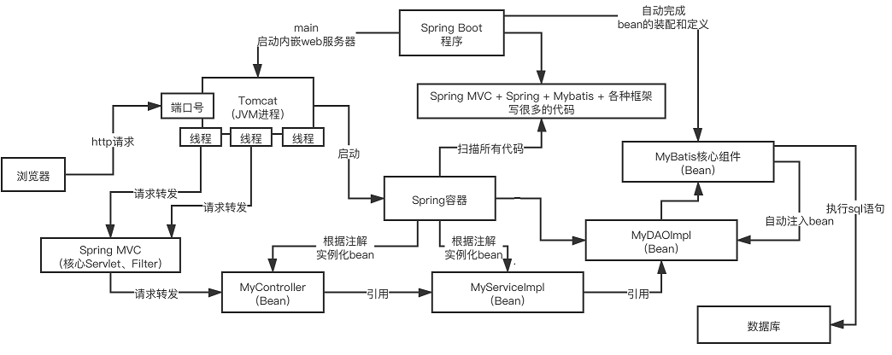

# Spring Boot
Spring的子项目。  
优点：简化了Spring繁琐的配置，快速整合第三方框架，实现了自动配置，提供了各种启动器，内嵌了Tomcat部署简单  
缺点：将传统的Spring Framework项目转换为Spring Boot应用程序比较麻烦，它仅适用于全新的Spring项目；集成度较高，使用过程中不太容易理解底层。  


### 初始化一个Spring Boot项目
https://start.spring.io/
````
  <parent>
        <groupId>cn.kinglian.nfys</groupId>
		<artifactId>nfys-bss</artifactId>
        <version>2.0</version>
    </parent>
	// groupId 域.公司名称
	// artifactId 项目（模块）名称
````
### 核心注解
@SpringBootApplication 是启动类注解，主要包含了以下三种：

1. @SpringBootConfiguration 组合了@Configuration注解，实现配置文件的功能
2. @EnableAutoConfiguration 打开或关闭自动配置的功能
3. @ComponentScan Spring组件扫描

### Spring Boot Starter的工作原理
启动时的三步：  
1. 依赖Starter包中寻找resource/META-INF/spring.factories配置文件，根据文件中配置的jar包扫描项目所依赖的jar包。
2. 根据spring.factories配置加载AutoConfigure类
3. 根据@Conditional注解的条件，进行自动配置并将Bean注入到Spring Context


### Spring Boot自动配置如何实现的
Spring Boot启动的时候会通过@EnableAutoConfiguration注解找到META-INF/spring.factories配置文件中的所有自动配置类，并对其进行加载。  
这些自动配置类都是以AutoConfiguration结尾来命名的，它实际上就是一个JavaConfig形式的Spring容器配置类，例ServletWebServerFactoryAutoConfiguration类  
这些自动配置类能通过以Properties结尾命名的类中取得在全局配置文件中配置的属性如：server.port，例ServerProperties类   

（如何取?） 
XxxxProperties类是通过@ConfigurationProperties注解从全局配置文件中绑定属性到对应的bean上(即xxxProperties的bean)，  
xxxxAutoConfiguration类再通过@EnableConfigurationProperties注解将这些bean导入到Spring容器中  


XxxxProperties类的含义是：封装配置文件中相关属性；  
XxxxAutoConfiguration类的含义是：自动配置类，目的是给容器中添加组件。

### Spring Boot配置加载顺序(不确定)
1. .properties文件
2. .yml
3. 系统环境变量
4. 命令行参数

### Spring Boot是否可以使用xml文件？
可以，但不建议，使用时用@ImportResource注解引入

### Spring Boot的核心配置文件
bootstrap.yml 由父ApplicationContext加载，优先于application.yml的加载，且属性配置不能被覆盖
application.yml 由ApplicationContext加载，用于项目的自动化配置

### Spring Profiles
主要用来配置开发环境和生产环境
spring.profiles.default 默认值，优先级低。当active没有配置时，使用此变量。
spring.profiles.active 优先级高，指定当前容器使用哪个profile

例子
spring:
  profiles:
    active: dev

### 如何实现 Spring Boot 应用程序的安全性？
使用 spring-boot-starter-security 依赖项，添加安全配置类，配置类将必须扩展WebSecurityConfigurerAdapter 并覆盖其方法

### Spring Boot中如何解决跨域问题
在后端通过CORS(Cross-origin resource sharing)来解决跨域问题  
一个Http请求先走filter，到达Servlet后才进行拦截器的处理，把cors放在filter里，就可以优先于权限拦截器执行

### Spring Boot的监视器
Spring boot actuator 是 spring 启动框架中的重要功能之一 ，对项目进行检查和监控

### Swagger
Swagger 是用于生成 RESTful Web 服务的可视化表示的工具，它使文档能够以与服务器相同的速度更新。

### Spring Boot打包成的jar和普通的jar
Spring Boot打包成的jar可以直接运行，java -jar xxx.jar，不能作为普通的jar被其他项目依赖  
普通jar解压后就是包名，Spring Boot的jar解压后/BOOT-INF/classess目录下才是我们的代码

### Spring Boot如何进行异常处理
@ControllerAdvice+@ExceptionHandler

例： 
``` 
@Slf4j
@RestControllerAdvice
public class GlobalExceptionHandler {

    @ExceptionHandler({MaxUploadSizeExceededException.class})
    public ResponseEntity<ApiResult> maxUploadSizeExceededException(MaxUploadSizeExceededException e) {
        if (null != e.getMessage()) {
            if (e.getMessage().contains("The field file exceeds its maximum permitted size of 1048576 bytes.")) {
                return new ResponseEntity<>(new ApiResult(null, -1, "上传的文件大小不能超过1MB!"), HttpStatus.PAYLOAD_TOO_LARGE);
            }
        }
        log.error("发生异常, e={}", e.getMessage(), e);
        return new ResponseEntity<>(new ApiResult(e), HttpStatus.OK);
    }
```

### Spring Boot分页
spring-boot-starter-data-jpa可实现

### 微服务中如何实现Session共享
将所有微服务的Session统一保存到Redis上，对Session读取操作时都去读取Redis的Session

### Spring Boot如何实现定时任务
配置类上添加@EnableScheduling，然后在方法上添加@Scheduled(cron = " 0 0 10,16 * * ?")

### 注解
@Import：@Import的实现有很多时候需要借助 ImportSelector 接口，判断如果被@import的是 ImportSelector.class 接口的实现，那么初始化这个被Import的类，然后调用它的selectImports方法去获得所需要的引入的configuration，然后递归处理


# github上的springboot-learning-example

## @SpringbootApplication
Springboot应用的启动类

## 配置文件

### application.properties
demo.book.name=springboot
demo.book.writer=VAQ

### 也可以引用其他的属性值
demo.book.description=${demo.book.writer}${demo.book.writer}

## application.yml
demo:
	book:
		name: springboot
demo:
	book:
		writer: VAQ

两个同时存在时默认优先application.properties

## @Component
泛指组件bean，应用启动时被加载进容器，可细分为@Controller、@Service、@Repository，指控制层、服务层、持久层  


### @Mapper和@Repository
使用@mapper后，不需要在spring配置中设置扫描地址，通过mapper.xml里面的namespace属性对应相关的mapper类，spring将动态的生成Bean后注入到ServiceImpl中。 
@repository则需要在Spring中配置扫描包地址，然后生成dao层的bean，之后被注入到ServiceImpl中

## PropertySource("classpath:book.properties")
通过注解引入其他注解文件

## @Autowired(required=false)
控制层自动装配属性Bean，默认=false，则允许为null

## @Value
@Value("${demo.book.name}")
private String name;

配置文件中必须有demo.book.name 否则会java.lang.IllegalArgumentException 非法参数异常

## @ConfigurationProperties(prefix="demo.book") 
指定以demo.book为前缀的对象;
还可以数据验证，属性类上加@Validated，类属性上加@NotEmpty、@NotNull等，此时属性为空的话会报编译异常：org.springframework.boot.context.properties.bind.BindException


## @RestController
SpringMVC的注解，实现了REST API

## @RequestMapping("/book")
接口路径

## 编码方式
Spring Boot 是以 iso-8859 的编码方式读取 application.properties 配置文件。

### @RestController
等于 @ResponseBody + @Controller

### @ResponseBody 
注解表示该方法的返回值，会直接写入http响应体（不会被视图解析器认为是个视图对象）

### maven插件
Spring Boot包含一个Maven插件，可以将项目打包为可执行jar

  
## 启动失败相关   

### 端口号被占用

Disconnected from the target VM, address: '127.0.0.1:9596', transport: 'socket'

Process finished with exit code 0

### 没有引入Bean组件
Consider defining a bean of type 'demo.springboot.dao.UserRepository' in your configuration.


### @ConfigurationProperties
```
@Data
@Configuration
@ConfigurationProperties(prefix = "upload")
public class UploadPropertes {

    private String root;

}

uploadPropertes.getRoot() 相当于获取application.yml文件中的配置数据D:/temp/upload 
upload:
  root: D:/temp/upload
  
  
```


