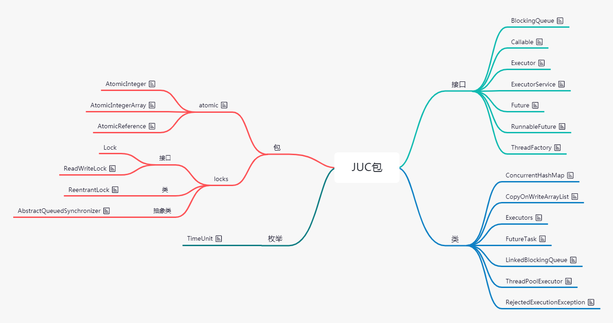

## Java并发包 java.util.concurrent

### 接口
```
BlockingQueue<E>、Interface Callable<V>、Interface ConcurrentMap<K,V>、ExecutorService、Future<V>、RunnableFuture<V>、FutureTask<V>、RejectedExecutionHandler、ThreadFactory
```
### 类
```
ConcurrentHashMap<K,V>、Executors、LinkedBlockingQueue<E>、ThreadPoolExecutor
```
### 枚举
TimeUnit
### 异常
RejectedExecutionException 


### volatile
保证了可见性，禁止指令重排序，即使多线程之间，一个线程修改后其他线程也能感知变化，但不是能保证原子性

每次对该关键字修饰的变量的操作，都会激发一次load and save 操作，load：把值从主内存中加载到本地栈 ，完成操作后，再save保存到主内存中。
volatile修饰的值被修改后，会使该值在其他所有工作内存中失效，其他线程再去操作的话就得从主内存中重新获取值。  
插入了内存屏障，保证处理器不乱序执行，所以它会降低一点性能，但volatile比synchronized的更轻量级，不会引起线程上下文的切换和调度

### JMM 
Java内存模型
定义了线程和主内存之间的抽象关系：线程之间的共享变量存储在主内存中，每个线程都有一个私有的本地内存，本地内存中存储了该线程以读/写共享变量的副本。  
JMM 的规定：所有的共享变量都存储于主内存。这里所说的变量指的是实例变量和类变量，不包含局部变量，因为局部变量是线程私有的，因此不存在竞争问题。

### 并发存在的问题
1. 共享
2. 可变

### Unsafe 魔术类
可以绕过虚拟机，直接访问底层内存


###
state 状态，情况
ReentrantLock 可重入锁


## 线程池

### 为什么需要线程池？
1. 可以减少创建和销毁线程的次数，减少系统开销  
2. 可以根据系统情况调整线程的数量  
3. 可以根据项目控制并发的数量

### 几种线程池
1. newCachedThreadPool 可缓存线程池，可创建无限多的线程数，线程数量超过处理需要，可灵活回收空闲线程
2. newFixedThreadPool  定长线程池，可控制线程最大并发数，超出数量则在队列中等待
3. newScheduledThreadPool 定长线程池，支持定时和周期性任物执行
4. newSingleThreadExecutor  单线程化的线程池，只会用一个工作线程执行，保证任务的执行顺序

### 新建一个线程池
```
public interface ExecutorService extends Executor 
public abstract class AbstractExecutorService implements ExecutorService 
public class ThreadPoolExecutor extends AbstractExecutorService

ThreadFactory threadFactory = new ThreadFactoryBuilder().setNameFormat("xmpp-pool-%d").build();
ThreadPoolExecutor threadPool = new ThreadPoolExecutor(corePoolSize , maximumPoolSize , keepAliveTime , BlockingQueue<Runnable> , threadFactory);
```
### 线程池的实现原理
线程池本质是个HashSet，关键技术：锁(Lock、CAS)，阻塞队列、HashSet(资源池)

### 线程池的几个参数
int corePoolSize：线程池的基本大小，即没有任务需要执行时线程池的大小,线程的数量没有达到此值，则每来一个任务就会创建一个线程，直到达到此值再把任务放在队列中排队  
int maximumPoolSize：线程池中允许的最大线程数，当前运行数量poolSize不会超过该值  
long keepAliveTime：一个线程处在空闲状态的时间超过该值，就会因为超时而退出，0表示立刻终止  
TimeUnit unit: 时间粒度转换  
BlockingQueue`<Runnable>` workQueue：阻塞队列，新提交的任务放在里面  
ThreadFactory threadFactory: 线程工厂，用于管理线程，可设置线程名称、对线程分组管理、设置线程优先级
RejectedExecutionHandler handler：饱和策略


### 新提交任务时处理流程
```
当前线程数量没有达到线程池的基本大小（poolSize < corePoolSize）时,会新增一个线程处理新提交的任务，达到基本大小时，会将新提交的任务提到阻塞队列排队等候处理。
```
### 属性：allowCoreThreadTimeOut
线程池的属性，是否允许基本线程超时退出。ture表示超时没有任务执行，则线程（包括基本线程）退出。

### 线程池的方法：

prestartAllCoreThreads()：提前创建并启动所有核心线程，使其处于等待工作的空闲状态
getPoolSize(): 线程池中当前运行的线程数量
execute(runable) ：异步执行任务，没有返回值，无法判断任务是否执行成功，任务是接口Runable的一个实例   功能相当于 new Thread(runable).start();但又不完全相同
submit(): 提交需要返回值的任务，返回一个Future对象，Future对象调用get()方法可获得任务的返回值，且此时线程会阻塞，直到get方法完成后才继续后面的任务
shutdown(): 关闭线程池，原理是关闭线程的工作栈，逐个调用线程的interrupt方法来中断线程，所以无法响应中断的任务可能永远无法终止。 （线程池的状态设为SHUTWDOWN，正在执行的任务会执行下去，没有执行的任务则中断）
shutdownnow: 线程池的任务设为STOP，正在执行的任务不再执行，立即停止，没有执行的任务返回。	


### RejectedExecutionHandler
饱和策略，当队列都满了并且线程池的线程数量达到了maximumPollSize，处于饱和状态，采取策略处理新提交的任务，默认是AbortPolicy
1. AbortPolicy 直接抛出异常
2. CallerRunsPolicy 只用调用者所在线程处理任务
3. DiscardOldestPolicy 抛弃队列里最近的任务，来放置新提交的任务
4. DiscardPolicy 不处理，直接丢掉

这几个类都实现了RejectedExecutionHandler

## 并发编程
主要解决两个问题
 1. 线程之间如何通信 ，主要是共享内存和消息传递
 2. 线程之间如何完成同步


### 上下文切换
CPU不断的通过切换线程，每次切换时需要保存当前的状态，切换非常损耗性能

### 如何减少上下文切换
1. 使用最少的线程
2. 无锁并发编程，不同的线程处理不同段的数据
3. CAS算法，使用了乐观锁，可以有效的减少一部分不必要的锁竞争带来的上下文切换
4. 在单线程实现多任务调度

### 如何避免Si锁
1. 避免一个线程同时获得多个锁
2. 避免一个线程在锁内部占用多个资源，尽量保证一个线程占用一个资源
3. 使用定时锁lock.tryLock(timeOut); 超时等待时当前线程不会阻塞
4. 对于数据库锁，加锁和解锁必须在一个数据库连接里，否则会出现解锁失败的情况

### 同步 VS 异步
同步：必须等待调用的方法结束后才能继续执行。 保证了程序的可靠性
异步：调用B方法后，不用等待B方法结束，就可以继续执行，不论B是否完成。 提高了程序的性能

### 并行 VS 并发
并行：多个CPU或机器同时执行一段逻辑
并发：一个CPU通过调度算法执行多个线程，不是真正的同时，线程之间竞争CPU

### 阻塞 VS 非阻塞
阻塞：当前线程挂起，等待需要的资源被其他线程释放
非阻塞：没有线程会阻塞其他线程，所有线程都会尝试往前继续运行。 会提高CPU的利用率，但会增加线程切换的消耗


### Thread、ThreadLocalMap、ThreadLocal
ThreadLocal是用来提供线程级别的变量，变量只对当前线程可见，使线程间数据隔离，每个线程都有自己的变量副本。  
spring中使用ThreadLocal来设计TransactionSynchronizationManager类，实现了事务管理与数据访问服务的解耦，同时也保证了多线程环境下Connection的线程安全问题
(提供了一种以空间换时间的概念)

Thread中有个map，就是ThreadLocalMap
ThreadLocalMap是ThreadLocal的静态内部类，ThreadLocalMap的key是ThreadLocal类型，value是我们设定的(get、set方法)
ThreadLocal是个弱引用，为null时会被垃圾回收调

当ThreadLocal是null时，但ThreadLocalMap生命周期和Thread的一样，它就不会被回收调，就会出现ThreadLocalMap的key没了，但value还在，出现内存泄露问题，  
解决办法：使用完ThreadLocal后，执行remove操作。


## 线程

### 创建方式
1. 继承Thread类，重写run方法
2. 实现Runnable接口，重写run方法
3. 实现Callable接口，重写call方法

### Runnable接口的run()方法和Callable接口的call()方法区别
* run方法无返回值，call方法返回装载有返回结果的Future对象，Future对象调用get()方法可以获取该返回值
* Future是接口，一般使用它的实现类Futuretask
  public interface RunnableFuture extends Runnable , Future
  public class FutureTask implements RunnableFuture


### 线程安全
> 在并发的情况下，代码经过多线程调用，线程的调度顺序不影响结果则安全，即不会出现数据不一致或数据污染  
> 当多个线程同时执行，多个线程之间是相互抢占资源执行，并且抢占是发生在线程的执行的每一步过程中，导致出现非法数据。这种现象就称之为多线程的并发安全问题。
> 局部变量不会出现线程安全问题，因为局部变量是存在虚拟机栈中，是线程私有的

### Si锁
两个或两个以上线程持有各自所需要的锁，互相等待对方释放锁资源，形成无限等待。

### 阻塞队列
BlockingQueue相当于队列Queue附加了两个操作
1. 当队列为空时，线程会等待队列为非空
2. 当队列满时，存储元素的线程会等待队列可用

### 线程的状态
1. 就绪状态Runable
当一个线程创建后，其他线程调用它的start方法，则此线程变为就绪状态，java虚拟机会为它创建方法栈和程序计数器，此状态的线程位于可运行池中，等待获取CPU的使用权
2. 运行状态Running
此状态的线程正在占用CPU，执行程序代码
3. 阻塞状态Blocked
此状态的线程停止运行，没有占用CPU，直到线程重新进入就绪状态，才有机会转到运行状态

阻塞状态分为3种 ： 1. 线程执行到某个对象的wait()方法  2. 线程试图获得某个对象的同步锁但该对象已被其他线程占用了lock() 3. 线程执行了sleep方法、或调用了其他线程的join()方法，或执行了I/O请求时

4. Si亡状态
* 线程的run方法执行完毕，该线程的生命周期结束
* 未捕获的异常终止了run方法而使线程停止

### 锁池
* 是同步环境下才有的概念，一个对象对应一个锁池
* 当前线程想调用对象A的同步方法时，发现对象A正在被别的线程占用，则当前线程进入锁池状态。锁池里放的都是想争夺对象锁的线程
* 当线程1被线程2唤醒时，线程1进入锁池状态，去争夺对象锁

### Java中线程的调度算法
抢占式，一个线程用完CPU之后，操作系统根据线程的优先级和线程饥饿情况，算出总的优先级，并分配给下一个时间片给某一个线程执行。

### Thread.sleep(0)作用
有时某个线程会一直获得CPU的控制权，这样可以手动触发一次操作系统重新分配时间片的操作，平衡CPU的控制权。

### start()和run()
调用start()方法时，表示线程启动，并调用run方法，继续执行下面的方法，且无需等待run方法执行完毕。
run()方法只是线程的一个普通方法，直接调用run方法要等待run方法执行完毕后才继续往下执行。

### sleep()和wait()
sleep会一直持有锁，通常用于暂停执行
wait会释放锁，一般用于线程间的交互

### sleep()和yield()
sleep方法后，任何其他线程都可以进行竞争CPU
yield方法只会给同优先级或更高优先级的线程运行的机会

//都是静态方法
public static native void sleep(long millis) throws InterruptedException;
public static native void yield(); 

### interrupted()
一个运行中的线程被其他线程调用该线程的此方法进行了中断操作

### join()
A线程中执行到了ThreadB.join(); 则A线程阻塞，但不释放对象锁，需要等待B线程执行完毕后才继续执行，如果等待超时，则到了超时时间，A继续往下执行

### isAlive()
线程方法 public final native boolean isAlive();
线程是新建或Si亡状态时返回false，运行或阻塞状态时返回true

### wait、notify、notifyAll方法
wait(),notify(),notifyAll() 这三个方法都是对锁进行操作，java提供的锁是对象级的，而不是线程级的。 是final修饰的，无法被重写

都在同步代码块中调用

wait() 会立即释放对象锁，使当前对象处于等待状态。
notify/notifyAll() 唤醒一个或多个处于等待状态（wait）的线程，用在wait之后


```
synchronized(object){
	while(不满足当前条件){
		try{
		//等待阻塞，释放当前的锁，让出CPU，进入等待状态。不继续做事情A了
			object.wait();
		}catch(InterruptedException e){
			e.printStackTrace();
		}
		
		System.out.println("现在被唤醒了");
	}
	
	
	//唤醒等待的线程，并不会立即释放锁,执行完代码块后再释放锁
	object.notifyAll();
	
	//开始继续做事情A
}

```
### 为什么用while而不用if
用if的话，线程被重新唤醒，会继续执行wait之后的代码，此时的条件可能不满足了
用while，线程被唤醒后会再进行判断循环条件，成立的话继续执行wait()后的代码，不成立的话执行while代码块之后的代码

### 守护线程
为用户线程提供服务，比如GC线程
线程对象在start()方法之前调用setDaemon(true);设为守护线程

程序执行完毕后，JVM会等待非守护线程执行完毕后关闭，而不会等待守护线程;且守护线程退出时不会执行finally块的代码


### happens-before规则

定义：
1）如果一个操作happens-before另一个操作，那么第一个操作的执行结果将对第二个操作可见，而且第一个操作的执行顺序排在第二个操作之前。
2）两个操作之间存在happens-before关系，并不意味着Java平台的具体实现必须要按照happens-before关系指定的顺序来执行。如果重排序之后的执行结果，
与按happens-before关系来执行的结果一致，那么这种重排序并不非法（也就是说，JMM允许这种重排序）。

8项规则：

1. 程序顺序规则：一个线程中的每个操作，happens-before于该线程中的任意后续操作。
2. 监视器锁规则：对一个锁的解锁，happens-before于随后对这个锁的加锁。
3. volatile变量规则：对一个volatile域的写，happens-before于任意后续对这个volatile域的读。
4. 传递性：如果A happens-before B，且B happens-before C，那么A happens-before C。
5. start()规则：如果线程A执行操作ThreadB.start()（启动线程B），那么A线程的ThreadB.start()操作happens-before于线程B中的任意操作。
6. join()规则：如果线程A执行操作ThreadB.join()并成功返回，那么线程B中的任意操作happens-before于线程A从ThreadB.join()操作成功返回。
7. 程序中断规则：对线程interrupted()方法的调用先行于被中断线程的代码检测到中断时间的发生。
8. 对象finalize规则：一个对象的初始化完成（构造函数执行结束）先行于发生它的finalize()方法的开始。


### synchronized 阻塞式同步
* 可以保证同一时刻只有一个线程执行某个方法或某个代码块，同时可以保证一个线程的变化可见性(即可以替代volatile)
* 颗粒度：即可作用在以下下三个地方时：  

1. 静态方法，作用范围是整个静态方法，作用对象是类，即所有对象同一把锁
2. 普通方法，作用范围是整个方法，作用的对象是调用这个方法的实例对象
3. 代码块，  作用范围是{}里面的代码，作用对象是调用这段代码的实例对象


synchronized(Test.class){ //类对象
	//do something;
}

synchronized(this){ //实例对象
	//do something;
}

## JUC java.util.concurrent 并发工具包
包含两个子包： atomic、locks
还有BlockingQueue、Executor、Future、Callable等

### Lock 
相比Synchronized更灵活，可以显示加锁和释放锁，必须调用unlock方法释放锁，所以在finally块中释放锁，获取锁过程中能够响应中断，可以超时获取锁


### AQS
AbstractQueuedSynchronizer ，用于构建锁和同步机制的抽象类，子类有Sync
有个属性 private volatile int state; state为0时表示锁没有人占用


### ReentrantLock
```
Lock lock = new ReentrantLock();
lock.lock(); 
try{
	// do something
}finally{
	lock.unlock();//在finally中释放锁
}
```

* 实现了Lock接口，加锁和解锁都需要显式写出 public class ReentrantLock implements Lock, java.io.Serializable
* 静态内部类有Sync、FairSync、NonFairSync，其中公平锁和非公平锁都继承了Sync
* 默认使用非公平锁
* 锁是可重入的（持有锁的线程可以继续持有，释放对等的次数后才真正释放该锁），每次lock都会让state加1，unlock后state就减1
* tryLock(); 表示用来尝试获取锁，如果获取成功，则返回true，如果获取失败（即锁已被其他线程获取），则返回false

### ReentrantReadWriteLock  

public class ReentrantReadWriteLock implements ReadWriteLock, java.io.Serializable  
读写锁实现原理是，将同步变量state分为高16位和低16位，高16位代表读锁、低16位代表写锁  

### 公平锁
线程获取锁的顺序和调用lock的顺序一致，FIFO
获取锁时，线程去竞争一个锁，可能成功或失败，成功的话直接持有资源，失败则进入队列阻塞，等待唤醒后再尝试竞争锁。

### 非公平锁
线程获取锁的顺序是抢占式


### monitor监视器（对象锁）
* 是Synchronized的底层原理

* Java中每个对象都有一个监视器，来监测并发代码的重入，在非多线程编码时monitor不起作用
* 执行同步代码块之前首先执行monitorenter指令获取对象的监视器monitor，退出时monitorexit指令，同一时刻只能有一个线程获取monitor

* 锁的重入性：同一个锁对象，线程不需要再次获取同一把锁，即monitorenter指令只会运行一次，而monitorexit指令可能会多次。每个对象拥有一个锁计数器，线程获取对象锁是该数加一，释放锁后减一

### 多个线程竞争同步资源的流程细节
无锁->偏向锁->轻量级锁->重量级锁  
  
无锁：不锁住资源，多个线程只能有一个修改资源成功，其他线程会重试  
偏向锁：同一个线程多次访问执行同步资源时，该线程就会自动获取锁  
轻量级锁：多个线程竞争同步资源时，偏向锁被另外的线程访问，偏向锁就会升级成轻量级锁，**没有获取资源的线程自旋等待锁的释放，不会阻塞**  
重量级锁：多个线程竞争同步资源时，**没有获取资源的线程都会阻塞等待唤醒**  
  
### 使用无界队列的线程池会导致内存飙升吗？

线程池中线程的数量达到corePoolSize后，就开始向BlockingQueue队列堆积任务了，只要队列不满，就不会创建新的线程，就用不到maximumPollSize和KeepAliveTime了，如果线程处理的速度比进入队列的要慢，BlockingQueue就会越积越多，最后导致JVM OOM（内存溢出）

### 重排序
为了提高性能，编译器和处理器常会对既定代码执行顺序进行指令重排序


### 写两个线程交替打印奇偶数
```
public class PrintAB  {
    private static volatile int i = 1;
    public static void main(String[] args) throws Exception {
        final Object obj = new Object();

        Runnable runnable = new Runnable() {
            public void run() {
                synchronized (obj) {
                    for (; i <=20; ) {
                        System.out.println(Thread.currentThread().getName() + " " + (i++));
                        try {
                            obj.notifyAll();
                            obj.wait();
                        } catch (InterruptedException e) {
                            e.printStackTrace();
                        }
                    }
                    obj.notifyAll();
                }
            }
        };
        Thread t1 = new Thread(runnable, "打印偶数的线程 ");
        Thread t2 = new Thread(runnable, "打印奇数的线程 ");
        t2.start();
        t1.start();
    }
}

```

### java.util.concurrent
public enum TimeUnit.SECONDS.sleep(1L);  //线程暂停1秒钟


