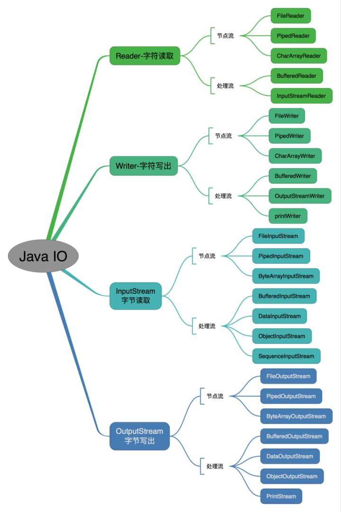
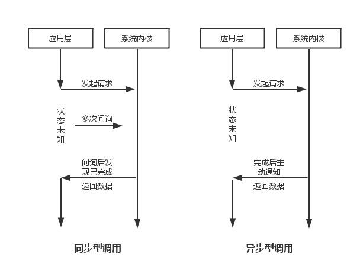
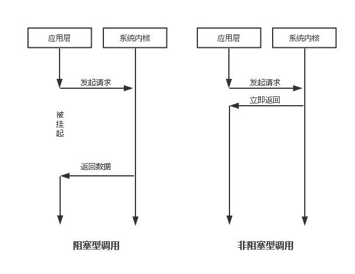

# IO



### 输入输出流
StringReader extends Reader
StringWriter extends Writer

操作数据源为字符串的字符流


### 字符流
Reader  InputStreamReader ， BufferedReader
Writer  OutputStreamWriter ， BuferedWrite

### 字节流
InputStream OutputStream

区别：字符流单元是两个字节的Unicode字符，字节流单元是一个字节；
字符流以字符或字符数组的形式读写数据，只能读写二进制文件，字节流能读写各种类型的数据。音频、图片最好用字节流，避免数据丢失，关系到中文最好用字符流。

字节输入流转字符输入流：通过适配器模式，用InputStreamReader实现，该类构造器可以传入InputStream对象，字节输出流转字符输出流，用OutputStreamWriter。

### mkdirs()方法
file.mkdirs() 如果你想根据File里的路径名建立文件夹（当你不知道此文件夹是否存在，也不知道父文件夹存在），就可用此方法，  
它建立文件夹的原则是：如果父文件夹不存在并且最后一级子文件夹不存在，它就自动新建所有路经里写的文件夹；  
如果父文件夹存在，它就直接在已经存在的父文件夹下新建子文件夹  

```
		File file = new File(fullPath);
		if (!file.exists()) {
			file.mkdirs();
		}
```

### 同步VS异步
同步I/O：每个请求串行执行，会造成阻塞，用户线程发起I/O请求后需要等待或轮询内核I/O操作完成后才能继续执行。 能够保证程序的可靠性  
异步I/O：多个请求并发执行，用户线程发起I/O请求后可以继续执行，当内核I/O操作完成后会通知用户线程，或调用用户线程注册的回调函数。  能够提高程序的性能  

着重于是否是否等待任务完成后再继续进行



### 阻塞VS非阻塞
阻塞：请求发出后，所需要的操作条件不满足时，请求一直阻塞，不会返回，知道满足为止。  
非阻塞：请求发出后，所需要的操作条件不满足时，立即返回一个标识信息告知条件不满足，而不会一直等待，一般需要循环判断请求条件是否满足来获取请求结果  

着重于请求的条件不满足时是否等待


### Unix下五种I/O模型
1. 阻塞I/O
分两个阶段：  
* 等待数据就绪，网络IO是等待数据陆续到达，磁盘IO是等待磁盘数据从磁盘上读取到内核态内存  
* 数据拷贝，出于安全，用户态程序无权限直接读取内核态内存，需要把内核态内存拷贝一份到用户态内存中  

2. 非阻塞I/O
分三个阶段：  
* socket设为NONBLOCK(非阻塞)，则请求的I/O无法完成时，返回一个错误码(EWOULDBLOCK)，这样请求就不会阻塞了  
* I/O操作函数不断地测试操作数据是否已经准备好，知道数据准备好为止，虽然I/O请求后立即返回了，但是仍需要不断的轮询、重复请求，消耗了大量的CPU资源
* 数据拷贝

很少直接只用此模式，但给I/O多路复用提供了条件

3. I/O多路复用
用到了select或poll函数，这两个函数也会使线程阻塞，但可以同时阻塞多个I/O，实现了可以一个线程同时处理多个Channel的I/O请求

4. 信号驱动I/O (Java不支持)
socket允许信号驱动I/O，并安装一个信号处理函数，数据准备好后线程会收到一个SIGIO信号，调用信号处理函数进行数据处理

5. 异步I/O  
前四个模型都是同步阻塞的。  
用aio_read 函数，告诉内核描述字，缓冲区指针，缓冲区大小，文件偏移以及通知的方式，然后立即返回。当内核将数据拷贝到缓冲区后，再通知应用程序。  
所以异步I/O模式下，阶段1和阶段2(数据拷贝)全部由内核完成，完成不需要用户线程的参与。

Java中，NIO是非阻塞I/O，通过NIO实现的reactor模式是I/O多路复用的实现，通过AIO实现的Proactor模式是异步I/O的实现

### reactor模式
反应器模式（事件驱动模型），主要有两部分组成BOSS和WORK，BOSS就像老板，拉活、谈项目，然后下发到worker去处理。  
处理并发请求，如果有内容进来会自动通知我们，不必开启多个线程死等了。  


### IO和NIO的区别
IO是阻塞的，调用read(),write()方法  
NIO是非阻塞，NIO中引入了缓冲区的概念，对数据的操作都是基于将数据移进、移出缓冲区  
  
IO是面向流的，每次从流中(InputStream/OutputStream)读取一个或多个字节，直到取到所有字节
NIO是面向缓冲的，数据会被读到一个缓冲区，可以在缓冲区前后移动处理，增加了处理过程的灵活性

NIO中有选择器，一个单独的线程监视多个通道，注册多个通道到一个选择器上
NIO可以零拷贝，FileChannel拥有transferFrom和transferTo两个方法，可以将FileChannel的数据拷贝到另一个Channel，或者直接把另一个Channel数据拷贝到FileChannel，避免了传输数据时将源数据从内核态拷贝到内存态，再从内存态拷贝到目标内核态这两次上下文切换


## Java中的I/O
1. 磁盘操作：file
2. 字节操作：InputStream、OutputStream
3. 字符操作：Reader、Writer
4. 对象操作：serializable
5. 网络操作：Socket
6. 新的IO：  NIO

### 磁盘操作
### 字节操作
使用了装饰者模式，InputStream属于抽象组件，FileInputStream属于具体组件，FilterInputStream属于抽象装饰者，为组件提供额外的功能，如BufferedInputStream为FileInputStream提供缓存的功能

### 字符操作
编码：字符-->字节，byte bytes = str.getBytes("UTF-8");  
解码：字节-->字符，String str = new String(bytes,"UTF-8");  

OutputStreamWriter 字符流-->字节流 
InputStreamReader 实现从字节流解码成字符流  
 

### 对象操作
序列化，即将对象转换成字节序列，方便存储和传输，ObjectOutputStream.writeObject();
反序列化，ObjectInputStream.readObject();  
  
不会对静态变量进行序列化，因为序列化只是保存对象的状态，静态变量属于类状态

transient关键字，表示不能被序列化


### 网络操作
Java中的网络支持：  
InetAddress：网络地址，即ip  
URL：统一资源定位符  
Socket：使用TCP协议实现网络通信。 通过InputStream和OutputStream进行输入输出
Datagram：使用UDP协议实现网络通信。 DatagramSocket通信类，DatagramPacket数据包类  

### 通道
public interface Channel extends Closeable
常用实现类：  
FileChannel：从文件中读写数据  
SocketChannel：通过TCP读写网络中的数据
ServerSocketChannel：监听新进来的TCP连接，对每一个新进来的连接都会创建一个SocketChannel
DatagramChannel：通过UDP读写网络中的数据

### 缓冲区  
不会对通道直接进行读写操作，而是依靠缓冲区  
public abstract class Buffer    
状态变量：
```
	// mark <= position <= limit <= capacity
	
	private int mark = -1; 
    private int position = 0; //当前已读的字节数
    private int limit; //还可以读的字节数
    private int capacity; //最大容量
	
	public final Buffer flip() { //切换读写
        limit = position;
        position = 0;
        mark = -1;
        return this;
    }
	
	public final Buffer clear() { //清空缓冲区
        position = 0;
        limit = capacity;
        mark = -1;
        return this;
    }
	
```
实现类有：ByteBuffer，CharBuffer，ShortBuffer，IntBuffer，LongBuffer，DoubleBuffer，FloatBuffer

### 选择器
1. 创建选择器
2. 将通道注册到选择器上
3. 监听事件
4. 获取到达的事件
5. 事件循环


## 文件字节大小转换
```
public static String readableFileSize(long size) {
        if (size <= 0) return "0";
        final String[] units = new String[]{"B", "KB", "MB", "GB", "TB"};
        int digitGroups = (int) (Math.log10(size) / Math.log10(1024));
        return new DecimalFormat("#,##0.#").format(size / Math.pow(1024, digitGroups)) + " " + units[digitGroups];
    }
```


