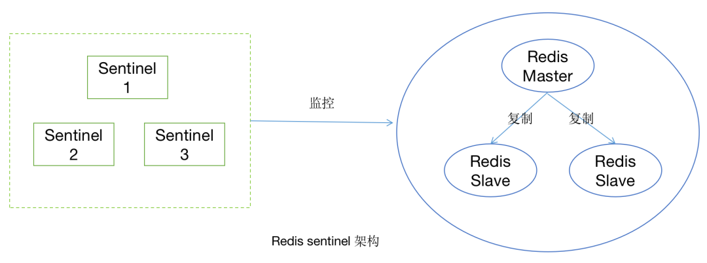
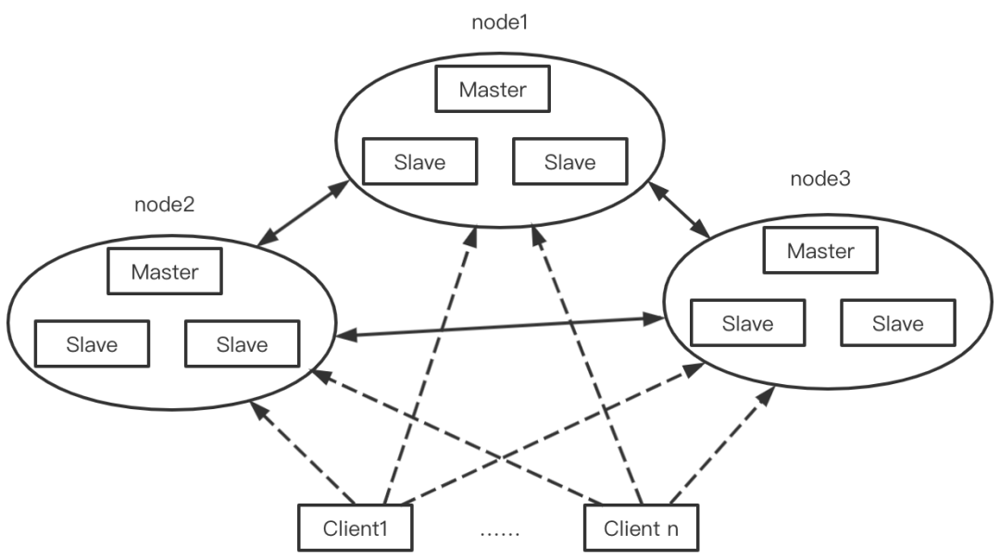

## Redis
默认端口号6379

1. 丰富的数据类型
Redis是key-value型数据库，key是字符串格式，value可以是String,Hash,List,Set,Sorted Set 
Key和Value均能存512M的值

* String使用场景；
> 用户访问次数、商品浏览次数、
> 缓存频繁读取但不常修改的信息(值用json格式)、
> 限定某个ip特定时间的访问次数、
> 分布式session(session是以文件形式存在服务器中，用户在服务器A登录，下次却访问了服务器B，解决方式可以把session存在Redis中，Redis可以独立于所有负载均衡服务器，也可以放在一台服务器上)

* Hash使用场景：
> 某个属性需要频繁修改时。如购物车的商品信息，商品价格、销量等变化

* List使用场景：
> 定时排行榜
Lrange  返回列表中指定区间内的元素，相当于分页查找 
lrange key_name start end  0表示第一个元素，-1表示倒数第1个，-2表示倒数第2个  [start,end] 

* Set使用场景：
> 音乐收藏夹列表

* Sorted Set,即zSet，元素不允许重复，每个元素都关联了一个double类型的分数(score)，根据分数从小到大排序，分数可以重复，使用场景：
> 新歌榜、飙升榜 点击量作为score


2. 内存存储
> 传统数据库是索引存下内存中，数据存在硬盘，
> 数据是直接存在内存中的，是基于内存的而不是硬盘，读写速度非常快，所以被广泛应用于缓存方向
3. 可持久化
> 把内存的数据保存在硬盘中，方便进行数据的备份和恢复


### Redis的持久化
将内存中的数据(如对象)保存到存储设备中(如磁盘)
1. RDB默认方式(可自动触发bgsave和手动触发)
按照一定的时间周期把内存的数据以快照的形式保存到硬盘的二进制文件。（二进制文件和文本文件都是按照二进制存储的，文本文件是把一个个字节解读成字符，二进制文件的输入输出省去了转换的过程）
对应产生的数据文件为dump.rdb，可通过配置文件redis.conf中的save参数来定义保存周期，save 900 1 表示如果900秒内有1个key发生了变化(增、修、删)，则重写rdb文件，save""表示关闭自动触发
2. AOF 需要配置appendonly yes，默认不开启。默认文件名appendonly.aof
将每一个收到的写命令通过write函数追加到文件最后，重启Redis后会根据内存的写命令在内存中重建整个数据库的内容。Redis还会对AOF文件进行后台重写，使得AOF文件不至于过大

3. 两种方式同时开启时，优先执行AOF方式，因为AOF保存的要比RDB保存的完整

RDB优点：是紧凑的二进制文件，比较适合备份和全量复制，速度远快于AOF  
   缺点：无法实现实时或毫秒级持久化，新老版本无法兼容rdb文件
AOF优点: 更好的保护数据不丢失，最多丢失一秒的数据，appen-only模式写入性能比较高，适合做灾难性的误删除紧急恢复  
   缺点：文件占用空间大，开启后会对QPS有影响，数据恢复比较慢不适合做冷备份(离线备份)

### 单线程的模型
采用IO多路复用机制同时监听多个socket，根据socket上的事件来选择对应的事件处理器进行处理

### 单线程的Redis为什么那么快
1. 纯内存操作
2. 单线程避免了频繁的上下文切换
3. 采用了非阻塞IO，多路I/O复用机制

   
### 缓存雪崩
原因：设置的缓存采用了相同的过期时间，同一时刻出现原有缓存过期；或缓存服务突然宕机了。

结果：（新缓存还没存入期间，）访问缓存的请求都直接去访问数据库了，对数据库的CPU和内存造成压力

解决办法：
1. 加锁 ， 同缓存击穿
2. 队列
保证不会有大量的线程对数据库一次性进行读写
3. 将缓存失效时间分散开，过期时间加上一个随机值

### 缓存穿透
原因：数据库中不存在，缓存中也肯定不存在，但每次访问都会先访问缓存再访问数据库

结果：造成里两次无用的查询

解决办法：
A. 采用布隆过滤器BloomFilter，将所有可能存在的数据哈希到一个足够大的bitmap中，一个不存在的数据会被这个bitmap拦截，从而避免了对数据库查询的压力
B. 缓存空值，数据库中不存在的值，则在缓存中设为null，有查询当前key的请求时直接返回null（注意设置过期时间）

布隆过滤器：n个相互独立的哈希函数，解决哈希冲突，一个函数在bitmap中查询不到就说明不存在，只有全部函数都查到了才说明存在这个数据 

两种方案可同时使用，先A过滤，再B缓存null

### 缓存击穿
原因：一个key非常热点，这个key失效的瞬间，大并发穿破缓存直接访问数据库

结果：请求都直接去访问数据库了，对数据库的CPU和内存造成压力

解决办法：在访问key之前，采用SETNX（set if not exist），设置另一个短期key来锁住当前key的访问，访问结束后再删除该短期key，即在第一个查询数据的请求上采用一个互斥锁，没有查询到数据时锁住当前key，查询到以后，做缓存，再解锁

### 缓存预热
在系统上线后将相关的缓存数据直接加载到缓存系统。这样可以直接查询事先被预热的缓存数据，避免用户在请求时先查询数据库再讲数据进行缓存。

### 缓存更新
Redis有6中自带的缓存失效策略。 

* 可定期清理过期的缓存  缺点：维护大量缓存的key比较麻烦
* 当有用户请求过来时再判断请求的缓存是否过期了，过期的话就从数据库中得到新数据并更新缓存  缺点：每次请求都要判断缓存是否失效，逻辑比较复杂

### 缓存降级
非核心业务影响到核心性能，对其降级，目的是保证核心服务可用，即使是有损的

### 热点数据、冷数据

缓存在失效前至少被访问了两次，这样缓存才有意义。要为访问频率比较高的热点数据建立缓存

### 事务
 开启事务：MULTI 总是返回 OK
 命令入队列：每次操作的命令都会加入到一个队列中，但此时命令不会执行
 提交事务：EXEC 开始顺序执行队列中的命令

 DISCARD清空事务队列并退出事务
 WATCH监控一至多个key，一旦其中一个键被修改(删除)，之后的事务就不会执行了
 UNWATCH取消对key的监视，执行DISCARD就不用执行这个了

* 发生命令执行错误Redis不会停止执行然后回滚数据的，所以Redis的事务不是原子性，为什么? 为了保证功能简化 ，运行速度更快 

### Redis的主从复制
将一台redis服务器(主节点master)的数据复制到其他节点redis服务器中(从节点slave)

作用：数据冗余、故障恢复、负载均衡(读写分离、只由主节点负责写)、高可用基石(是哨兵和集群的基础)

实现原理： 
1. 连接建立阶段 ：
    - 保存主节点信息: 从节点执行slaveof命令(异步)，维护masterhost、masterport两个字段，存储主节点的ip和port信息
    - 建立socket连接：从节点每秒一次调用复制定时函数replicationCron(),创建socket连接，主节点accept后，为该socket创建相应的客户端状态
    - 发送ping命令：  从节点发送ping命令检查socket是否可用，主节点是否能够处理请求，只有返回pong才说明正常
    - 身份验证： 如果从节点设置里masterauth选项，则通过向主节点发送auth命令进行身份验证
    - 发送从节点端口信息 ：从节点向主节点发送其监听的端口信息，主节点将该信息保存到从节点对应的客户端的slave_listening_port字段中
2. 数据同步阶段： 从节点的数据初始化，从节点向主节点发送psync命令进行同步数据
3. 命令传播阶段： 主节点将自己执行的写命令发送给从节点，从节点接收命令并执行，保证主从数据一致性。是异步过程，所以延迟在所难免

### Sentinel(哨兵模式)
主从复制模式下，主节点发生问题需要手动将从节点晋升为主节点，还要通知客户端更新主节点地址
Sentinel是一个管理多个Redis实例的工具，可实现对Redis的监控、通知、自动故障转移
Sentinel创建时会从主节点上获取所有从节点的信息

心跳机制：
1. Sentinel与Redis Node之间，Sentinel定时向主节点和从节点发送info命令获得其拓扑结构和状态信息
2. Sentinel与Sentinel之间，基于Redis的订阅发布功能，每个Sentinel节点会向主节点的Sentinel发送本节点对于主节点的判断以及当前Sentinel节点的信息

故障转移：Sentinel节点发现Redis主结点出现心跳检测超时时，判定为主观下线，数量达quorum个节点判定为主观下线则为客观下线(quorum = Sentinel节点总数量/2 + 1)，就会基于Raft算法选出一个领导者Sentinel进行故障转移
故障转移步骤：

（1）在从节点列表中选出一个节点作为新的主节点
	过滤不健康或者不满足要求的节点；
	选择 slave-priority（优先级）最高的从节点， 如果存在则返回， 不存在则继续；
	选择复制偏移量最大的从节点 ， 如果存在则返回， 不存在则继续；
	选择 runid 最小的从节点。
（2）Sentinel 领导者节点会对选出来的从节点执行 slaveof no one 命令让其成为主节点。

（3）Sentinel 领导者节点会向剩余的从节点发送命令，让他们从新的主节点上复制数据。

（4）Sentinel 领导者会将原来的主节点更新为从节点， 并对其进行监控， 当其恢复后命令它去复制新的主节点。


### Cluster(集群)
实现了多节点同时写数据，采用无中心结构，每个节点都保存数据，节点之间相互连接从而知道整个集群状态


### 获取所有某个固定Pre前缀开头的key列表
keys pre*
执行此命令时会导致线程阻塞一段时间

scan命令可以无阻塞提取，但数据会有重复问题，可在客户端进行去重，而且整体所花费的时间会较长


## Redisson 
是Redis官方Java版客户端

### 缓存+数据库  
读：先读缓存，缓存没有，则读数据库，取出数据后放入缓存，返回响应  
更新：先更新数据库，再删除缓存(适用于更新多、查询少；更新缓存适用于更新少、查询多)  

### 值是否带有双引号问题
@Autowired
private RedisTemplate<String,String> redisTemplate;

set和get的redisTemplate中应该用泛型保持一致


### 哪个业务用了Redis？  
* String类型：  
微信公众号的accesstoken，通过app_id和app_secret  
消息队列消费失败时，通过redis记录重新消费的次数，达到次数时就不再重试了  

* zSet类型：   
  保存用户收藏的文章或视频：用户id：文章id的Set集合，已收藏的时间戳作为分数进行排序  
  
* hash类型   
1. 购物车的商品信息，key为用户id，value为商品id、商品规格id、数量。 加入购物车前要判断商品是否存在  
   购物车新增：先判断商品是否存在，再新增到数据库，最后存入redis   
   购物车修改商品数量：修改redis，再放入RabbitMQ，消费者再修改数据库  
   
2. 商品规格信息： key为商品规格id，value为名称、图片、价格  
商品规格信息被修改后，直接再更新redis中的商品规格信息    

Redis中存到常驻内存数据：收藏的文章、视频；购物车；商品

● 在Redis里你们具体是选用了哪种数据结构存放什么数据？数据的过期时间是什么？如果缓存过期了，你的数据兜底方案是什么，到哪儿去回查？  

### Redis分布式锁的原子性操作  

### 可视化工具Redis Desktop Manager

### redisTemplate操作List
```
存：
redisTemplate.opsForList().rightPushAll("vaq", list);
取：
List<Person> vaq = redisTemplate.opsForList().range("vaq", 0, -1);
```


### SpringBoot中使用redis的消息订阅和发布

1. SpringBoot中注册redis消息监听器和消息监听适配器
```

```

### 修改启动的redis端口号
/etc/redis/redis.conf中


