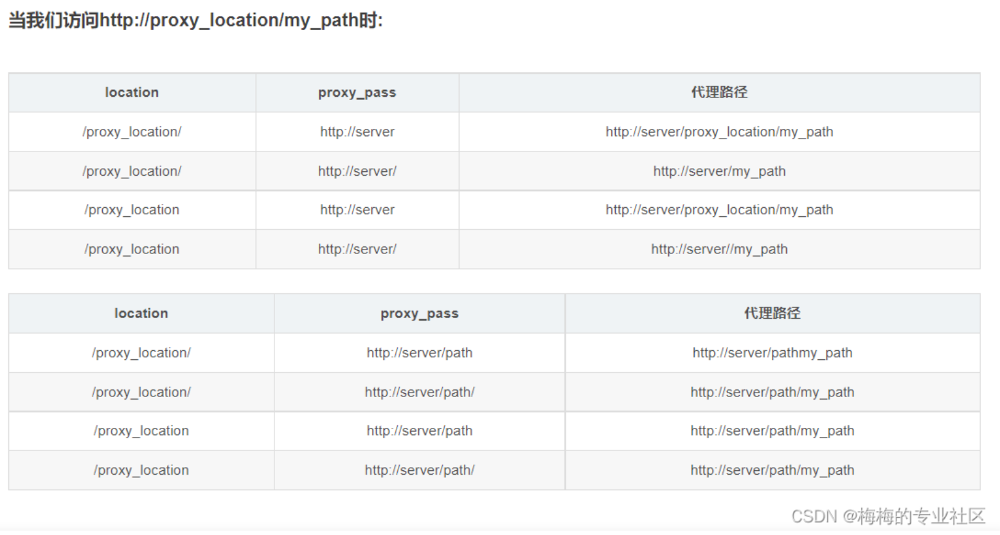

用来做负载均衡和反向代理的web服务器

为性能优化而来的，可支持5万并发  

支持热部署  

[官方下载](https://nginx.org/download/)

## 反向代理
正向代理：代理客户端，在客户端或者浏览器中配置代理，服务端不知道实际发起请求的客户端   
反向代理：代理服务端，客户端访问反向代理服务器，反向代理服务器将请求转发到实际的tomcat服务器，客户端不知道实际提供服务的服务器    

## 负载均衡
针对多个服务器，将请求平均分发到这些服务器上

## 动静分离

## 命令
进入到nginx的目录下，再运行命令
/usr/local/nginx/sbin  

./nginx -v  版本号  
./nginx  启动nginx  
./nginx -s stop  关闭nginx
./nginx -t    测试能否运行成功（重启之前-t一下更稳）  
./nginx -s reload  热加载nginx（重新加载配置文件）

### CentOS查看安装目录

ps -ef|grep nginx    //获取进程id

ls -l /proc/进程id/exe  

## 配置文件

位置：/usr/local/nginx/conf/nginx.conf  

* 全局块 *
worker_processess 1;  Nginx可处理的并发量  

* events块 *
主要影响Nginx服务器与网络的连接  
worker_connections 1024;  支持的最大连接数  

* http块 * 
  配置最频繁的部分，包含了http全局块、server块  
  listen 80;  监听的端口
  server_name localhost;  服务名

### proxy_pass

如果location或if中用到了正则，则不能再转发除ip:port外的路径请求