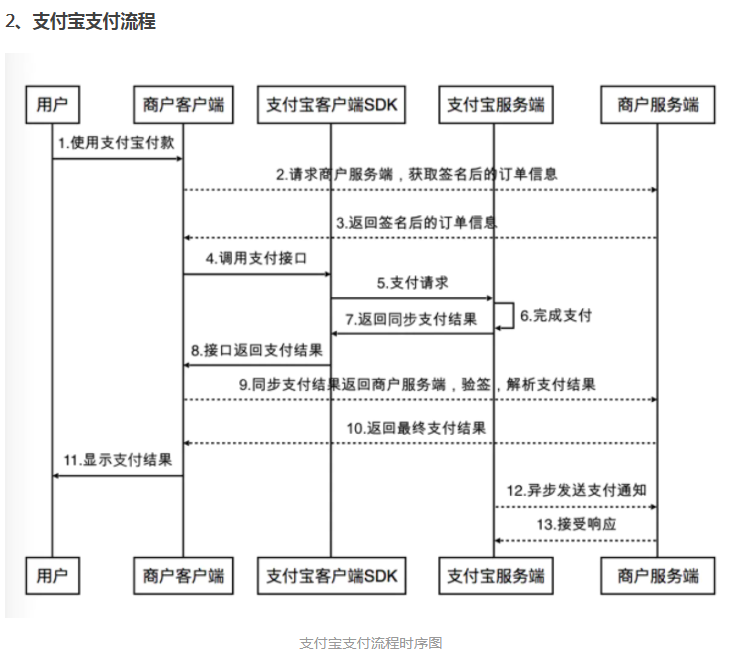
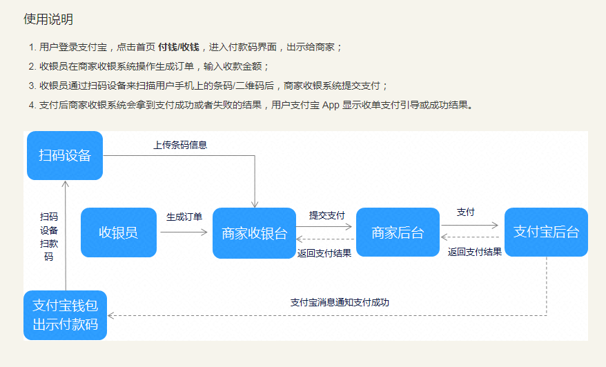
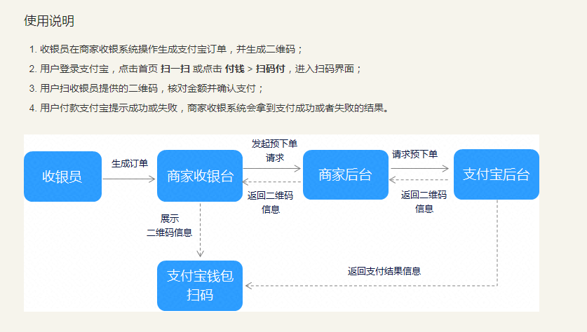
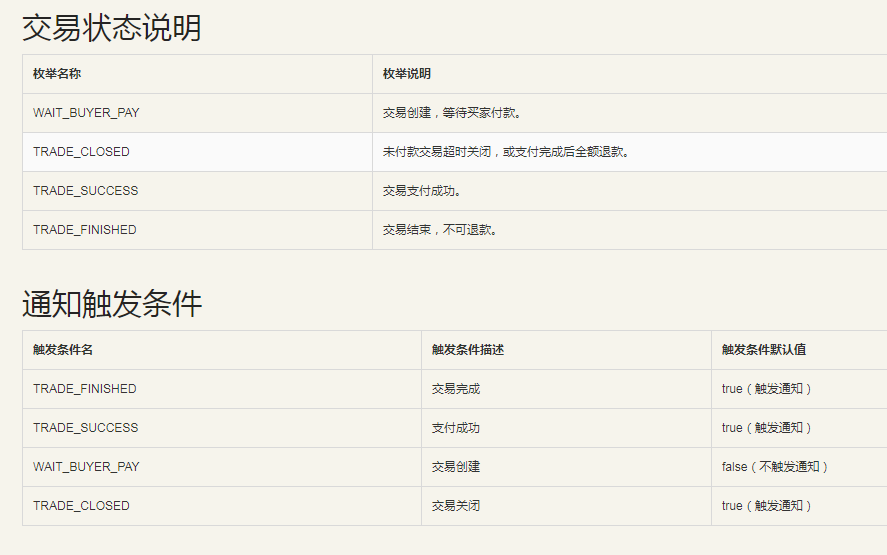
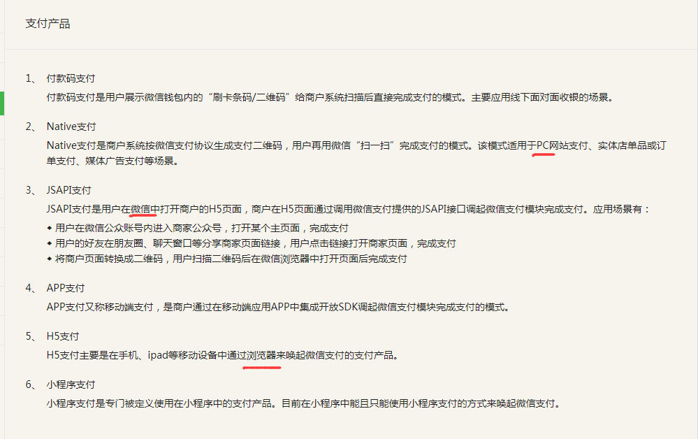

## spring-boot-pay

* 下载内网穿透工具，使本机地址可以被外网访问https://blog.52itstyle.vip/archives/2972/
* 项目中的支付宝SDk(com.alipay.demo)需要自行去官网下载打入本地仓库或者私服，提供下载地址：http://pan.baidu.com/s/1mi5LfhI
* 部署到生产中作为一个功能模块的时候建议走RPC调用
* 项目在启动的时候会往某个ip的zookeeper去注册，如果有同学想去掉的话，可以把Application里的“@ImportResource({"classpath:spring-context-dubbo.xml"})”注释掉，然后@Service不用dubbo包的，改用spring的
* 支付宝和微信的二维码下单方式就有明显的区别
* Dubbo2.7.3、zookeeper3.5.3

### English
sign cert 签名证书  
encrypt cert 加密证书
verifier 验证者


### 银联没成功，点付款就是页面不见了http://localhost:8080/springboot_pay/unionpay/null

把com.itstyle.modules.unionpay.util.AcpService类中的createAutoFormHtml方法中的sf.append里面的script的代码注释掉，  
因为这个js直接提交了，所以为null，再把input值type=hidden改为text,就能看到值了

### 启动报错，说链接不到zookeeper

Dubbo接口服务需要启动 zookeeper


## 最重要的下单、回调

支付公司限制了订单号，一个订单号只能有一笔交易


## 支付宝
    

### 公钥和私钥
一对密钥生成后，保存在生成者手里的为私钥，生成者发布出去的为公钥

商户端生成了一对密钥A和B，保存了A而把B发给了支付宝，则A是商户端私钥、B是商户端公钥；  
支付宝生成了一对密钥C和D，保存了C而把D发给了我们，则C是支付宝私钥、D是支付宝公钥。  

支付宝提供了一键生成RSA密钥(商户端公私钥)的工具，生成的公钥需要填写在支付宝开放平台，填写后平台会生成一个支付宝公钥，我们存在服务端用于验证是否是支付宝的响应信息

### 加密、解密
公钥和私钥中，使用一个密钥对数据进行加密、用另一个密钥对数据解密的过程，使用了RSA2算法(可逆的非对称加密算法) 
支付宝的加密、解密过程：   
1. 商户端：明文订单信息+商户端私钥加密=加密订单信息    
2. 商户端：将加密订单信息传递给支付宝  
3. 支付宝：加密订单信息+商户端公钥解密=明文订单信息
4. 支付宝：处理完订单后，将处理结果信息+支付宝私钥=处理结果加密信息
5. 支付宝：将处理结果加密信息返回给商户端
6. 商户端：处理结果加密信息+支付宝公钥解密=处理结果信息  

### 数字签名  
支付宝是使用RSA加密生成数字签名；  
微信支付是使用MD5加密生成数字签名的。

eg: 发起生成订单信息时：  
数字签名：商户端通过订单信息得到订单摘要，再通过商户端私钥将订单摘要生成数字签名，将数字签名拼接在订单信息尾端。  
数字签名验证：支付宝同样先通过订单信息得到订单摘要a，再通过商户端公钥解析数字签名得到订单摘要b，比较a和b是否一致  
**签名和验证签名都在商户服务端做**  

### alipay-sdk-java
封装了签名、验签和 HTTP 接口请求等基础功能，  
在 SDK 调用具体的 API（接口）前需要进行 alipayClient 对象初始化。  
alipayClient 对象只需要初始化一次，后续调用不同的 API 都可以使用同一个 alipayClient 对象。 
```
AlipayClient alipayClient = new DefaultAlipayClient("https://openapi.alipay.com/gateway.do","app_id","your private_key","json","GBK","alipay_public_key","RSA2");
```

```
		<!-- https://mvnrepository.com/artifact/com.alipay.sdk/alipay-sdk-java -->
		<dependency>
			<groupId>com.alipay.sdk</groupId>
			<artifactId>alipay-sdk-java</artifactId>
			<version>4.8.10.ALL</version>
		</dependency>
```


### 当面付-条码支付
alipay.trade.pay(统一收单交易支付接口)  
适用场景：商家扫描用户展示的付款码，完成支付
   


```
AlipayTradePayRequest request = new AlipayTradePayRequest();
	request.setNotifyUrl(builder.getNotifyUrl());
	request.putOtherTextParam("app_auth_token", builder.getAppAuthToken());
	
	//请求参数的集合，最大长度不限，除公共参数外所有请求参数都必须放在这个参数中传递，具体参照各产品快速接入文档
	request.setBizContent(builder.toJsonString());
  
AlipayTradePayResponse response = alipayClient.execute(request);

/**
 * 通过response.getCode()判断支付情况
 */
  
1. 明确的支付成功
  "10000".equals(response.getCode()) 
  //TODO 订单号、用时、成功标志放在阻塞队列中
  
2. 用户支付中
  "10003".equals(response.getCode()) 
  //TODO 订单号、用时、支付宝返回处理中标志放在阻塞队列
  
  //轮询查询订单信息：配置最大轮询次数、查询间隔 
  AlipayTradeQueryRequest request = new AlipayTradeQueryRequest();
  AlipayResponse response = alipayClient.execute(request);
  
  // 根据轮询结束后的结果判断，成功则返回，失败则撤销订单
  AlipayTradeCancelRequest request = new AlipayTradeCancelRequest(); //撤销订单
  AlipayResponse response = client.execute(request);

3. 系统异常
  "20000".equals(response.getCode()) 
  //TODO 订单号、用时、支付宝返回失败标志放在阻塞队列中
  
  //TODO 调用一次查询，如果查询失败，则调用撤销接口
  
4. 明确的支付失败
  "40004".equals(response.getCode()) 
  //TODO 订单号、用时、支付宝返回失败标志放在阻塞队列
  
```

### 当面付-扫码支付
alipay.trade.precreate(统一收单线下交易预创建)  

适用场景：商家生成二维码(预下单)，供用户扫描支付。  



```
AlipayTradePrecreateRequest request = new AlipayTradePrecreateRequest();
		
AlipayResponse response = alipayClient.execute(request);

```

### APP支付
alipay.trade.app.pay(app支付接口2.0)  
适用场景：外部商户APP唤起快捷SDK创建订单并支付
```
AlipayTradeAppPayRequest request = new AlipayTradeAppPayRequest();

AlipayTradeAppPayResponse response = alipayClient.sdkExecute(request);
```

### 手机网站支付
alipay.trade.wap.pay(手机网站支付接口2.0)  
适用场景：外部商户创建订单并支付  
```
AlipayTradeWapPayRequest request = new AlipayTradeWapPayRequest();

AlipayTradeWapPayResponse response = alipayClient.pageExecute(request);
```

### 电脑网站支付
alipay.trade.page.pay(统一收单下单并支付页面接口)  
适用场景：PC场景下单并支付  
```
AlipayTradePagePayRequest request = new AlipayTradePagePayRequest();

AlipayTradePagePayResponse response = alipayClient.pageExecute(request);
```

### 创建订单
alipay.trade.create(统一收单交易创建接口)  
适用场景：商户通过该接口进行交易的创建下单

```
AlipayTradeCreateRequest request = new AlipayTradeCreateRequest();

AlipayTradeCreateResponse response = alipayClient.execute(request);
```

### 订单查询
alipay.trade.query(统一收单线下交易查询)  
适用场景：商家网络或服务器出现异常、  
商家系统最终未接收到支付通知、  
调用支付接口后返回系统错误或未知交易状态、  
调用alipay.trade.pay时返回INPROCESS的状态、  
调用alipay.trade.cancel之前确认支付状态  

```
AlipayTradeQueryRequest request = new AlipayTradeQueryRequest();

AlipayResponse response = alipayClient.execute(request);
```

### 撤销接口  
alipay.trade.cancel(统一收单交易撤销接口)  
适用场景：只有在没有明确是支付结果时才调用，如用户支付中(支付超时)、支付宝系统异常。
```
  AlipayTradeCancelRequest request = new AlipayTradeCancelRequest(); 
  
  AlipayResponse response = alipayClient.execute(request);
```

### 退款
alipay.trade.refund(统一收单交易退款接口)  
适用场景：在签约时设置的可退款时间内
```
AlipayTradeRefundRequest request = new AlipayTradeRefundRequest();

AlipayResponse response = alipayClient.execute(request);
```

### 阿里支付预下单
如果你调用的是当面付预下单接口(alipay.trade.precreate)，调用成功后订单实际上是没有生成，因为创建一笔订单要买家、卖家、金额三要素。  
预下单并没有创建订单，所以根据商户订单号操作订单，比如查询或者关闭，会报错订单不存在。  
当用户扫码后订单才会创建，用户扫码之前二维码有效期2小时，扫码之后有效期根据timeout_express时间指定。  


### 支付异步通知  
当交易状态发生改变时支付宝会发送异步通知，如当订单支付成功时，支付宝将向商户在 alipay.trade.create 设置的 notify_url (异步通知地址)发送异步通知(POST方式)。  
商家可监听该地址获取支付宝返回的支付结果，当异步通知中返回的 trade_status(交易状态)为 TRADE_SUCCESS 时，表示支付成功。  

建议商家以调用 alipay.trade.query(统一收单线下交易查询)接口轮询支付结果 + 异步通知的形式来确认订单状态。  

接收异步通知后，商家需返回字符串 success 给支付宝，不返回的话支付宝会不断重发通知直到超过24小时22分钟，频率为4m、10m、10m、1h、2h、6h、15h，共通知8次。   




## 微信支付

支付宝SDK使用的是RAS加密算法来加密和生成数字签名的。  
微信支付是使用MD5加密生成数字签名的，最新版改为了基于非对称密钥的SHA256-RSA的数字签名算法，不再使用MD5或HMAC-SHA256  

支付宝支付，服务端会直接返回给我们调起支付宝支付的订单信息，  
而微信支付的话，服务端会返回给我们一些信息，我们需要将这些信息拼一个请求体来调起微信支付

* 加密：AES-256-GCM，对称密钥  
* 签名：SHA-256 with RSA
  

V3之前使用的是微信支付颁发的API证书，V3使用证书授权机构颁发的证书。
### 微信支付模式  


除了付款码支付外，商户系统先调用统一下单接口在微信支付服务后台生成预支付交易单，返回正确的预支付交易单会话标识后再按小程序、JSAPI、APP等不同场景生成交易串调起支付。

### 协议规则
* 传输方式：HTTPS  
* 提交方式：POST  
* 数据格式：提交和返回的数据都是XML格式，根节点名为xml  
* 字符编码：UTF-8  
* 签名：MD5/HMAC-SHA256算法，请求和接收数据都需要校验签名    
* API证书：申请退款、撤销订单、红包接口等需要商户api证书，在微信官方下载证书，默认密码为商户id；api的调用和安装需要密码    

### 参数规定
交易金额单位为分，不能有小数点

### 异步通知
支付完成后，微信把支付结果和用户信息发送给商户   
商户要对通知内容做签名验证，并校验订单金额，防止"假通知"，  
因为微信可能会发多次通知，所以应先检查通知是否被处理过，  
要用数据锁进行并发控制，避免数据混乱。  


## 银联


## 支付宝扫码和微信扫码支付场景问题记录

[问题记录](https://blog.52itstyle.vip/archives/263)

扫码之前二维码有效期为2个小时不能更改，扫码之后账单有效时间 timeout_express 可以更改。  

## 通知失败
支付可能会出现通知失败或MQ消费失败，需要采用补偿机制，  
一般的补偿方案为：消息落地数据库，流程成功删掉指定消息，  
对于失败的消息有指定的定时任务轮询重发，重发次数可以参考指数退避算法，业务方做好接口幂等。  
  支付通知失败官方建议：业务方主动向三方支付查询消费交易状态，然后进行后续业务处理。


