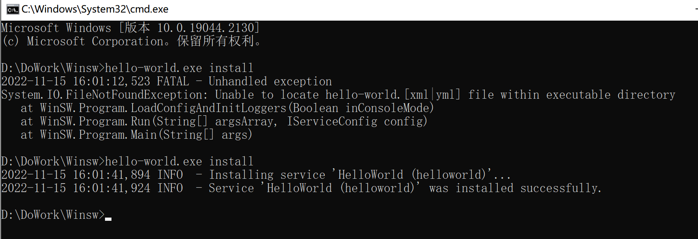
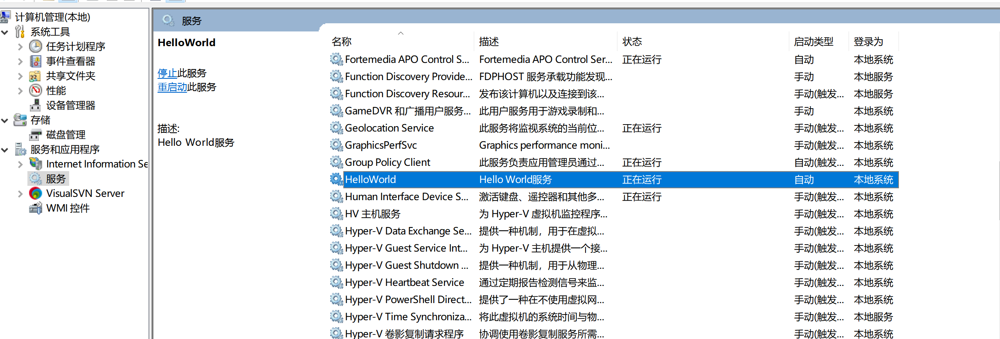

## 以hello-world.jar为例
1. 下载WinSW-x64.exe [最新稳定版](https://github.com/winsw/winsw/releases/tag/v2.11.0)

2. 重命名WinSW-x64.exe为和.jar同名，hello-world.exe

3. 新建.xml文件，和jar同名，hello-world.xml
   ```xml
   <service>
   	<id>HelloWorld</id>
   	<name>HelloWorld</name>
   	<description>Hello World服务</description>
   	<executable>java</executable>
   	<arguments>-jar "hello-world.jar" --spring.profiles.active=dev</arguments>
   	<logmode>rotate</logmode>
   </service>
   ```
   id和name都要是唯一的，一般同名即可
4. 安装服务

在cmd命令窗口输入`hello-world.exe install`
（卸载命令为hello-world.exe uninstall）
5. 启动服务
```
hello-world.exe start
其他命令：
	hello-world.exe restart
	hello-world.exe stop
	hello-world.exe status
```
结束后便能在服务中查看HelloWorld了


